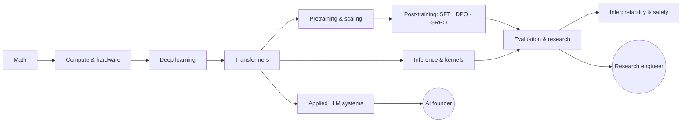

<div align="center">


<h3>Rebuild the modern LLM stack from scratch, one tested lab at a time.</h3>

<p>Autograd → tokenizer → GPT → FlashAttention in Triton → KV cache → LoRA · DPO · GRPO → quantization → speculative decoding → evals → interpretability → retrieval.<br/>
Each lab ships a handout, a stub you implement and a test suite that tells you when you're right, with scale-up runs sized for a single 8 GB GPU.</p>

[](https://github.com/Lourdhu02/interview/actions/workflows/ci.yml)


[](LICENSE)

**[Labs](labs/README.md)** · **[Curriculum](curriculum/README.md)** · **[Roadmap](ROADMAP.md)** · **[Research track](tracks/research-engineer/README.md)** · **[Founder track](tracks/founder/README.md)** · **[Setup](SETUP.md)**

[`llm`](https://github.com/topics/llm) [`deep-learning`](https://github.com/topics/deep-learning) [`pytorch`](https://github.com/topics/pytorch) [`triton`](https://github.com/topics/triton) [`transformers`](https://github.com/topics/transformers) [`flash-attention`](https://github.com/topics/flash-attention) [`rlhf`](https://github.com/topics/rlhf) [`dpo`](https://github.com/topics/dpo) [`grpo`](https://github.com/topics/grpo) [`quantization`](https://github.com/topics/quantization) [`interpretability`](https://github.com/topics/interpretability) [`from-scratch`](https://github.com/topics/from-scratch)

</div>

<br/>

<table>
<tr>
<td align="center" width="25%"><br/><b>Test-driven</b><br/><sub>216 reference tests, run in CI on every push</sub></td>
<td align="center" width="25%"><br/><b>From scratch</b><br/><sub>you write the math; libraries only for plumbing</sub></td>
<td align="center" width="25%"><br/><b>Measured</b><br/><sub>predict FLOPs, memory and tokens/s, then check</sub></td>
<td align="center" width="25%"><br/><b>Career-aimed</b><br/><sub>research-engineer and founder tracks</sub></td>
</tr>
</table>

## Why this exists

Most AI prep is reading: blog posts, paper summaries, question lists. You finish it able to *name* FlashAttention and unable to *write* it.

This repo trains the opposite skill. You implement every core mechanism yourself, and a test suite tells you when you're right. Every lab also asks you to predict a number (memory, FLOPs, tokens/s, loss) before you measure it, because the gap between prediction and measurement is where understanding comes from.

> **The rule:** you understand what you can build, measure and explain, and nothing else.

## The labs

Each lab has a handout, a stub you implement (`exercise.py`), tests, and a reference solution you read only *after* an honest attempt.

| | Lab | You build | Tests |
|:-:|---|---|:-:|
|  | [01 · Autograd](labs/01_autograd/README.md) | Reverse-mode autodiff in NumPy; train an MLP with it | 37 |
|  | [02 · Training core](labs/02_training_core/README.md) | AdamW (bit-exact vs PyTorch), Muon, WSD schedules, correct grad accumulation | 24 |
|  | [03 · Napkin math](labs/03_napkin_math/README.md) | Parameters, FLOPs, KV cache, roofline, MFU, $/token; exact counts for GPT-2 and Llama-3 | 18 |
|  | [04 · Tokenizer](labs/04_tokenizer/README.md) | Byte-level BPE with GPT-4 / o200k pre-tokenization, and why they treat Telugu differently | 33 |
|  | [05 · Transformer](labs/05_transformer/README.md) | A Llama-style GPT (RoPE, GQA, SwiGLU, QK-norm) plus a pretraining script | 17 |
|  | [06 · Attention kernels](labs/06_attention_kernels/README.md) | Online softmax, FlashAttention forward and backward, a Triton kernel | 21 |
|  | [07 · KV cache & sampling](labs/07_kv_cache_sampling/README.md) | KV cache, chunked prefill, top-k / top-p / min-p | 13 |
|  | [08 · Scaling laws](labs/08_scaling_laws/README.md) | Power-law fits, Chinchilla-optimal and inference-aware model sizing | 5 |
|  | [09 · Parallelism](labs/09_parallelism/README.md) | Ring all-reduce, Megatron tensor parallelism, ZeRO memory | 7 |
|  | [10 · LoRA](labs/10_lora/README.md) | Adapters, merging, a direct test of the low-rank hypothesis | 4 |
|  | [11 · DPO](labs/11_dpo/README.md) | DPO / IPO / SimPO, and numerical proof of DPO's closed-form optimum | 5 |
|  | [12 · GRPO](labs/12_grpo/README.md) | REINFORCE → GRPO with clipping and a k3 KL penalty; RL on a verifiable task | 5 |
|  | [13 · Quantization](labs/13_quantization/README.md) | INT8/INT4, NF4, SmoothQuant, GPTQ | 8 |
|  | [14 · Speculative decoding](labs/14_speculative_decoding/README.md) | Exact rejection sampling, statistically verified to be lossless | 3 |
|  | [15 · Eval statistics](labs/15_eval_stats/README.md) | CIs, paired tests, clustered SEs, pass@k, power, Bradley–Terry | 6 |
|  | [16 · Interpretability](labs/16_interpretability/README.md) | Induction heads, activation patching, sparse autoencoders | 5 |
|  | [17 · Retrieval](labs/17_retrieval/README.md) | BM25, RRF, MMR, nDCG, an IVF vector index | 5 |

All reference solutions pass in CI on CPU, Triton kernels included (via its interpreter). Scale-up runs are sized for an 8 GB consumer GPU.

## Learning path



| Module | Covers |
|---|---|
| [00 How to learn](curriculum/00-learning-os.md) | The Read → Derive → Build → Measure → Write loop |
| [01 Math](curriculum/01-math.md) | The VJP table, KL, the log-derivative trick, statistics |
| [02 Compute](curriculum/02-compute-and-hardware.md) | Roofline, FLOP and memory accounting, number formats |
| [03 Deep learning](curriculum/03-deep-learning.md) | Init, optimizers, μP, a debugging playbook |
| [04 Transformers](curriculum/04-transformers.md) | Attention, RoPE, GQA/MLA, MoE, SSMs |
| [05 Pretraining](curriculum/05-pretraining.md) | Data, scaling laws, 3D parallelism, stability |
| [06 Post-training](curriculum/06-post-training.md) | SFT, RLHF, DPO derivation, GRPO/DAPO, test-time compute |
| [07 Inference](curriculum/07-inference.md) | Batching, PagedAttention, quantization, speculative decoding |
| [08 Eval & research](curriculum/08-evaluation-and-research.md) | Error bars, ablations, 7 research projects that fit on 8 GB |
| [09 Interpretability & safety](curriculum/09-interpretability-and-safety.md) | Circuits, SAEs, prompt injection |
| [10 Applied systems](curriculum/10-applied-llm-systems.md) | RAG, agents, context engineering, LLMOps |

## Quickstart

```bash
git clone https://github.com/Lourdhu02/interview.git && cd interview
pip install numpy regex pytest torch        # CUDA builds for RTX 50-series: see SETUP.md
python -m pytest --impl=solution            # all reference solutions pass
python tools/measure_gpu.py                 # measure your GPU's roofline
pytest labs/01_autograd                     # 37 failing tests: your first job
python tools/progress.py                    # your scoreboard across all labs
```

## Two tracks

<table>
<tr>
<td width="50%" valign="top">


**[Research engineer](tracks/research-engineer/README.md)**

Frontier-lab teams and what each one tests · interview loops · a [question bank](tracks/research-engineer/question-bank.md) with answers · [LLM-era system design](tracks/research-engineer/ml-system-design.md) · a [portfolio](tracks/research-engineer/portfolio.md) that proves depth

</td>
<td width="50%" valign="top">


**[AI founder](tracks/founder/README.md)**

[Problem selection](tracks/founder/01-problem-selection.md) · [eval-driven product](tracks/founder/02-ai-product-engineering.md) · [unit economics of LLM products](tracks/founder/03-unit-economics.md) · [moats](tracks/founder/04-moats-and-flywheels.md) · [go-to-market](tracks/founder/05-go-to-market.md) · [fundraising](tracks/founder/06-fundraising-and-structure.md)

</td>
</tr>
</table>

## Repository layout

```
curriculum/   11 modules: derivations, napkin math, traps, papers
labs/         17 labs: handout · exercise.py · solution.py · tests
tracks/       research-engineer/ and founder/
career/       résumé, stories, outreach, negotiation, visa (condensed, honest)
journal/      your experiments, paper notes, reviews: the proof of work
tools/        stub generator · progress scoreboard · GPU roofline · link checker
```

## Acknowledgements

Inspired by Andrej Karpathy's *Zero to Hero* and nanoGPT, Stanford CS336, GPU MODE, ARENA, and the papers listed in [curriculum/papers.md](curriculum/papers.md). Icons by [Lucide](https://lucide.dev) (ISC, see [assets/icons/LICENSE](assets/icons/LICENSE)).

## License

[MIT](LICENSE). If this repo helps you, star it so others can find it.
