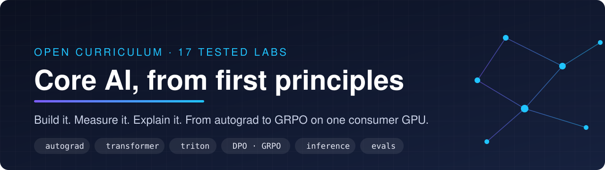
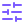
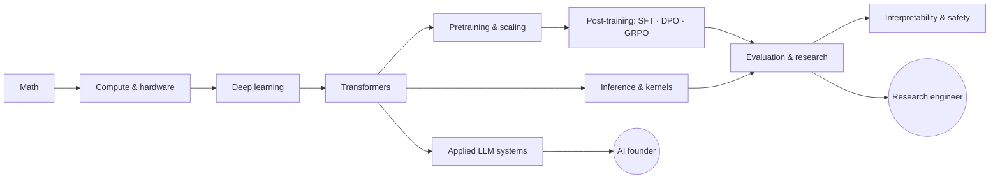

<div align="center">



<h3>Rebuild the modern LLM stack from scratch, one tested lab at a time.</h3>

<p>Autograd → tokenizer → GPT → FlashAttention in Triton → KV cache → LoRA · DPO · GRPO → quantization → speculative decoding → evals → interpretability → retrieval.<br/>
Every lab runs on a laptop CPU. The scale-up runs are sized for one 8 GB GPU or a free Colab T4.</p>

[](https://github.com/Lourdhu02/achilles/actions/workflows/ci.yml)
[](https://lourdhu02.github.io/achilles/)


<br/>


[](LICENSE)

[](https://colab.research.google.com/github/Lourdhu02/achilles/blob/main/notebooks/colab_quickstart.ipynb)
[](https://codespaces.new/Lourdhu02/achilles)

**[Docs](https://lourdhu02.github.io/achilles/)** · **[Labs](labs/README.md)** · **[Curriculum](curriculum/README.md)** · **[Library](library/README.md)** · **[Companies](companies/README.md)** · **[Roadmap](ROADMAP.md)** · **[Setup](SETUP.md)**

[`llm`](https://github.com/topics/llm) [`deep-learning`](https://github.com/topics/deep-learning) [`pytorch`](https://github.com/topics/pytorch) [`triton`](https://github.com/topics/triton) [`transformers`](https://github.com/topics/transformers) [`flash-attention`](https://github.com/topics/flash-attention) [`rlhf`](https://github.com/topics/rlhf) [`grpo`](https://github.com/topics/grpo) [`quantization`](https://github.com/topics/quantization) [`interpretability`](https://github.com/topics/interpretability) [`from-scratch`](https://github.com/topics/from-scratch) [`ai-engineering`](https://github.com/topics/ai-engineering)

</div>

<br/>

<table>
<tr>
<td align="center" width="20%"><br/><b>Test-driven</b><br/><sub>216 reference tests, run in CI on Linux, Windows and macOS</sub></td>
<td align="center" width="20%"><br/><b>From scratch</b><br/><sub>you write the math; libraries only for plumbing</sub></td>
<td align="center" width="20%"><br/><b>Measured</b><br/><sub>predict FLOPs, memory and tokens/s, then check</sub></td>
<td align="center" width="20%"><br/><b>Runs anywhere</b><br/><sub>CPU, NVIDIA, Apple Silicon, Colab, Codespaces</sub></td>
<td align="center" width="20%"><br/><b>Career-aimed</b><br/><sub>company guides, research and founder tracks</sub></td>
</tr>
</table>

## Why Achilles

Every engineer has an Achilles heel: a layer of the stack they can name but cannot build. Most AI preparation makes it worse. It is reading: blog posts, paper summaries, question lists. You finish able to *name* FlashAttention and unable to *write* it, and interviews at the labs that matter find that gap within minutes.

Achilles trains the opposite skill. You implement every core mechanism yourself, and a test suite tells you when you are right. Every lab also asks you to predict a number (memory, FLOPs, tokens/s, loss) before you measure it, because the gap between prediction and measurement is where understanding comes from.

> [!IMPORTANT]
> **The rule:** you understand what you can build, measure and explain, and nothing else.

## What's inside

| | Part | What you get |
|:-:|---|---|
|  | **[Labs](labs/README.md)** | 17 test-driven labs: a handout, a stub you implement, a test suite and a reference solution for each |
|  | **[Curriculum](curriculum/README.md)** | 11 modules from the math to applied systems: mechanisms, derivations, napkin math, traps and papers |
|  | **[Library](library/README.md)** | 90 visual guides, papers and course notes across 19 hard topics, the sections worth your time in each, and a PDF fetcher |
|  | **[Companies](companies/README.md)** | How to get into Anthropic, OpenAI, Google DeepMind, Meta and NVIDIA: teams, interview loops, reading lists and portfolio projects |
|  | **[Research-engineer track](tracks/research-engineer/README.md)** | Interview loops, a question bank with answers, LLM system design, coding drills and a portfolio plan |
|  | **[Founder track](tracks/founder/README.md)** | Problem selection, eval-driven products, unit economics, moats, go-to-market, fundraising and team |
|  | **[Career](career/README.md)** | Résumé, stories, outreach, market intel, negotiation and visas |
|  | **[Roadmap](ROADMAP.md)** | A 12-month plan with exit criteria for each stage and two decision gates |

## Start in five minutes

```bash
git clone https://github.com/Lourdhu02/achilles.git && cd achilles
python -m venv .venv && source .venv/bin/activate      # Windows: .venv\Scripts\Activate.ps1
pip install torch --index-url https://download.pytorch.org/whl/cpu   # NVIDIA: .../whl/cu128 · Apple Silicon: pip install torch
pip install -r requirements.txt
python -m pytest --impl=solution -q    # all 216 reference tests pass: your setup works
pytest labs/01_autograd                # 37 failing tests: your first job
python tools/progress.py               # your scoreboard across all 17 labs
```

> [!TIP]
> **Nothing to install:** open the [Colab quickstart](https://colab.research.google.com/github/Lourdhu02/achilles/blob/main/notebooks/colab_quickstart.ipynb) (free T4 GPU) or a [Codespace](https://codespaces.new/Lourdhu02/achilles) (CPU, preconfigured). Per-platform instructions, including the RTX 50-series on Windows, are in [SETUP.md](SETUP.md).

## Run it on what you have

| | You have | What you can do | Setup |
|:-:|---|---|---|
|  | Any laptop, no GPU | Every lab's tests, the napkin math, the Triton kernels in their CPU interpreter (Linux), a small pretraining run | [CPU wheels](SETUP.md#cpu-only-any-os) |
|  | NVIDIA GPU with 8 GB or more (RTX 5060 class) | Everything above, plus pretraining on TinyStories, Triton on the GPU, LoRA and DPO on a 0.5B model, GRPO, quantization and speculative-decoding benchmarks | [CUDA wheels](SETUP.md#nvidia-gpu-cuda) |
|  | Apple Silicon Mac | Every test except the Triton ones; training on the Apple GPU (MPS) | [Apple Silicon](SETUP.md#apple-silicon-mps) |
|  | Only a browser | Colab or Kaggle with a free T4 for the scale-up runs; Codespaces for a ready CPU environment | [Cloud notebooks](SETUP.md#4-cloud-notebooks-and-codespaces) |

`python tools/measure_gpu.py` measures your hardware's roofline and prints the `train.py --preset` that fits it. The [tier table](SETUP.md#what-you-can-do-on-each-tier) lists the minimum hardware for every experiment.

## How a lab works

1. **Read** the handout: the mechanism, the derivation and worked numbers.
2. **Predict** the number that matters (memory, FLOPs, loss, tokens/s) and write it down.
3. **Implement** `exercise.py` until `pytest labs/NN_name` passes. Hints are in the stub.
4. **Measure** and compare against your prediction; scale up on a GPU if you have one.
5. **Write it up** in [`journal/`](journal/README.md). The gap you found is the lesson, and a write-up is what gets you interviews.

```python
# labs/06_attention_kernels/exercise.py (abridged)
def flash_attention_forward(q, k, v, causal=False, block_q=16, block_k=16):
    """Tiled attention with online softmax. Returns O and the log-sum-exp of each row."""
    # HINT: for each query tile keep m (running max), l (running sum), acc (unnormalized output);
    # HINT: for each key tile: s = q k^T * scale, mask, m_new = max(m, rowmax(s)), p = exp(s - m_new),
    # HINT: rescale l and acc by exp(m - m_new), add p's contribution. Finally O = acc / l, LSE = m + log l.
    raise NotImplementedError("06_attention_kernels: implement flash_attention_forward")
```

The tests compare your code against PyTorch or a closed form, check invariants (speculative decoding must be exactly lossless, DPO must reach its analytic optimum), and include the edge case that catches the usual bug. Run `pytest labs/NN_name --impl=solution` to see the reference pass, and read `solution.py` only after an honest attempt.

## The labs

| | Lab | You build | Tests |
|:-:|---|---|:-:|
|  | [01 · Autograd](labs/01_autograd/README.md) | Reverse-mode autodiff in NumPy; train an MLP with it | 37 |
|  | [02 · Training core](labs/02_training_core/README.md) | AdamW (bit-exact against PyTorch), Muon, WSD schedules, correct gradient accumulation | 24 |
|  | [03 · Napkin math](labs/03_napkin_math/README.md) | Parameters, FLOPs, KV cache, roofline, MFU, $/token; exact counts for GPT-2 and Llama 3 | 18 |
|  | [04 · Tokenizer](labs/04_tokenizer/README.md) | Byte-level BPE with GPT-4 and o200k pre-tokenization, and why they treat Telugu differently | 33 |
|  | [05 · Transformer](labs/05_transformer/README.md) | A Llama-style GPT (RoPE, GQA, SwiGLU, QK-norm) plus a pretraining script for CPU, CUDA or MPS | 17 |
|  | [06 · Attention kernels](labs/06_attention_kernels/README.md) | Online softmax, FlashAttention forward and backward, a Triton kernel | 21 |
|  | [07 · KV cache & sampling](labs/07_kv_cache_sampling/README.md) | KV cache, chunked prefill, top-k, top-p and min-p | 13 |
|  | [08 · Scaling laws](labs/08_scaling_laws/README.md) | Power-law fits, Chinchilla-optimal and inference-aware model sizing | 5 |
|  | [09 · Parallelism](labs/09_parallelism/README.md) | Ring all-reduce, Megatron tensor parallelism, ZeRO memory; real DDP on two CPU processes | 7 |
|  | [10 · LoRA](labs/10_lora/README.md) | Adapters, merging, a direct test of the low-rank hypothesis | 4 |
|  | [11 · DPO](labs/11_dpo/README.md) | DPO, IPO and SimPO, and a numerical proof of DPO's closed-form optimum | 5 |
|  | [12 · GRPO](labs/12_grpo/README.md) | REINFORCE to GRPO with clipping and a k3 KL penalty; RL on a verifiable task | 5 |
|  | [13 · Quantization](labs/13_quantization/README.md) | INT8 and INT4, NF4, SmoothQuant, GPTQ | 8 |
|  | [14 · Speculative decoding](labs/14_speculative_decoding/README.md) | Exact rejection sampling, statistically verified to be lossless | 3 |
|  | [15 · Eval statistics](labs/15_eval_stats/README.md) | Confidence intervals, paired tests, clustered standard errors, pass@k, power, Bradley–Terry | 6 |
|  | [16 · Interpretability](labs/16_interpretability/README.md) | Induction heads, activation patching, sparse autoencoders | 5 |
|  | [17 · Retrieval](labs/17_retrieval/README.md) | BM25, RRF, MMR, nDCG, an IVF vector index | 5 |

All reference solutions pass in CI on Linux, Windows and macOS, with the Triton kernels running in Triton's CPU interpreter on Linux.

## Learning path



| Module | Covers | Labs |
|---|---|:-:|
| [00 How to learn](curriculum/00-learning-os.md) | The read, derive, build, measure, write loop; a weekly template, a prediction log, reading papers | |
| [01 Math](curriculum/01-math.md) | Linear algebra, matrix calculus, probability and information, optimization, statistics | 01 |
| [02 Compute](curriculum/02-compute-and-hardware.md) | The GPU in one picture, the roofline (attention included), number formats, FLOP, memory and communication accounting | 03 |
| [03 Deep learning](curriculum/03-deep-learning.md) | Autodiff, initialization, normalization, optimizers, schedules, mixed precision, a debugging playbook | 01, 02 |
| [04 Transformers](curriculum/04-transformers.md) | Attention, positional encodings, the block, parameter and FLOP accounting, MoE, beyond vanilla attention | 04, 05 |
| [05 Pretraining](curriculum/05-pretraining.md) | Data, scaling laws, the standard recipe, distributed training, stability, long context, planning a 7B run | 08, 09 |
| [06 Post-training](curriculum/06-post-training.md) | SFT, LoRA, reward models and PPO, the DPO derivation, GRPO, test-time compute, distillation | 10–12 |
| [07 Inference](curriculum/07-inference.md) | Prefill and decode, serving mechanics, speculative decoding, quantization, kernels, capacity planning | 06, 07, 13, 14 |
| [08 Evaluation & research](curriculum/08-evaluation-and-research.md) | Error bars, product evals, experiment discipline, reproducing papers, research taste, 8 GB projects | 15 |
| [09 Interpretability & safety](curriculum/09-interpretability-and-safety.md) | Mechanistic interpretability, alignment failure modes, misuse and security, governance | 16 |
| [10 Applied systems](curriculum/10-applied-llm-systems.md) | RAG, agents, context engineering, structured outputs, LLMOps and cost control | 17 |

## The library: visual guides and papers

For each of 19 hard topics (FlashAttention, distributed training, RLHF and GRPO, mechanistic interpretability, and more) the [library](library/README.md) picks the best visual explainer, the definitive paper and the course notes worth reading, says why each made the cut, and names the sections to focus on. A 10-item "start here" path takes you from the transformer to evaluation.

```bash
python tools/fetch_library.py --list                     # the 90 items and which have PDFs
python tools/fetch_library.py --topic flashattention     # download PDFs to library/pdfs/ (git-ignored) for offline study
```

## Get into a frontier lab

Each guide covers the teams where core-AI engineers work, what the interview loop tests, the papers to read, the portfolio projects that would impress that team, and a plan to get there. Volatile facts are dated, and each folder has a brief for refreshing them every quarter.

| | Organization | The guide covers | Also |
|:-:|---|---|---|
|  | [Anthropic](companies/anthropic/README.md) | Interpretability, alignment, RL, pretraining, inference; the values interview | [Reading list](companies/anthropic/reading-list.md) · [Projects](companies/anthropic/projects.md) |
|  | [OpenAI](companies/openai/README.md) | Research, post-training and reasoning, safety systems, scaling and inference | [Reading list](companies/openai/reading-list.md) · [Projects](companies/openai/projects.md) |
|  | [Google DeepMind](companies/google/README.md) | Gemini, research engineering, JAX and TPUs, hiring committees and team matching | [Reading list](companies/google/reading-list.md) · [Projects](companies/google/projects.md) |
|  | [Meta](companies/meta/README.md) | Superintelligence Labs, FAIR, Llama, PyTorch; the E-level loop | [Reading list](companies/meta/reading-list.md) · [Projects](companies/meta/projects.md) |
|  | [NVIDIA](companies/nvidia/README.md) | CUDA and kernels, TensorRT-LLM, deep-learning software, research; performance interviews | [Reading list](companies/nvidia/reading-list.md) · [Projects](companies/nvidia/projects.md) |
|  | [More labs](companies/more-labs.md) | Microsoft, Apple, xAI, Mistral, DeepSeek, Qwen, Hugging Face, Cohere, Ai2, India-based labs, startups | |

## Two tracks

<table>
<tr>
<td width="50%" valign="top">


**[Research engineer](tracks/research-engineer/README.md)**

The core teams and what each one tests · [interview loops](tracks/research-engineer/interview-loops.md) · a [question bank](tracks/research-engineer/question-bank.md) with answers · [LLM-era system design](tracks/research-engineer/ml-system-design.md) · [coding drills](tracks/research-engineer/coding-interviews.md) · a [portfolio](tracks/research-engineer/portfolio.md) that proves depth

</td>
<td width="50%" valign="top">


**[AI founder](tracks/founder/README.md)**

[Problem selection](tracks/founder/01-problem-selection.md) · [eval-driven product](tracks/founder/02-ai-product-engineering.md) · [unit economics](tracks/founder/03-unit-economics.md) · [moats](tracks/founder/04-moats-and-flywheels.md) · [go-to-market](tracks/founder/05-go-to-market.md) · [fundraising](tracks/founder/06-fundraising-and-structure.md) · [team](tracks/founder/07-team-and-operating.md)

</td>
</tr>
</table>

## Repository layout

```
curriculum/   11 modules: mechanisms, derivations, napkin math, traps, papers
labs/         17 labs: handout · exercise.py · solution.py · tests
library/      90 visual guides and papers by topic, manifest.json
companies/    Anthropic, OpenAI, Google DeepMind, Meta, NVIDIA and more labs
tracks/       research-engineer/ and founder/
career/       résumé, stories, outreach, negotiation, visas
journal/      templates for experiments, paper notes and reviews: your proof of work
notebooks/    Colab and Kaggle quickstart
tools/        stub generator · progress scoreboard · GPU roofline · PDF fetcher · link checker · docs build
```

## Contributing

Found a wrong number, a test that accepts a wrong implementation, or a better explainer? That is the most valuable contribution there is. See [CONTRIBUTING.md](CONTRIBUTING.md), and please follow the [code of conduct](CODE_OF_CONDUCT.md).

## Citation

```bibtex
@misc{raju2026achilles,
  author       = {Raju, Lourdu},
  title        = {Achilles: Core {AI} from First Principles},
  year         = {2026},
  howpublished = {\url{https://github.com/Lourdhu02/achilles}}
}
```

## Acknowledgements

Inspired by Andrej Karpathy's *Zero to Hero* and nanoGPT, Stanford CS336, GPU MODE, ARENA, and the papers in [curriculum/papers.md](curriculum/papers.md). Icons by [Lucide](https://lucide.dev) (ISC, see [assets/icons/LICENSE](assets/icons/LICENSE)).

## License

[MIT](LICENSE). If Achilles helps you, star it so others can find it.
