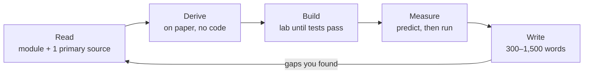

# 00 — How to learn at this level

This module is the operating system for everything else: a weekly loop that turns reading into artifacts, a memory system for the numbers you must know cold, and a prediction log that measures whether your understanding is real.
Read it once now, set up the three files it asks for (weekly review, deck, prediction log), and reread it at every monthly review.

**Contents:** [the loop](#1-the-loop-read--derive--build--measure--write) · [rules](#2-rules-that-separate-people-who-get-good-from-people-who-collect-tutorials) · [weekly template](#3-a-concrete-weekly-template) · [spaced repetition deck](#4-the-spaced-repetition-deck) · [prediction log](#5-the-prediction-log) · [reading papers](#6-reading-papers) · [tutors and LLMs](#7-using-llm-tutors-without-outsourcing-your-thinking) · [when stuck](#8-when-you-are-stuck) · [check yourself](#check-yourself)

---

## 1. The loop: Read → Derive → Build → Measure → Write

1. **Read** the module, then one primary paper. Skim first, then read the method section with a pen.
2. **Derive** the core equation on paper *before* looking at code: the backward pass, the loss, the FLOP count. If you cannot derive it, you have found the part to reread.
3. **Build** it from scratch in the lab until the tests pass. Look at the reference only after an honest attempt (at least 2 hours stuck on one thing). Then close it and rewrite from memory the next day.
4. **Measure:** predict a number (memory, tokens/s, loss after N steps), then measure it, then explain the gap. The gap between prediction and measurement is where you learn the most.
5. **Write** 300–1,500 words in [`journal/`](../journal/README.md). If you cannot explain it in writing, you do not understand it yet. The best entries become blog posts and interview stories.

> [!TIP]
> The loop fails most often at step 2. People read, then jump straight to code, and the tests become a guessing game. Put a 20-minute timer on the derivation, write it on paper, and photograph it into the journal entry. You will reuse those pages before every interview.

## 2. Rules that separate people who get good from people who collect tutorials

- **Outputs over inputs.** Track labs passed, experiments written up, PRs merged. Hours are an input. `python tools/progress.py` is the scoreboard.
- **Predict before you measure, every time.** Your calibration is the skill interviewers probe when they ask "roughly how long would that take?"
- **One primary source beats five explainers.** Explainers are for when you are stuck on a specific step, not a substitute for the paper.
- **Spaced repetition for facts and numbers** (§4). Ten minutes a day, every day, including rest days.
- **Implement the hard 20%.** Use libraries for plumbing; hand-write the core: the loss, attention, the sampler, the optimizer step.
- **Ship small, weekly.** A result every week beats a big result in six months that never ships.
- **Rewrite from memory.** A lab you passed once is at mastery level 3. Re-implementing its core from a blank file two weeks later, in under an hour, is what makes it stick for interviews.

## 3. A concrete weekly template

Budget: about 25 hours (5 weekdays × 2.5 h, plus 2 weekend blocks of 6 h). Scale every block proportionally if you have 12 or 40 hours; keep the shape.

| day | block 1 | block 2 | output by end of day |
|---|---|---|---|
| Mon (2.5 h) | 10 min deck review · 60 min read module section | 80 min derive on paper | one photographed derivation |
| Tue (2.5 h) | 10 min deck · 30 min DSA (1 problem) | 110 min lab work | at least 1 more test passing |
| Wed (2.5 h) | 10 min deck · 60 min primary paper, pass 2 | 80 min lab work | paper note in `journal/papers/` |
| Thu (2.5 h) | 10 min deck · 30 min DSA | 110 min lab work or rewrite-from-memory | lab tests green, or a written note on what blocks you |
| Fri (2.5 h) | 10 min deck · 20 min write 3 predictions for Saturday | 120 min drills, question bank, or mock interview | predictions logged before any run |
| Sat (6 h) | 3 h deep lab work or a GPU/CPU experiment | 3 h measure, compare with predictions | results table + plots in `journal/experiments/` |
| Sun (6 h, or rest) | 2 h write-up (300–1,500 words) | 1 h weekly review ([template](../journal/templates/weekly-review.md)), 1 h add cards, plan next week | published or committed write-up |

Rules for the template:
- **Friday predictions, Saturday measurements.** Writing predictions a day early stops you from adjusting them after seeing the first result.
- **Plan 80%, keep 20% slack.** Something always breaks: a driver, a dependency, a bug that takes a day.
- **Rest.** Take one full day off at least every two weeks, and protect sleep. Memory consolidation happens offline; cramming 40-hour weeks for a month usually ends in a lost month. See [career/sustainability.md](../career/sustainability.md).

A weekly review that works answers five questions in under 15 minutes: What did I ship? Which predictions missed, and by how much? What am I stuck on? What are next week's top three outputs? How is my energy (1–5)?

## 4. The spaced repetition deck

Use any spaced-repetition tool (Anki, Mochi, RemNote, or paper flashcards in Leitner boxes). The deck is for **facts you need instantly in an interview or while reading a paper**, not for understanding. Understanding comes from deriving and building; the deck protects what you have built from being forgotten.

**Card-writing rules** (adapted from Andy Matuschak's [*How to write good prompts*](https://andymatuschak.org/prompts/) and Michael Nielsen's [*Augmenting Long-term Memory*](http://augmentingcognition.com/ltm.html)):
- One fact per card. "Adam state bytes/param in fp32?" → "8 (m and v)". Not "Explain Adam."
- Ask for the *reason* as well as the number, on a separate card: "Why is batch-1 decode memory-bound?"
- Add cards only for things you have already derived or built. A card for a formula you never derived is a trivia card and decays fast.
- Delete or rewrite any card you fail three times; the card is badly written, or you need to go back to the derivation.

**Deck outline** (roughly 200 cards by the end of module 07; start with the first four sections):

| section | example cards (front → back) | source |
|---|---|---|
| Identities (≈30) | softmax CE gradient → `softmax(z) − onehot(t)` · softmax Jacobian → `diag(y) − yyᵀ` · `Y = XW` VJP → `X̄ = ȲWᵀ, W̄ = XᵀȲ` · LayerNorm VJP → `(ȳ − mean ȳ − x̂·mean(ȳ⊙x̂))/σ` · log-derivative trick · k3 KL estimator | [01](01-math.md) |
| FLOPs (≈20) | matmul `(m×k)(k×n)` → `2mkn` · forward per token → `2N` · training per token → `6N` · causal attention per token forward → `2·L·T·d` · Chinchilla tokens/param → ≈ 20 | [02](02-compute-and-hardware.md), [lab 03](../labs/03_napkin_math/README.md) |
| Memory (≈25) | mixed-precision Adam → 16 B/param · Adam state alone → 8 B/param · KV cache formula · Llama-2-70B KV per token (GQA, bf16) → 320 KiB · activations per layer → `34sbh + 5as²b` bytes | [02](02-compute-and-hardware.md) |
| Hardware (≈25) | H100 SXM dense bf16 → ~990 TFLOP/s · H100 HBM3 → ~3.35 TB/s · H100 ridge → ~295 FLOP/byte · A100 → 312 TFLOP/s, ~2.0 TB/s · RTX 5060 → 8 GB, 448 GB/s · warp → 32 threads · NVLink (H100) → ~900 GB/s · PCIe 5.0 x16 → ~64 GB/s per direction | [02](02-compute-and-hardware.md) |
| Number formats (≈15) | bf16 bits → 1/8/7 · bf16 epsilon → 2⁻⁷ ≈ 0.0078 · fp16 max → 65,504 · fp8 e4m3 max → 448 · e5m2 max → 57,344 | [02 §4](02-compute-and-hardware.md#4-number-formats-what-each-bit-buys) |
| Training defaults (≈20) | LLM AdamW betas → (0.9, 0.95) · weight decay → 0.1 · clip → 1.0 · initial loss → ln V (50,257 → 10.82) · Kaiming variance → 2/n_in · GPT-2 init std → 0.02, output projections scaled by 1/√(2L) | [03](03-deep-learning.md) |
| Architectures (≈30) | Llama-3-8B → 32 layers, d = 4096, 32 Q heads, 8 KV heads, V = 128,256 · GPT-2 small → 124,439,808 params | [04](04-transformers.md) |
| Inference and serving (≈20) | decode bound → bandwidth ÷ weight bytes · cost per M tokens → `$/h ÷ (tok/s × 3600) × 10⁶` | [07](07-inference.md) |
| Statistics (≈15) | SE of accuracy → `√(p(1−p)/n)` · 95% CI at p = 0.7, n = 1,000 → ±2.8 points | [08](08-evaluation-and-research.md) |

> [!TIP]
> Review cards out loud with a timer in the last week before an interview loop. The deck turns into the "napkin math" part of a system-design round: you want to say "an 8B model in bf16 is 16 GB, so on an H100 batch-1 decode is at most about 210 tokens per second" without reaching for a calculator.

## 5. The prediction log

One file, `journal/predictions.md`, one row per prediction. Write the prediction and the reason **before** running anything. Review the log monthly: are you biased (always too optimistic about speed)? Is your error shrinking?

Example entries. The "measured" values in rows 1–3 come from running this repo's reference solutions on CPU; row 4 shows the shape of an entry you fill in on your own GPU.

| date | what | prediction (and why) | measured | error | lesson |
|---|---|---|---|---|---|
| wk 2 | std of layer-30 activations, ReLU MLP, width 256, N(0, 1) init ([lab 02](../labs/02_training_core/README.md)) | ~10³¹: per-layer gain √(256/2) ≈ 11.3, and 11.3³⁰ ≈ 10³¹ | 2.5·10³¹ | within 3× | geometric growth is predictable from one layer |
| wk 2 | same, Kaiming init | 1.0 | 0.62 | 0.6× | finite width and batch make the variance drift; still O(1) |
| wk 1 | spirals MLP accuracy after 600 SGD steps ([lab 01](../labs/01_autograd/README.md)) | 95% | 99.3% | +4 pts | small MLPs fit 300 points easily; loss is the more sensitive signal |
| wk 5 | batch-1 decode tokens/s, 1.5B model in bf16 on RTX 5060 | ≤ 448 GB/s ÷ 3.1 GB ≈ 145, expect ~70% of that ≈ 100 | *(your number)* | | *(where the other 30% went: kernel launches, KV reads, sampling)* |

Scoring rule of thumb: within 2× is good for runtime and memory; within 20% is good for parameter counts and FLOPs, which are exact arithmetic. A miss bigger than 10× almost always means a unit error (bits vs bytes, GB vs GiB, per-token vs per-sequence) or a wrong mental model, and both are worth a journal paragraph.

## 6. Reading papers

- **Pass 1 (10 min):** abstract, figures, conclusion. What is the claim, and what evidence would falsify it?
- **Pass 2 (1 h):** method and experiments. What is compared against what, at what compute, with how many seeds? Are the baselines tuned as hard as the method?
- **Pass 3 (a day, for the few that matter):** reproduce one figure at small scale. Note every detail the paper left out.

For every paper, write: *claim · evidence · compute · what I'd test next · does it still hold?* ([template](../journal/templates/paper-notes.md)). The last question matters: many 2022–2023 results were overturned or absorbed within two years, and interviewers like candidates who know which.

## 7. Using LLM tutors without outsourcing your thinking

A strong language model is a tireless tutor and a terrible crutch. The difference is whether you do the thinking first.

**Good uses:**
- **Critique my derivation.** Paste *your* handwritten LayerNorm backward and ask where it is wrong, not for the answer.
- **Socratic mode.** Ask it to ask you questions about a topic, one at a time, and to not reveal answers until you commit.
- **Generate drills** from a module, then answer them out loud, timed, before looking at its answers.
- **Counterexamples.** "Give me a graph where visiting nodes in plain DFS order gives a wrong gradient."
- **Explain an error message or a stack trace** after you have formed your own hypothesis.

**Bad uses:**
- Asking for a lab solution you have not attempted. The tests will pass and you will have learned nothing you can reproduce in an interview.
- Accepting numbers without checking. Models state spec-sheet figures, parameter counts and memory sizes confidently and sometimes wrongly (off by a factor of 2 or 8 is common: bits vs bytes, K and V counted once, GQA forgotten). Verify against the paper, the config file, or your own lab 03 calculator.
- Pasting a whole paper and reading only the summary. You lose the details that matter (baselines, compute, seeds).

**A protocol that works:** attempt for 30–60 minutes → write down exactly what you are stuck on in one sentence → ask for a hint, not a solution → close the chat and continue → after solving, ask for a critique of your solution. Keep a line in the journal for each time you asked and what the hint was; if the same kind of hint recurs, that is a gap to study.

## 8. When you are stuck

1. Shrink the problem: one example, one layer, float64, batch size 1.
2. Print shapes at every step. Most bugs are shape or broadcasting bugs.
3. Compare against a trusted reference (PyTorch, NumPy, finite differences) on the smallest input that shows the bug.
4. Explain the problem out loud or in writing to someone (a study partner, a notebook). Stating the assumption is often enough to break it.
5. After 2 hours on one thing, read the reference for *that one thing only*, close it, and write it yourself.

## Check yourself

1. Why predict before measuring, instead of just measuring carefully?

Measuring tells you a number; predicting tells you whether your model of the system is right. A prediction that misses by 5× points at a wrong assumption (a memory-bound kernel you thought was compute-bound, a GiB/GB mix-up), and fixing that assumption is the learning. It is also exactly the skill tested in "estimate this" interview questions.

2. What belongs in the spaced-repetition deck and what does not?

Facts you need instantly and have already derived or built: identities, formulas, hardware numbers, defaults, architecture configs. Not: explanations you have not worked through, long lists, anything you could not reconstruct if the card disappeared.

3. You have 12 hours a week, not 25. What do you cut?

Keep the shape and halve each block: deck daily, one derivation, lab progress, one weekend measurement, one short write-up. Cut breadth (fewer papers, fewer DSA problems), not the loop. A 300-word write-up is still a write-up.

4. When should you look at a lab's reference solution?

After an honest attempt: at least 2 hours stuck on one specific thing. Read only the part you are stuck on, close it, and write your own version. The next day, rewrite the whole core from a blank file.

5. Your prediction for tokens/s was 3× too high. Name three likely causes.

The kernel is memory-bound and you used the compute peak; you forgot a memory term (KV-cache reads, dequantization, activations); overheads you did not model (kernel launch latency, Python, synchronization, sampling on the CPU). Unit errors (GB vs GiB, bits vs bytes) are the fourth usual suspect.

6. How do you use an LLM on a lab without outsourcing it?

Attempt first, ask for a hint on one precisely stated sticking point, never for the solution; ask for a critique after you have a working answer; verify any number it gives you against a primary source or your own calculator.

7. What makes a weekly review useful rather than a diary?

It measures outputs (what shipped), calibration (which predictions missed and why), and blockers, and it ends with three concrete outputs for next week. If you cannot name what shipped, the week's plan was too vague.

## Read next
[01 Math](01-math.md) → then [lab 01](../labs/01_autograd/README.md). Set up `journal/predictions.md`, a deck with the "Identities" section, and a weekly review file before you start.
