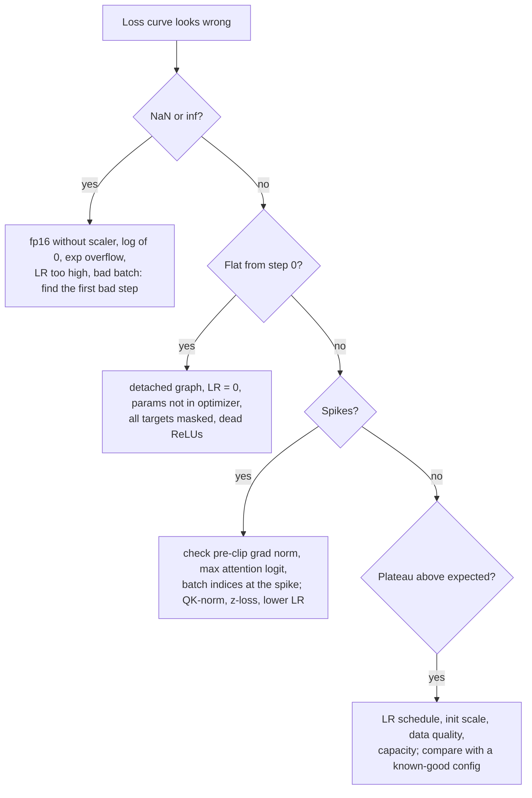

# 03 — Deep learning, the parts that matter at scale

What `backward()` really does, why initialization and normalization decide whether a deep network trains at all, how Adam and its successors work down to the bias correction, and a playbook for debugging a run from its curves.
Mastery target: given a diverging or flat training run, name the three most likely causes from the curves alone, and derive every default (Kaiming variance, $1/\sqrt{2L}$, β₂ = 0.95, the first Adam step) from first principles.

Labs: [01 autograd](../labs/01_autograd/README.md), [02 training core](../labs/02_training_core/README.md).

**Contents:** [1 Autodiff](#1-autodiff-what-backward-actually-does) · [2 Initialization](#2-initialization-keeping-signals-alive) · [3 Normalization](#3-normalization-and-the-residual-stream) · [4 Optimizers](#4-optimizers) · [5 Schedules](#5-schedules-and-batch-size) · [6 Mixed precision](#6-mixed-precision) · [7 Debugging playbook](#7-debugging-a-training-run-the-playbook) · [Interview traps](#interview-traps) · [CPU vs GPU notes](#cpu-vs-gpu-notes) · [Check yourself](#check-yourself) · [Visual guides](#visual-guides) · [Read next](#read-next)

---

## 1. Autodiff: what backward() actually does

A program is a DAG of ops. Reverse mode walks it in reverse topological order, applies each op's VJP ([01 §2](01-math.md#2-matrix-calculus-the-only-calculus-you-need)), and **sums gradients where paths merge**:

```
 forward:   x ──┬──▶ (*) ──▶ a = x·x ──┐
                └────────────────────▶ (+) ──▶ y = x·x + x
 backward:  ȳ = 1
            ā = ȳ = 1            (+ passes the gradient to both inputs)
            x̄ = ā·2x  +  ȳ·1     (two paths into x, summed)  = 2x + 1
```

A node may only propagate once every consumer has contributed; that is why the order is topological and why lab 01's `test_node_used_twice_accumulates` exists.

**Cost.** For a scalar loss, one backward pass costs a small constant multiple of the forward pass whatever the number of parameters: about 2× for matmul-dominated networks ([02 §5](02-compute-and-hardware.md#5-flop-accounting)). That is why deep learning is possible. Forward mode (JVPs) costs one pass per *input* direction, so it wins only for few inputs and many outputs.

**Memory is the price.** Backward needs the forward's intermediates. Hence activation checkpointing (store every $k$-th layer input, recompute the rest; $k \approx \sqrt{L}$ gives $O(\sqrt{L})$ memory for one extra forward), recomputation inside kernels (FlashAttention recomputes $P$), and offloading to CPU memory.

**What PyTorch does, concretely:**
- The graph is built while the forward runs (define-by-run). Each op's `grad_fn` saves the tensors its VJP needs.
- `loss.backward()` frees those saved tensors as it goes, so a second `backward()` through the same graph fails unless you passed `retain_graph=True`.
- Gradients **accumulate** into `.grad` of leaf tensors. That is what makes gradient accumulation work, and why you must `zero_grad()` every step. Non-leaf tensors do not keep `.grad` unless you call `retain_grad()`.
- In-place ops bump a version counter; if a saved tensor was modified, backward raises "one of the variables needed for gradient computation has been modified by an inplace operation".
- `torch.no_grad()` and `torch.inference_mode()` skip recording; `.detach()` cuts the graph at one tensor.

Writing your own VJP is one class (runs on CPU; `gradcheck` needs float64):
```python
import torch

class RMSNormFn(torch.autograd.Function):
    @staticmethod
    def forward(ctx, x, eps=1e-6):
        r = torch.sqrt(x.pow(2).mean(-1, keepdim=True) + eps)
        xhat = x / r
        ctx.save_for_backward(xhat, r)          # what backward needs, nothing more
        return xhat

    @staticmethod
    def backward(ctx, gy):
        xhat, r = ctx.saved_tensors
        gx = (gy - xhat * (gy * xhat).mean(-1, keepdim=True)) / r
        return gx, None                         # one gradient per forward input

x = torch.randn(3, 8, dtype=torch.float64, requires_grad=True)
print(torch.autograd.gradcheck(RMSNormFn.apply, (x,)))   # True
```

## 2. Initialization: keeping signals alive

**Forward derivation.** For $y_i = \sum_{j=1}^{n_\text{in}} W_{ij}x_j$ with $W$ zero-mean, independent of $x$ and of each other:
$$\mathrm{Var}(y_i) = n_\text{in}\,\mathrm{Var}(W)\,\mathbb{E}[x_j^2].$$
If $x = \mathrm{ReLU}(z)$ with $z$ symmetric around 0, half of $z$'s second moment survives: $\mathbb{E}[x^2] = \mathrm{Var}(z)/2$. So pre-activations evolve as $\mathrm{Var}(z_{l+1}) = \tfrac12 n_\text{in}\mathrm{Var}(W)\,\mathrm{Var}(z_l)$, which is stable only if
$$\mathrm{Var}(W) = \frac{2}{n_\text{in}} \qquad\text{(Kaiming / He, for ReLU).}$$
For linear or tanh-like layers (slope 1 at 0) the factor ½ disappears: $\mathrm{Var}(W) = 1/n_\text{in}$ (LeCun).

**Backward derivation.** $\bar{x}_j = \sum_i W_{ij}\bar{y}_i$ gives $\mathrm{Var}(\bar{x}) = n_\text{out}\mathrm{Var}(W)\mathrm{Var}(\bar{y})$, so gradients want $\mathrm{Var}(W) = 1/n_\text{out}$ (times 2 for ReLU). Glorot/Xavier compromises between the two: $\mathrm{Var}(W) = 2/(n_\text{in} + n_\text{out})$. For uniform init, $\mathrm{Var}(U(-a, a)) = a^2/3$, so Kaiming-uniform uses $a = \sqrt{6/n_\text{in}}$ (lab 01's `Linear`).

**Worked numbers** (lab 02's `activation_stds`: 30 bias-free ReLU layers, width 256, batch 512; measured with the reference solution):

| init | predicted per-layer gain on the std | predicted layer-30 std | measured layer-30 std |
|---|---|---|---|
| N(0, 1) | $\sqrt{256/2} = 11.3$ | ~10³¹ | 2.5·10³¹ |
| N(0, 0.01²) | $0.01\sqrt{128} = 0.113$ | ~10⁻²⁹ | 2.5·10⁻²⁹ |
| Kaiming N(0, 2/256) | 1.0 | O(1) | 0.62 |

**Residual networks.** $x_{l+1} = x_l + f_l(x_l)$ adds each branch's variance to the stream. A transformer has $2L$ branches (attention and MLP per layer), so if each adds variance $v$, the stream's variance grows like $2Lv$. GPT-2 scales the init of each branch's output projection by $1/\sqrt{2L}$ so the total added variance stays independent of depth. **Worked:** GPT-2 small uses std 0.02 everywhere and $0.02/\sqrt{24} = 0.0041$ for the 24 output projections of its 12 layers.

**At the output,** you want near-uniform predictions so the initial loss is $\ln V$ ([§7](#7-debugging-a-training-run-the-playbook)): small or zero-initialized LM-head weights, or a final norm with small logits.

**μP** (Yang et al., Tensor Programs V, [arXiv:2203.03466](https://arxiv.org/abs/2203.03466)) goes further: it scales init *and* per-layer learning rates with width so the best hyperparameters found on a narrow proxy transfer to a wide model. For Adam, the rules to remember (Table 3 of the paper has the full set):

| parameter | init variance | Adam learning rate |
|---|---|---|
| embeddings and biases | ∝ 1/fan_in | constant in width |
| hidden matrices | ∝ 1/fan_in | ∝ 1/fan_in |
| output (unembedding) | ∝ 1/fan_in² (equivalently, logits multiplied by 1/width) | ∝ 1/fan_in |
| attention logits | scale by $1/d_h$ instead of $1/\sqrt{d_h}$ | |

Under standard parameterization the optimal learning rate shifts as width grows; under μP it stays put. That is how labs tune very large models on small proxies.

## 3. Normalization and the residual stream

```
 post-norm (original Transformer)          pre-norm (GPT-2 onward, Llama, most LLMs)
   x ──┬──▶ f ──▶(+)──▶ LN ──▶ x'            x ──┬──▶ LN ──▶ f ──▶(+)──▶ x'
       └─────────▲                               └──────────────────▲
   every gradient passes through LN          identity path from loss to every layer
```

- **Pre-norm** keeps an identity gradient path through depth, so deep stacks train without careful warmup (Xiong et al., 2020, [arXiv:2002.04745](https://arxiv.org/abs/2002.04745)). The cost: the residual stream's norm grows with depth, so later layers' writes are relatively smaller, and a final norm before the LM head is required.
- **Post-norm** can reach slightly better quality when it trains, but needs long warmup and is fragile at depth.
- **LayerNorm vs RMSNorm.** RMSNorm drops the centering and the bias: cheaper, and as good in practice (Llama, Qwen, Mistral). Their backward passes are derived in [01 §2.4](01-math.md#24-layernorm-backward-derived).
- **Scale invariance.** A weight matrix $W$ that feeds a norm has no preferred scale: the function of $cW$ equals that of $W$, and the gradient scales as $1/c$. The effective step on $W$'s *direction* is about $\eta/\|W\|^2$, so weight decay (which shrinks $\|W\|$) acts as a learning-rate *increase* on those weights, and training settles into an equilibrium norm. This is why weight decay still matters in fully normalized networks.
- **The residual stream** is a shared channel every layer reads from (through a norm) and writes to (through an output projection). Interpretability builds on this view ([09](09-interpretability-and-safety.md)).

## 4. Optimizers

### Adam, with the bias correction derived

$$m_t = \beta_1 m_{t-1} + (1-\beta_1)g_t,\qquad v_t = \beta_2 v_{t-1} + (1-\beta_2)g_t^2,\qquad \theta_t = \theta_{t-1} - \eta\,\frac{\hat{m}_t}{\sqrt{\hat{v}_t} + \epsilon}.$$

Unrolling from $m_0 = 0$: $m_t = (1-\beta_1)\sum_{i=1}^t\beta_1^{t-i}g_i$. If the gradients are stationary with mean $\mathbb{E}[g]$,
$$\mathbb{E}[m_t] = \mathbb{E}[g]\,(1-\beta_1)\sum_{i=1}^{t}\beta_1^{t-i} = \mathbb{E}[g]\,(1-\beta_1^t),$$
so $\hat{m}_t = m_t/(1-\beta_1^t)$ is unbiased; likewise $\hat{v}_t = v_t/(1-\beta_2^t)$.

**Consequences you can check:**
- At $t = 1$: $\hat{m}_1 = g$, $\hat{v}_1 = g^2$, so the first update is $\eta\,g/|g| = \eta\,\mathrm{sign}(g)$ (up to $\epsilon$), whatever the gradient's scale. Lab 02's `test_first_adam_step_has_magnitude_lr` checks exactly this.
- **Without** correction the update is off by $(1-\beta_1^t)/\sqrt{1-\beta_2^t}$:

| step $t$ | 1 | 10 | 100 | 1000 |
|---|---|---|---|---|
| β = (0.9, 0.999) | 3.16× | 6.53× | 3.24× | 1.26× |
| β = (0.9, 0.95) | 0.45× | 1.03× | 1.00× | 1.00× |

With the classic β₂ = 0.999, uncorrected early steps are several times **too large**, not too small, because $v$ starts much further below its target than $m$ does.

**Why LLMs use β₂ = 0.95.** $v$ averages over roughly $1/(1-\beta_2)$ steps: 20 instead of 1,000. **Worked:** in steady state with $g = 1$ (so $m = v = 1$), a single 10× gradient spike gives $m = 1.9$. With β₂ = 0.999, $v = 1.099$ and the update is $1.9/\sqrt{1.099} = 1.81$, almost double. With β₂ = 0.95, $v = 5.95$ and the update is $0.78$: the spike is damped instead of amplified.

**ε matters more than it looks.** When the gradient RMS of some parameters falls toward $\epsilon$ (tiny gradients in large models, or bf16 gradients), $\sqrt{\hat v} + \epsilon$ is dominated by $\epsilon$ and those updates shrink. Wortsman et al. (2023, [arXiv:2309.14322](https://arxiv.org/abs/2309.14322)) show this at scale and use a much smaller ε.

### AdamW: why the decay is decoupled

Adam with L2 regularization adds $\lambda\theta$ to the gradient, and then divides it by $\sqrt{\hat{v}}$: parameters with large gradient history are barely regularized. AdamW (Loshchilov & Hutter, [arXiv:1711.05101](https://arxiv.org/abs/1711.05101)) applies the decay directly: $\theta \leftarrow \theta(1-\eta\lambda) - \eta\,\hat{m}/(\sqrt{\hat{v}}+\epsilon)$. In PyTorch the decay is multiplied by the current learning rate, so it follows the schedule. The decay timescale is $1/(\eta\lambda)$ steps: with $\eta$ = 3e-4 and $\lambda$ = 0.1, that is 33k steps, and a weight with no gradient signal shrinks to $e^{-3} \approx 5\%$ over 100k steps at constant LR.

LLM defaults: β = (0.9, 0.95), λ = 0.1 (not on norms, biases or often embeddings), gradient clipping at 1.0, ε = 1e-8 unless you have a reason. State: two fp32 tensors, 8 bytes/param.

### Muon and the rest

- **Muon** (Keller Jordan, [2024 write-up](https://kellerjordan.github.io/posts/muon/)): momentum for each 2-D hidden matrix, orthogonalized with a few Newton–Schulz iterations ($M = USV^\top \to UV^\top$), so every singular direction moves the same amount. Embeddings, the LM head, norms and biases stay on AdamW. State: 4 bytes/param. Moonshot's *Muon is Scalable for LLM Training* ([arXiv:2502.16982](https://arxiv.org/abs/2502.16982)) adds weight decay and rescales updates to AdamW-like RMS; their Moonlight and Kimi K2 models were trained with Muon variants.
- **Lion:** the sign of an interpolated momentum; 4 bytes/param; needs a smaller LR and larger weight decay than AdamW.
- **Adafactor:** factors the second moment of an $n\times m$ matrix into row and column statistics, $O(n + m)$ memory instead of $O(nm)$.
- **Shampoo / SOAP:** Kronecker-factored preconditioners; strong per-step, heavier per step.
- **8-bit optimizer states** (block-wise quantized $m$ and $v$): about 2 bytes/param of state.

| optimizer | state bytes/param (fp32 states) |
|---|---|
| SGD / SGD + momentum | 0 / 4 |
| AdamW | 8 |
| Muon (hidden matrices) | 4 |
| Lion | 4 |
| 8-bit AdamW | ~2 |

## 5. Schedules and batch size

```
 LR   cosine                                  WSD (warmup-stable-decay)
 peak ┤  ╭──╮                                  ┤  ╭──────────────────╮
      │ ╱    ╲___                              │ ╱                    ╲
      │╱         ╲___                          │╱                      ╲
 min  ┼───────────────╲────▶ step              ┼────────────────────────╲──▶ step
       warmup  decay over the whole run         warmup  flat         decay (last 10–20%)
```

- **Warmup** (~1–2% of steps, or a few thousand): early on, Adam's $\hat v$ estimates are noisy and the loss surface is sharp, so full-size steps can push the model somewhere it never recovers from. RAdam (Liu et al., [arXiv:1908.03265](https://arxiv.org/abs/1908.03265)) traces this to the variance of the adaptive learning rate in the first steps.
- **Cosine** to ~10% of peak by the final step. You must fix the step count in advance.
- **WSD** holds the peak and decays over the last 10–20% (MiniCPM, [arXiv:2404.06395](https://arxiv.org/abs/2404.06395)). You can branch cooldowns off one long stable run to get several finished models at different token counts, and continue training later. With a good cooldown it matches cosine (Hägele et al., [arXiv:2405.18392](https://arxiv.org/abs/2405.18392)), which makes it the natural schedule for scaling-law sweeps ([lab 08](../labs/08_scaling_laws/README.md)).
- **Critical batch size** (McCandlish et al., [arXiv:1812.06162](https://arxiv.org/abs/1812.06162)): below it, doubling the batch nearly halves the steps needed; above it, extra batch buys almost nothing. It grows as the loss falls, which is why large runs ramp the batch size up.
- **LR vs batch.** For SGD, scale the LR linearly with batch (up to a point). For Adam, scaling by about $\sqrt{k}$ when the batch grows $k\times$ is a starting guess, not a law; re-tune near the critical batch size.

> [!TIP]
> Log the learning rate you actually applied, every step, from the optimizer's `param_groups`. Off-by-one warmup bugs (LR = 0 at step 0, so step 0 is wasted), schedules that restart on resume, and schedules computed from the wrong total step count are common and invisible in the loss curve until much later.

## 6. Mixed precision

- **bf16 autocast with fp32 master weights.** Matmuls run in bf16 on tensor cores; softmax, norms, losses and reductions run in fp32; weights and optimizer states stay fp32 ([02 §4](02-compute-and-hardware.md#4-number-formats-what-each-bit-buys) shows why: bf16's gap after 1.0 is 0.0078).
- **fp16 needs dynamic loss scaling.** Multiply the loss by $S$ before backward so small gradients do not underflow; unscale before the optimizer step; if any gradient is inf/NaN, skip the step and halve $S$; after a run of good steps, double it. PyTorch's `GradScaler` starts at $S = 2^{16}$ and tries to grow every 2,000 steps. Always unscale **before** gradient clipping, or you clip the scaled norm.
- **bf16 needs no scaler** (fp32's exponent range).
- **FP8 training** (DeepSeek-V3 style) needs fine-grained block scaling and high-precision accumulation; see [02 §4](02-compute-and-hardware.md#4-number-formats-what-each-bit-buys).

## 7. Debugging a training run (the playbook)

1. **Initial loss ≈ ln V.** 10.82 for V = 50,257 (GPT-2), 11.76 for 128,256 (Llama 3), 10.37 for 32,000 (Llama 2). Much higher means logits are too large at init (big LM-head init, no final norm). Much lower means label leakage (targets not shifted, or causal mask missing).
2. **Overfit one batch** to near-zero loss. If you cannot, there is a bug, not a hyperparameter problem.
3. **Read the data.** Decode a batch back to text and check that `targets` are `inputs` shifted by one, that masks cover what you think, and that padding is ignored.
4. **Log the right signals:** per-layer gradient norms, pre-clip global norm, update-to-weight ratio (~1e-3 per step is a common healthy range), max attention logit, output logit norm, the applied LR, and (fp16) the loss scale.
5. **LR range test.** Sweep the LR over a few hundred steps. Flat loss means the LR is too low or the graph is detached; oscillation or spikes mean it is too high, or there is a bad batch or logit growth.
6. **Most bugs are data bugs:** truncation, shuffling, masking, tokenizer mismatch, duplicated shards, eval leakage.
7. **Gradient accumulation normalization:** divide by total valid tokens across micro-batches, not by micro-batch count ([lab 02](../labs/02_training_core/README.md#7-clipping-and-accumulation)).
8. **Seeds.** Run two seeds before believing a difference smaller than the seed-to-seed spread.



| symptom | most likely causes |
|---|---|
| loss is NaN at step 1 | log of 0 or exp overflow in a hand-written loss; fp16 overflow; uninitialized memory (`torch.empty`) used as weights |
| loss stuck at exactly ln V | outputs independent of inputs: detached graph, zeroed attention, wrong targets |
| loss falls, then slowly rises | LR too high for late training, no decay; or train/eval mismatch |
| spikes at the same step across seeds | a bad data shard at a fixed position; inspect those batches |
| spikes at random steps, growing | attention-logit or output-logit growth; lower LR, QK-norm, z-loss ([05 §6](05-pretraining.md#6-stability-at-scale)) |
| sharp drop at each epoch boundary | memorization of repeated data; check duplicates and epoch count |
| validation loss below training loss | dropout on in training only, or eval set easier or leaked |
| tokens/s drops over time | data loader starvation, growing Python lists, memory fragmentation |

---

## Interview traps

- **"Bias correction makes early Adam steps bigger."** It depends on the betas. With (0.9, 0.999), uncorrected steps would be *several times too large*; correction shrinks them. With (0.9, 0.95), correction enlarges the first steps (0.45× → 1×).
- **"Kaiming is 1/n_in."** For ReLU it is $2/n_\text{in}$; $1/n_\text{in}$ is LeCun (linear or tanh-like).
- **"Weight decay is L2 regularization."** Only for SGD. In Adam, L2 gets divided by $\sqrt{\hat v}$; AdamW decouples it. For weights feeding a norm, decay changes the effective learning rate, not the function.
- **"Pre-norm is strictly better."** It trains more reliably; post-norm can be better when it trains. Know the trade-off.
- **"Checkpointing halves memory for free."** It costs about one extra forward (≈ +33% compute) and only helps activation memory, not weights or optimizer state.
- **"Adam's ε is irrelevant."** It sets a floor on the denominator and matters when gradients are tiny.
- **Clipping before unscaling** in fp16 training: the scaled norm is huge, so clipping fires every step, and the later unscale shrinks the real gradient by the loss scale.
- **Blaming hyperparameters first.** Overfit one batch before touching the LR.

## CPU vs GPU notes

- Every lab 01 and lab 02 test runs on CPU (lab 02's AdamW check runs in float64, where bitwise-close comparison with PyTorch is meaningful). The spirals MLP in lab 01 is pure NumPy; on a slow CPU the full training test takes about a minute.
- On GPU, the same code differs in three ways: bf16/TF32 precision (compare to a float64 CPU reference, not bitwise), non-deterministic reductions (atomics in backward of `index_add_`, some attention kernels), and speed that depends on batch size far more than on CPU.
- Debug on CPU in float64 at tiny sizes, then move to GPU. A bug that shows up only on GPU is usually precision (fp16 overflow, bf16 accumulation) or a missing `.to(device)` that silently leaves one tensor on CPU and makes everything slow.
- On an 8 GB GPU, the memory hierarchy of a training step is: weights + grads + optimizer state (16 B/param), then activations (§1 and [02 §6](02-compute-and-hardware.md#6-memory-accounting)). Checkpointing and smaller micro-batches with gradient accumulation are the two levers you will use most.

## Check yourself

<details><summary>1. Derive Kaiming initialization in four lines.</summary>

$\mathrm{Var}(y_i) = n_\text{in}\mathrm{Var}(W)\mathbb{E}[x^2]$ for independent zero-mean weights. With $x = \mathrm{ReLU}(z)$ and symmetric $z$, $\mathbb{E}[x^2] = \mathrm{Var}(z)/2$. For $\mathrm{Var}(z_{l+1}) = \mathrm{Var}(z_l)$ you need $n_\text{in}\mathrm{Var}(W)/2 = 1$. So $\mathrm{Var}(W) = 2/n_\text{in}$.
</details>

<details><summary>2. Why does GPT-2 scale residual output projections by 1/√(2L)?</summary>

The residual stream is the sum of $2L$ branch outputs (attention and MLP per layer). If each adds variance $v$, the stream's variance grows by $2Lv$. Scaling each branch's output std by $1/\sqrt{2L}$ scales each $v$ by $1/(2L)$, so the total added variance is independent of depth.
</details>

<details><summary>3. Show that the first Adam step has magnitude η whatever the gradient scale.</summary>

At $t = 1$: $m_1 = (1-\beta_1)g$, $v_1 = (1-\beta_2)g^2$. Bias correction gives $\hat m_1 = g$, $\hat v_1 = g^2$. The update is $\eta\,g/(|g| + \epsilon) \approx \eta\,\mathrm{sign}(g)$. A gradient of 1e-5 and one of 50 move their parameters by the same amount.
</details>

<details><summary>4. Why do LLMs use β₂ = 0.95 instead of 0.999?</summary>

$v$ remembers about $1/(1-\beta_2)$ steps: 20 instead of 1,000. After a gradient spike, a short memory raises $v$ quickly and damps the step (0.78× in the worked example), while β₂ = 0.999 barely moves $v$ and the spike nearly doubles the step (1.81×). Fast adaptation matters more than a smooth estimate in long, spiky LLM runs.
</details>

<details><summary>5. What does "decoupled" mean in AdamW, and when does the difference matter?</summary>

The decay $\theta \leftarrow \theta(1-\eta\lambda)$ is applied directly, not added to the gradient where Adam's $\sqrt{\hat v}$ would rescale it. With L2-in-Adam, parameters with large gradients get little regularization and those with small gradients get a lot. It matters whenever gradient scales differ across parameters, which is always in transformers.
</details>

<details><summary>6. Your fresh 128k-vocab model starts at loss 25. What is wrong?</summary>

Expected $\ln(128{,}256) \approx 11.76$. 25 means the logits are far from uniform at init: the LM head is initialized too large, there is no final norm, or a multiplier (e.g. a μP output multiplier) was applied the wrong way round.
</details>

<details><summary>7. Loss is flat and every gradient norm is ~1e-9. List three causes.</summary>

A detached graph (`.detach()`, `torch.no_grad()`, an assignment through `.data`); dead ReLUs or saturated activations; a loss multiplied by zero (all targets equal to `ignore_index`); an LR of 0 from a schedule bug; parameters not passed to the optimizer (their gradients would be non-zero, though, so check `.grad` directly).
</details>

<details><summary>8. Why can weight decay increase the effective learning rate?</summary>

For weights feeding a norm, the function is invariant to their scale and the gradient scales as $1/\|W\|$. The change in *direction* per step is about $\eta/\|W\|^2$. Decay shrinks $\|W\|$, so each step turns the direction more: a larger effective learning rate.
</details>

<details><summary>9. When would you choose WSD over cosine?</summary>

When you do not know the final step count, want to continue training later, or need several finished checkpoints at different token budgets from one run (scaling-law sweeps). Cosine needs the total length up front; WSD decays only at the end, and branches of it match cosine after a proper cooldown.
</details>

<details><summary>10. In fp16 training with clipping at 1.0, the loss barely moves. What did you forget?</summary>

To unscale the gradients before clipping (`scaler.unscale_(optimizer)` before `clip_grad_norm_`). With a loss scale of 65,536 the scaled norm is enormous, so clipping fires every step and normalizes the *scaled* gradients to norm 1; `scaler.step` then divides by 65,536 again, and the real update is tiny. The pre-clip norm you log is also meaningless until you unscale.
</details>

## Visual guides

- deeplearning.ai AI Notes, [Initializing neural networks](https://www.deeplearning.ai/ai-notes/initialization/): interactive plots of activations and gradients exploding and vanishing as you change the init, the picture behind §2.
- Gabriel Goh, [Why Momentum Really Works](https://distill.pub/2017/momentum/) (distill.pub): interactive momentum dynamics on quadratics, the intuition behind §4.
- Andrej Karpathy, [micrograd](https://github.com/karpathy/micrograd): a ~100-line autograd engine with a companion video lecture linked from its README; watch it after lab 01 to compare designs.

More per-topic visuals are collected in the [library](../library/README.md).

## Read next

- [04 Transformers](04-transformers.md): where these pieces sit in a modern LLM.
- [Lab 02](../labs/02_training_core/README.md): implement AdamW to 1e-10 against PyTorch, Muon, both schedules and correct accumulation.
- Karpathy, [*A Recipe for Training Neural Networks*](https://karpathy.github.io/2019/04/25/recipe/) (2019); Google, [*Deep Learning Tuning Playbook*](https://github.com/google-research/tuning_playbook); Wortsman et al. 2023 (small-scale proxies for large-scale instabilities); Yang et al. 2022 (μP).
