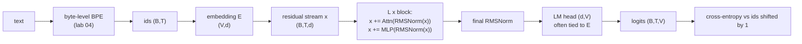
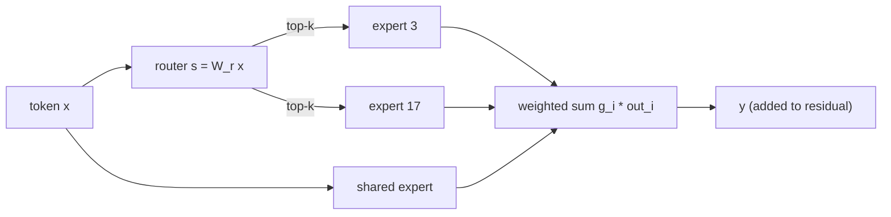

# 04 — Transformers

How a modern decoder-only LLM turns token ids into next-token probabilities, derived piece by piece with numbers you can check.
The mastery target is to implement a Llama-style model from a blank file and to defend every architectural choice (attention scaling, RoPE, GQA/MLA, SwiGLU, MoE, SSM hybrids) with arithmetic.

Labs: [04 tokenizer](../labs/04_tokenizer/README.md), [05 GPT](../labs/05_transformer/README.md), [06 kernels](../labs/06_attention_kernels/README.md), [07 KV cache](../labs/07_kv_cache_sampling/README.md).

**Contents:** [1 Tokens in, logits out](#1-tokens-in-logits-out) · [2 Attention](#2-attention) · [3 Positional information](#3-positional-information) · [4 The MLP and the block](#4-the-mlp-and-the-block) · [5 Parameter and FLOP accounting](#5-parameter-and-flop-accounting) · [6 Mixture of experts](#6-mixture-of-experts) · [7 Stability tricks](#7-stability-tricks-you-will-see-in-configs) · [8 Beyond vanilla attention](#8-beyond-vanilla-attention) · [Interview traps](#interview-traps) · [CPU vs GPU notes](#cpu-vs-gpu-notes) · [Check yourself](#check-yourself) · [Visual guides](#visual-guides) · [Read next](#read-next)

---

## 1. Tokens in, logits out



Byte-level BPE turns text into ids; an embedding table maps ids to $d$-dimensional vectors; $L$ blocks read from and write to the **residual stream**; a final norm and the LM head produce $V$ logits per position. Next-token cross-entropy, $-\log p(x_{t+1}\mid x_{\le t})$ averaged over positions, trains everything jointly. One forward pass gives a training signal at every position at once, which is why decoder-only pretraining is so data-efficient per FLOP.

Three facts to carry around:

- **Initial loss is $\ln V$.** At init the logits are near zero, so the prediction is near-uniform. For $V = 50{,}257$ that is 10.82 nats; for byte-level $V = 256$ it is 5.55. If your first logged loss is far from this, your init or your targets are wrong (lab 05 has a test for exactly this, and a subtle tied-embedding effect that breaks it).
- **The LM head is not free.** It costs $2dV$ FLOPs per token forward. For Llama-3-8B ($d = 4096$, $V = 128{,}256$) that is 1.05 GFLOP of the ~16 GFLOP forward pass, about 6.5%. For small models with big vocabularies it can dominate, which matters for scaling-law fits (see [05 §3](05-pretraining.md#3-scaling-laws)).
- **The tokenizer is frozen forever.** Digit grouping, whitespace handling, Indic combining marks and special tokens are properties of the model that no amount of training can fix. [Lab 04](../labs/04_tokenizer/README.md) shows GPT-4's cl100k regex splitting every Telugu word at its vowel signs.

> [!TIP]
> When you read any new model card, find four numbers first: $d$, $L$, $H/H_{kv}$ and $V$. Everything else in this module (parameters, FLOPs, KV cache, communication) follows from them and a few ratios.

## 2. Attention

Per head, with $Q = XW_Q$, $K = XW_K$, $V = XW_V$ and a causal mask $M$ ($0$ on and below the diagonal, $-\infty$ above):

$$\mathrm{Attn}(Q,K,V) = \mathrm{softmax}\!\left(\frac{QK^\top}{\sqrt{d_h}} + M\right)V$$

The heads' outputs are concatenated and projected by $W_O$ back into the residual stream.

### Why divide by $\sqrt{d_h}$

Assume the entries of $q$ and $k$ are independent with mean 0 and variance 1 (roughly what a norm layer plus a sensible init gives you). Then

$$\mathrm{Var}(q\cdot k) = \sum_{i=1}^{d_h}\mathrm{Var}(q_i k_i) = \sum_{i=1}^{d_h}\mathbb{E}[q_i^2]\,\mathbb{E}[k_i^2] = d_h .$$

So unscaled logits have standard deviation $\sqrt{d_h}$ (11.3 for $d_h = 128$). The softmax of logits that spread is close to one-hot, and its Jacobian $\partial p/\partial z = \mathrm{diag}(p) - pp^\top$ is then close to zero in every entry: attention stops learning. Dividing by $\sqrt{d_h}$ restores unit variance.

Checkable numbers (1,024 keys, Gaussian q and k, averaged over 300 draws; `ln 1024 = 6.93` is the maximum entropy):

| $d_h$ | unscaled: mean max prob | unscaled: entropy (nats) | scaled: mean max prob | scaled: entropy |
|---|---|---|---|---|
| 16 | 0.39 | 2.57 | 0.017 | 6.42 |
| 64 | 0.72 | 0.85 | 0.016 | 6.43 |
| 128 | 0.79 | 0.59 | 0.017 | 6.43 |

Reproduce it in ten lines of NumPy. Note that this argument fixes the *initial* scale only. During training, $\|q\|$ and $\|k\|$ can grow without bound and push the logits back into saturation; that is the attention-logit-growth instability that QK-norm fixes (§7).

### Heads as low-rank bilinear forms

The score head $h$ gives token $i$ attending to token $j$ is $x_i W_Q^h (W_K^h)^\top x_j^\top$: a bilinear form with matrix $W_{QK}^h = W_Q^h (W_K^h)^\top \in \mathbb{R}^{d\times d}$ of rank at most $d_h$. What the head writes is $x_j W_V^h W_O^h$, again a rank-$d_h$ matrix $W_{OV}^h$. This is the **QK circuit** (where to look) and **OV circuit** (what to move) decomposition from *A Mathematical Framework for Transformer Circuits*, and it is the language of [module 09](09-interpretability-and-safety.md). Consequences:

- Only the products $W_QW_K^\top$ and $W_VW_O$ matter; any invertible $R$ with $W_Q \to W_QR$, $W_K \to W_KR^{-\top}$ leaves the model unchanged. Individual weight matrices are not interpretable; circuits are.
- Multi-head attention with $H$ heads of size $d/H$ costs the same FLOPs as one head of size $d$, but gives $H$ independent attention patterns.

### Cost

For a sequence of length $T$, per layer, forward: the projections cost $2T\cdot(2d^2 + 2d\,H_{kv}d_h)$ FLOPs, the scores $QK^\top$ cost $2T^2d$ and the weighted sum costs another $2T^2d$ (halve both with causal masking if your kernel skips masked blocks). The $T^2$ terms dominate once $T$ exceeds a few times $d$. Memory is the other bottleneck: a naive implementation materializes the $T\times T$ matrix per head, which FlashAttention avoids by tiling with an online softmax ([lab 06](../labs/06_attention_kernels/README.md)).

### KV-cache arithmetic: MHA, GQA, MQA, MLA

During generation each new token attends to all previous keys and values, so they are cached. Bytes per token, summed over layers:

$$\text{KV bytes/token} = 2\,(\text{K and V}) \times L \times H_{kv} \times d_h \times \text{bytes/element}$$

| variant | what is cached per token per layer | Llama-3-8B shape ($L=32$, $d_h=128$), bf16 | at 8k context, batch 32 |
|---|---|---|---|
| MHA ($H_{kv} = H = 32$) | K, V for every head | 2·32·32·128·2 = 512 KiB | 128 GiB |
| GQA ($H_{kv} = 8$, what Llama-3-8B uses) | K, V per group | **128 KiB** | 32 GiB |
| MQA ($H_{kv} = 1$) | one K, one V | 16 KiB | 4 GiB |

The weights of Llama-3-8B are ~16 GB in bf16, so at 8k context and batch 32 the GQA cache alone is twice the weights. That is why the KV cache, not the weights, limits serving batch size, and why GQA became the default: 4x less cache than MHA with quality close to MHA (Ainslie et al. 2023), while MQA's 32x saving costs noticeable quality. Attention **FLOPs are unchanged** by GQA; every query head still scores every key. GQA reduces memory traffic during decoding, which is where decoding time goes.

**MLA (multi-head latent attention, DeepSeek-V2/V3)** caches a low-rank latent instead of per-head K and V:

$$c^{KV}_t = W^{DKV} h_t \in \mathbb{R}^{d_c},\qquad k^C_t = W^{UK} c^{KV}_t,\qquad v_t = W^{UV} c^{KV}_t .$$

Because $q^\top k^C = q^\top W^{UK} c = (W^{UK\top} q)^\top c$, the up-projection $W^{UK}$ can be absorbed into the query side (and $W^{UV}$ into $W_O$), so at inference attention runs directly over the cached $c^{KV}$. RoPE breaks this absorption, because a position-dependent rotation would sit between $W^{UK}$ and $c$. DeepSeek therefore adds a small **decoupled RoPE key** $k^R_t$ shared across heads and caches it alongside the latent. DeepSeek-V2 uses $d_c = 512$ and $d^R_h = 64$ with 128 heads of dimension 128 over 60 layers:

| | per token per layer (elements) | per token, all 60 layers, bf16 |
|---|---|---|
| MHA with the same heads | 2 · 128 · 128 = 32,768 | 3.75 MiB |
| MLA | 512 + 64 = 576 | **67.5 KiB** (1.8% of MHA) |

The DeepSeek-V2 paper describes this as equivalent in cache size to GQA with only 2.25 groups, while matching or beating MHA quality in their ablations. The price is extra compute on the latent path and a more complex kernel.

**Sliding-window / local attention** (Mistral 7B; Gemma 2 and 3 interleave local and global layers) caps a local layer's cache at the window size $W$ instead of $T$. With $W = 4096$ and 128k context, a local layer caches 3% of what a global layer does. Information still travels farther than $W$ through depth ($L$ layers reach $L\cdot W$ back), but not reliably.

> [!TIP]
> Say "GQA cuts KV memory and decode bandwidth, not attention FLOPs" in one breath. Interviewers use this to separate people who memorized the acronym from people who can do the arithmetic.

## 3. Positional information

Attention without a mask is permutation-equivariant: shuffle the input tokens and the outputs shuffle the same way. Causal masking leaks some order (a token can count how many tokens precede it), but models need explicit position information to be good.

### RoPE as complex rotation

Group the $d_h$ dimensions of $q$ and $k$ into $d_h/2$ pairs and read each pair as a complex number: $z_k = x_{2k} + i\,x_{2k+1}$. RoPE multiplies pair $k$ of the query at position $m$ by $e^{im\theta_k}$ and the key at position $n$ by $e^{in\theta_k}$, with

$$\theta_k = b^{-2k/d_h},\qquad k = 0,\dots,d_h/2-1,\qquad b = \text{base (10{,}000 originally)} .$$

For 2-vectors, the real dot product equals $\mathrm{Re}(z_q\,\overline{z_k})$. So the contribution of pair $k$ to the score is

$$\mathrm{Re}\!\left(q_k e^{im\theta_k}\;\overline{k_k e^{in\theta_k}}\right) = \mathrm{Re}\!\left(q_k\,\overline{k_k}\;e^{i(m-n)\theta_k}\right),$$

which depends on positions **only through $m-n$**. Relative position comes out of absolute rotations: no learned parameters, norms unchanged (a rotation is an isometry), and it works with a KV cache because each key is rotated once, by its own absolute position. RoPE is applied to $q$ and $k$ only, never to $v$: nothing dots with $v$, so a rotation there would only corrupt content. Lab 05's `test_rope_matches_complex_multiplication` and `test_rope_preserves_norm_and_encodes_relative_position` check exactly these identities.

**Wavelengths.** Pair $k$ completes a full turn every $\lambda_k = 2\pi/\theta_k = 2\pi b^{2k/d_h}$ tokens. For $d_h = 128$:

| base $b$ | fastest pair | slowest pair | pairs (of 64) with $\lambda_k$ > 4,096 | > 8,192 |
|---|---|---|---|---|
| 10,000 (Llama 2) | 6.3 tokens | 54,410 tokens | 18 | 14 |
| 500,000 (Llama 3) | 6.3 tokens | 2.56M tokens | 32 | 29 |

Fast pairs resolve local order (syntax); slow pairs change little across a document and act almost like position-free channels for semantic matching. Raising the base slows the low-frequency pairs, so fewer of them wrap around within the context.

### Why context extension works (PI, NTK-aware, YaRN)

Train at context $L$, run at $L' = sL$. With plain extrapolation, the slow pairs (those with $\lambda_k > L$) see rotation angles at positions beyond $L$ that they **never saw during training**, and attention breaks. The fast pairs are fine: they turned through every angle many times during training. Every extension method is a policy for which pairs to change.

| method | rule | effect on fast pairs | effect on slow pairs |
|---|---|---|---|
| Position interpolation (PI, Chen et al. 2023) | use position $m/s$: $\theta_k \to \theta_k/s$ for all $k$ | compressed by $s$: neighbouring tokens become harder to tell apart | angles stay inside the trained range |
| NTK-aware scaling | raise the base: $b' = b\cdot s^{d_h/(d_h-2)}$ | nearly unchanged | slowest pair scaled by exactly $s$ (check: $b'^{-(d_h-2)/d_h} = b^{-(d_h-2)/d_h}/s$) |
| NTK-by-parts (inside YaRN) | with $r_k = L/\lambda_k$: interpolate fully if $r_k < \alpha$, keep if $r_k > \beta$, blend linearly between | unchanged | interpolated by $s$ |
| **YaRN** (Peng et al. 2023) | NTK-by-parts plus an attention temperature: scale logits by $1/t$ with $\sqrt{1/t} = 0.1\ln s + 1$ | unchanged | interpolated; softmax sharpened |
| "ABF" / base raise before long training | e.g. Code Llama's $b = 10^6$ | unchanged | slower from the start |

YaRN uses $\alpha = 1$, $\beta = 32$ for Llama models. For $s = 16$ (4k to 64k), $\sqrt{1/t} = 1.277$, so the logits are multiplied by 1.63. The temperature exists because interpolation crowds more keys into the same angular range, which raises attention entropy; the sharper softmax compensates.

Why PI needed fine-tuning while NTK-aware scaling partly worked without it: PI damages the high-frequency pairs the model relies on for local order; NTK-aware scaling leaves them almost untouched. Why every method still wants some fine-tuning (PI extended Llama to 32k with about 1,000 steps): the model must also learn to *use* long-range information, and no positional trick supplies documents that are long. Long-context quality comes from long-context data ([05 §7](05-pretraining.md#7-long-context)).

**Alternatives.** ALiBi adds a fixed per-head linear penalty $-m_h\,|i-j|$ to the logits; it extrapolates gracefully but biases towards recency. NoPE uses no positional encoding and relies on causal masking; it works at small scale but is rarely used alone. Several recent models interleave NoPE and RoPE layers.

> [!WARNING]
> Two RoPE conventions exist. The RoPE paper and Meta's reference code rotate interleaved pairs $(2i, 2i{+}1)$; Hugging Face rotates halves $(i, i{+}d_h/2)$. Both are correct, but loading weights across conventions without permuting $W_Q$ and $W_K$ gives a model that runs and produces garbage. Lab 05 uses the interleaved form.

## 4. The MLP and the block

### SwiGLU sizing

$$\mathrm{MLP}(x) = W_{down}\big(\mathrm{SiLU}(W_{gate}x)\odot W_{up}x\big),\qquad \mathrm{SiLU}(u) = u\,\sigma(u)$$

A classic GELU MLP with hidden size $4d$ has $2\cdot d\cdot 4d = 8d^2$ parameters. SwiGLU has three matrices, $3\,d\,f$ parameters, so matching $8d^2$ gives $f = 8d/3$. Then round up for hardware-friendly shapes:

| model | $d$ | $8d/3$ | actual $f$ | why |
|---|---|---|---|---|
| Llama 2 7B | 4096 | 10,922.7 | 11,008 | round up to a multiple of 256 |
| Llama 3 8B | 4096 | 10,922.7 | 14,336 | ×1.3 (`ffn_dim_multiplier`) = 14,199.5, round up to a multiple of 1,024 |
| lab 05 default | 128 | 341.3 | 384 | round up to a multiple of 64 |

Shazeer (2020) found gated variants beat plain ReLU/GELU MLPs at equal parameters and FLOPs; nobody has a crisp theory of why, and "multiplicative interactions" is a description, not an explanation. Say that honestly in an interview.

The MLP holds about two-thirds of the non-embedding parameters (Llama-3-8B: $3\cdot 4096\cdot 14336 = 176$M per layer vs 42M for attention). Interpretability work treats MLPs as key-value memories: rows of $W_{up}/W_{gate}$ detect patterns, columns of $W_{down}$ write the associated output.

### The block

```
x ─┬──────────────────────────────(+)──┬──────────────────────────(+)──▶
   └─ RMSNorm ─ Attention ─ W_O ────┘   └─ RMSNorm ─ SwiGLU ─ W_down ┘
```

**Pre-norm** ($x + f(\mathrm{norm}(x))$) keeps an identity path from the loss to every layer, so deep stacks train without delicate warmup; post-norm (the 2017 original) normalizes after the addition and needs careful schedules. The cost of pre-norm is that the residual stream's norm grows with depth, so a **final norm** before the head is mandatory. **RMSNorm** drops LayerNorm's mean-centering and bias: $x/\sqrt{\mathrm{mean}(x^2)+\epsilon}\cdot g$. It is cheaper and works as well. **Init:** $\mathcal{N}(0, 0.02)$, with the two stream-writing projections ($W_O$, $W_{down}$) scaled by $1/\sqrt{2L}$ because $2L$ branches add into the stream; lab 05's `test_residual_projection_init_is_depth_scaled` checks it.

## 5. Parameter and FLOP accounting

Per layer, with GQA and SwiGLU (norm weights are negligible):

$$P_{layer} = \underbrace{2d^2 + 2d\,H_{kv}d_h}_{\text{attention}} + \underbrace{3df}_{\text{MLP}} ,\qquad P = L\,P_{layer} + Vd\,(\times 2 \text{ if untied}) .$$

For classic MHA with a $4d$ GELU MLP this collapses to the well-known $12d^2$ per layer.

**Llama-3-8B, worked:** $d = 4096$, $L = 32$, $H = 32$, $H_{kv} = 8$, $d_h = 128$, $f = 14{,}336$, $V = 128{,}256$, untied.
- Attention: $2\cdot4096^2 + 2\cdot4096\cdot1024 = 41.9$M. MLP: $3\cdot4096\cdot14336 = 176.2$M. Per layer: 218.1M. All layers: 6.98B.
- Embedding plus head: $2\cdot128256\cdot4096 = 1.05$B. Total **8.03B**. Lab 03 checks this exactly.

**FLOPs per token.** A matmul with $P$ weights costs $2P$ FLOPs per token forward and $4P$ backward (gradients with respect to inputs and weights), so training costs $\approx 6P$ per token over the matmul parameters. Attention scores add $6\,L\,T\,d$ per token for training at context $T$ (Kaplan et al.'s accounting, without the causal halving). The embedding lookup is not a matmul, so strictly count only the LM head, not the input embedding.

| context $T$ | $6PT$-free part: $6P$ (Llama-3-8B) | attention: $6LTd$ | attention share |
|---|---|---|---|
| 4,096 | 48 GFLOP | 3.2 GFLOP | ~6% |
| 131,072 | 48 GFLOP | 103 GFLOP | ~68% |

At short context "6N" is a fine estimate; at 128k context attention dominates, which is why long-context training is its own budget line.

## 6. Mixture of experts

Replace the MLP with $E$ expert MLPs and a router. For token representation $x$, router logits $s = W_r x \in \mathbb{R}^E$, pick the top-$k$ experts, and combine:

$$y = \sum_{i\in \mathrm{TopK}(s)} g_i(x)\,\mathrm{Expert}_i(x),\qquad g = \mathrm{softmax}(s)\ \text{(renormalized over the chosen }k\text{, or sigmoid scores in DeepSeek-V3)} .$$

**Total ≫ active parameters.** Mixtral 8x7B: 8 experts, top-2, 46.7B total, 12.9B active. DeepSeek-V3: 1 shared plus 256 routed experts per MoE layer, top-8, 671B total, 37B active. Training and prefill FLOPs scale with *active* parameters; memory scales with *total*.



### Load balancing, the math

Left alone, the router collapses: a few experts get most tokens, train faster, get chosen more. The **Switch Transformer auxiliary loss** for a batch of $T$ tokens is

$$\mathcal{L}_{aux} = \alpha\,E\sum_{i=1}^{E} f_i\,P_i,\qquad f_i = \frac{1}{T}\sum_{t}\mathbb{1}[\text{token } t \to i],\qquad P_i = \frac{1}{T}\sum_t p_i(x_t),$$

with $\alpha = 10^{-2}$ in the paper. $f_i$ (the dispatch fraction) is not differentiable; $P_i$ (the mean router probability) is. The gradient $\partial\mathcal{L}/\partial P_i = \alpha E f_i$ pushes probability away from overloaded experts in proportion to their overload. Under perfect balance $f_i = P_i = 1/E$, so $\mathcal{L}_{aux} = \alpha E\cdot E\cdot(1/E^2) = \alpha$: the loss is scaled so its balanced value does not depend on $E$.

**Capacity factor.** With fixed-size expert buffers, each expert takes at most $\lceil \mathrm{CF}\cdot kT/E\rceil$ tokens per batch; overflow tokens are **dropped** (they skip the MLP and pass through the residual). Example: $T = 4096$, $E = 64$, $k = 2$, CF = 1.25 gives 160 slots per expert. Higher CF means fewer drops but more padding FLOPs and memory.

**Router z-loss** (ST-MoE): $\mathcal{L}_z = \frac{1}{T}\sum_t\big(\log\sum_j e^{s_j(x_t)}\big)^2$ with coefficient $10^{-3}$ keeps router logits small, which avoids bf16 round-off in the softmax and the instabilities that follow.

**Auxiliary-loss-free balancing** (Wang et al. 2024, used in DeepSeek-V3): add a per-expert bias $b_i$ to the scores **for top-k selection only**; the gating weights still use the unbiased scores. After each step, lower $b_i$ by $\gamma$ for overloaded experts and raise it for underloaded ones. Balance is enforced by a controller rather than by a gradient that fights the language-modeling loss. DeepSeek-V3 keeps a tiny sequence-level auxiliary loss as a backstop.

**Fine-grained plus shared experts** (DeepSeekMoE): split each expert into $m$ smaller ones and route to $m$ times as many. The combinatorics explode: top-2 of 16 experts has $\binom{16}{2} = 120$ possible expert sets per token; top-8 of 64 has $\binom{64}{8} \approx 4.4\times10^9$, at the same FLOPs. Shared experts, always active, hold common knowledge so routed experts can specialize.

**Expert parallelism** places experts on different GPUs; each MoE layer then needs two **all-to-all** exchanges (dispatch tokens to their experts, combine results back). Per token per MoE layer forward, that is about $2\cdot k\cdot d$ elements moved, before deduplication. For DeepSeek-V3 ($k = 8$, $d = 7168$, bf16) that is ~229 KB per token per layer, which is why it dispatches in FP8, limits each token to at most 4 nodes, and overlaps communication with compute.

**The trade:** MoE buys more capacity per training FLOP. You pay in memory (all experts must be resident: 671B parameters are ~671 GB in FP8, more than one 8×80 GB node holds once you add the KV cache), in communication, and in serving complexity: at small batch sizes each expert sees few tokens, so decoding is memory-bound on expert weights.

## 7. Stability tricks you will see in configs

| trick | what it does | failure it prevents |
|---|---|---|
| QK-norm (RMSNorm on q and k per head) | bounds $\lvert q\cdot k\rvert$ by the learned norm gains | attention-logit growth into one-hot softmax (Dehghani et al. 2023; Wortsman et al. 2023); used in OLMo 2, Gemma 3 |
| z-loss $10^{-4}\cdot\log^2 Z$ on the output softmax | keeps the log-partition near 0 | output-logit divergence (PaLM) |
| logit soft-capping $c\tanh(z/c)$ | caps attention logits (50) and final logits (30) in Gemma 2 | the same two, bluntly; incompatible with some fused kernels |
| no biases | fewer parameters that can drift | minor instability; simpler sharding and quantization |
| no weight decay on norms, biases (and often embeddings) | decay pulls gains towards 0 | shrinking norm gains, degraded embeddings for rare tokens |
| depth-scaled init, μP | keeps update sizes consistent across depth and width | hyperparameters that fail to transfer from small proxies |

These are cheap insurance; [05 §6](05-pretraining.md#6-stability-at-scale) covers diagnosing a spike when it happens anyway.

## 8. Beyond vanilla attention

**Linear attention is an RNN.** Replace $\exp(q\cdot k)$ with a feature map $\phi(q)^\top\phi(k)$. Then causal attention becomes

$$S_t = S_{t-1} + \phi(k_t)v_t^\top,\qquad y_t = \frac{\phi(q_t)^\top S_t}{\phi(q_t)^\top z_t},\qquad z_t = z_{t-1} + \phi(k_t),$$

a recurrence with a fixed-size state $S_t \in \mathbb{R}^{d_k\times d_v}$: O(T) time, O(1) memory per generated token.

**State-space models.** A linear recurrence $h_t = \bar{A}h_{t-1} + \bar{B}x_t$, $y_t = Ch_t$ unrolls to $y_t = \sum_{s\le t} C\bar{A}^{t-s}\bar{B}\,x_s$. If $\bar A, \bar B, C$ do not depend on the input (S4), that is a long convolution you can train in parallel with FFTs. **Mamba** makes the step size $\Delta$, $B$ and $C$ functions of $x_t$ ("selective"), with $\bar{A} = \exp(\Delta A)$: a large $\Delta$ resets the state and focuses on the current token, a small $\Delta$ preserves memory. The convolution trick is lost, so training uses a hardware-aware parallel scan. Mamba-2 recasts this as structured masked attention, tying SSMs and linear attention together.

**The recall trade-off, in numbers.** A Mamba layer with $d = 4096$, expansion 2 and state size 16 stores $2d\cdot16 = 131{,}072$ numbers regardless of $T$. A GQA layer's KV cache with $H_{kv}d_h = 1024$ stores $2\cdot1024\cdot T$, which reaches the same size at $T = 64$ tokens. A fixed state cannot hold an arbitrary number of key-value pairs, so pure SSMs are weaker at exact recall (copying, associative lookup, needle retrieval). **Hybrids** keep a few attention layers for recall and use SSM or linear layers for the rest (Jamba uses one attention layer per seven Mamba layers). Test this yourself with lab 16's associative-recall setup.

Other directions worth recognizing: multi-token prediction (DeepSeek-V3 adds a sequential MTP module that predicts one extra token, and reuses it for speculative decoding), diffusion language models, and encoder-decoder models for speech and translation. Vision: ViT turns image patches into tokens, CLIP aligns images and text contrastively, and LLaVA-style projectors map vision features into an LLM's embedding space.

---

## Interview traps

- **"√d_h is there to normalize the output."** No: it keeps *pre-softmax logits* at unit variance at init so the softmax does not saturate. It does not stop logits growing later; QK-norm does.
- **"GQA makes attention faster to compute."** It cuts KV memory and decode-time memory traffic by $H/H_{kv}$; attention FLOPs are unchanged.
- **"RoPE encodes relative position, so it extrapolates."** The dot product depends on $m-n$, but slow pairs still see unseen angles beyond the training length. That is the whole reason PI/NTK/YaRN exist.
- **"Apply RoPE to V too."** Nothing is dotted with $v$; rotating it only mixes position into content.
- **"MoE is cheaper."** Cheaper per training FLOP at a given quality; more expensive in memory, communication and small-batch serving.
- **"SwiGLU hidden = 4d."** It is ~8/3·d to keep parameters equal to a 4d two-matrix MLP, then rounded (and Llama 3 deliberately widens it).
- **"6N FLOPs per token, always."** Add $6LTd$ for attention; at 128k context it is larger than $6N$ for an 8B model.
- **Counting parameters with tied embeddings twice**, or forgetting the LM head's FLOPs when the input embedding is excluded.
- **The MLA "it's just a smaller KV head" answer.** The interesting part is absorbing $W^{UK}$ into the query side and why RoPE forces the decoupled key.

## CPU vs GPU notes

- Everything in this module's derivations can be checked on a CPU in NumPy or PyTorch: the √d table, RoPE identities, parameter counts, KV-cache sizes. Lab 05's tests run on CPU in seconds.
- On a GPU, what changes is *what is slow*. Decoding is memory-bandwidth-bound, so GQA/MLA/sliding windows pay off directly in tokens/s. On CPU, matmuls are compute-bound much earlier and the gains look smaller.
- An 8 GB laptop GPU (e.g. RTX 5060) holds a ~10–30M-parameter model with batch and activations comfortably for pretraining (lab 05's S1 run), or runs inference for a 7–8B model only when quantized to 4 bits (~4–5 GB of weights) with a short context.

## Check yourself

<details><summary>1. Derive the variance of an unscaled attention logit and say what goes wrong at d_h = 128.</summary>

With independent zero-mean unit-variance entries, $\mathrm{Var}(q\cdot k) = \sum_i \mathbb{E}[q_i^2]\mathbb{E}[k_i^2] = d_h = 128$, standard deviation 11.3. The softmax over such logits is nearly one-hot (mean max probability ~0.8 over 1,024 keys), its Jacobian $\mathrm{diag}(p)-pp^\top$ is nearly zero, and gradients through attention vanish.
</details>

<details><summary>2. Llama-3-8B serves 8k-token requests in bf16. How much KV cache per request, and how many requests fit next to the weights on an 80 GB GPU?</summary>

$2\cdot32\cdot8\cdot128\cdot2 = 128$ KiB per token, times 8,192 tokens = 1 GiB per request. Weights take ~16 GB, leaving ~60 GB after overheads for roughly 55–60 concurrent requests (fewer once activations and fragmentation are counted; PagedAttention reduces the waste).
</details>

<details><summary>3. Why GQA rather than MQA?</summary>

MQA shrinks the cache by $H$ but costs quality and training stability; GQA with 8 groups keeps most of MHA's quality while shrinking the cache 4x (for 32 heads). It also shards cleanly under tensor parallelism when $H_{kv}$ is a multiple of the TP degree, whereas MQA's single KV head has to be replicated on every rank.
</details>

<details><summary>4. Show that RoPE's score depends only on m − n.</summary>

Per pair, $\mathrm{Re}(q e^{im\theta}\,\overline{k e^{in\theta}}) = \mathrm{Re}(q\bar{k}e^{i(m-n)\theta})$ because $|e^{i\phi}| = 1$ and $\overline{e^{in\theta}} = e^{-in\theta}$. Summing over pairs keeps the dependence on $m-n$ only.
</details>

<details><summary>5. What does raising the RoPE base do, and which dimensions does it affect most?</summary>

$\theta_k = b^{-2k/d_h}$: the fastest pair ($k = 0$) is unaffected, while slower pairs get slower, most of all the lowest-frequency ones. Fewer pairs wrap around within the context, so longer positions look less out-of-distribution. NTK-aware scaling picks the new base so the slowest pair slows by exactly the extension factor $s$.
</details>

<details><summary>6. Why does YaRN add a temperature, and what is it for s = 8?</summary>

Interpolation packs more keys into the same angle range, raising attention entropy; scaling logits by $1/t$ with $\sqrt{1/t} = 0.1\ln s + 1$ re-sharpens the softmax. For $s = 8$: $\sqrt{1/t} = 1.208$, so logits are multiplied by about 1.46.
</details>

<details><summary>7. Size the SwiGLU hidden layer for d = 2048 with Llama 2's rounding rule.</summary>

$8\cdot2048/3 = 5461.3$, rounded up to a multiple of 256 gives 5,632. Parameters per MLP: $3\cdot2048\cdot5632 = 34.6$M, close to the $8d^2 = 33.6$M of a 4d GELU MLP.
</details>

<details><summary>8. With the Switch auxiliary loss, what is the loss at perfect balance, and why does the gradient flow through P_i but not f_i?</summary>

At balance $f_i = P_i = 1/E$ and $\mathcal{L}_{aux} = \alpha E\sum_i 1/E^2 = \alpha$. $f_i$ counts discrete top-k assignments (piecewise constant, zero gradient); $P_i$ is a mean of softmax probabilities, so the gradient $\alpha E f_i$ lowers the probability of experts in proportion to how overloaded they are.
</details>

<details><summary>9. Why are MoE models cheap to train but expensive to serve on few GPUs?</summary>

FLOPs per token scale with active parameters (37B for DeepSeek-V3), but every expert must be resident (671B). At low batch sizes each expert processes few tokens, so decoding reads a lot of weight memory per token and the all-to-all adds latency; serving well needs many GPUs and large batches.
</details>

<details><summary>10. Why are pure SSMs worse at recalling a phone number from 10k tokens ago?</summary>

Their state is fixed-size (e.g. 131k numbers per layer, equal to the KV cache of 64 tokens for a GQA layer of the same width), so they must compress the past lossily and decide at read time what to keep. Attention keeps every token's key and value and can look any of them up exactly.
</details>

## Visual guides

- Jay Alammar, [The Illustrated Transformer](https://jalammar.github.io/illustrated-transformer/): the attention mechanics drawn step by step. Start here if the matrix shapes feel abstract.
- Elhage et al., [A Mathematical Framework for Transformer Circuits](https://transformer-circuits.pub/2021/framework/index.html) (transformer-circuits.pub): QK and OV circuits, the residual stream as a communication channel.
- EleutherAI, [Rotary Embeddings: A Relative Revolution](https://blog.eleuther.ai/rotary-embeddings/): RoPE with diagrams and the complex-number view.
- Google DeepMind, [How to Scale Your Model](https://jax-ml.github.io/scaling-book/): the transformer-parameter and FLOP accounting chapter matches §5 here, with TPU examples.

More per-topic visuals are collected in the [library](../library/README.md).

## Read next

- [05 Pretraining](05-pretraining.md): what you do with this architecture at scale: data, scaling laws, parallelism, stability.
- [07 Inference](07-inference.md): KV cache management, FlashAttention, quantization, speculative decoding.
- [Lab 05](../labs/05_transformer/README.md) to build it, then [lab 06](../labs/06_attention_kernels/README.md) for the kernels and [lab 07](../labs/07_kv_cache_sampling/README.md) for the cache.

**Papers** (full list in [papers.md](papers.md)): Vaswani et al. 2017 ([1706.03762](https://arxiv.org/abs/1706.03762)); Su et al., RoFormer ([2104.09864](https://arxiv.org/abs/2104.09864)); Shazeer, MQA ([1911.02150](https://arxiv.org/abs/1911.02150)); Ainslie et al., GQA ([2305.13245](https://arxiv.org/abs/2305.13245)); Shazeer, GLU variants ([2002.05202](https://arxiv.org/abs/2002.05202)); Chen et al., position interpolation ([2306.15595](https://arxiv.org/abs/2306.15595)); Peng et al., YaRN ([2309.00071](https://arxiv.org/abs/2309.00071)); Press et al., ALiBi ([2108.12409](https://arxiv.org/abs/2108.12409)); Llama 3 herd ([2407.21783](https://arxiv.org/abs/2407.21783)); DeepSeek-V2 ([2405.04434](https://arxiv.org/abs/2405.04434)) and V3 ([2412.19437](https://arxiv.org/abs/2412.19437)); Fedus et al., Switch Transformer ([2101.03961](https://arxiv.org/abs/2101.03961)); Zoph et al., ST-MoE ([2202.08906](https://arxiv.org/abs/2202.08906)); Wang et al., auxiliary-loss-free balancing ([2408.15664](https://arxiv.org/abs/2408.15664)); Gu and Dao, Mamba ([2312.00752](https://arxiv.org/abs/2312.00752)); Wortsman et al., small-scale proxies for instabilities ([2309.14322](https://arxiv.org/abs/2309.14322)).
