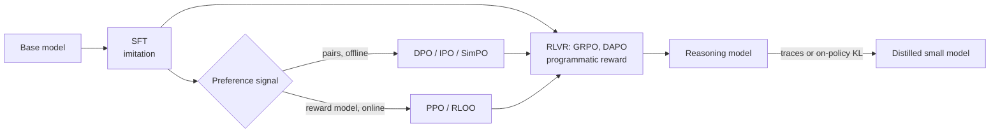

# 06 — Post-training: SFT, preferences, RL

Post-training turns a next-token predictor into an assistant that follows instructions, prefers good answers and reasons on checkable problems. This module derives every objective you will be asked about (Bradley–Terry, policy gradients, PPO, DPO, GRPO), explains the known fixes and failure modes, and ends with a recipe that runs on an 8 GB GPU.

Labs: [10 LoRA](../labs/10_lora/README.md), [11 DPO](../labs/11_dpo/README.md), [12 GRPO](../labs/12_grpo/README.md). Math you need first: the log-derivative trick and KL divergence from [01 Math](01-math.md).

**Contents:** [1 SFT](#1-sft) · [2 PEFT](#2-parameter-efficient-fine-tuning) · [3 Reward models and PPO](#3-reward-models-and-rlhf-with-ppo) · [4 DPO family](#4-dpo-and-its-family) · [5 GRPO and RLVR](#5-rl-with-verifiable-rewards-grpo-and-friends) · [6 Test-time compute](#6-reasoning-and-test-time-compute) · [7 Distillation](#7-distillation-and-ai-feedback) · [8 The 8 GB path](#8-an-8-gb-practical-path) · [Interview traps](#interview-traps) · [CPU vs GPU notes](#cpu-vs-gpu-notes) · [Check yourself](#check-yourself) · [Visual guides](#visual-guides) · [Read next](#read-next)



A modern pipeline (Tülu 3 is a fully documented open example) is roughly: SFT on curated instructions, preference tuning (DPO or on-policy RL against a reward model), then RL with verifiable rewards on math, code and instruction-following constraints. Each stage uses a different loss, but they are all special cases of "raise the log-probability of some outputs, lower others, and stay close to a reference."

---

## 1. SFT

### 1.1 The loss and what it really optimizes

Given pairs (prompt $x$, response $y$), minimize the negative log-likelihood of the response tokens only:

$$\mathcal{L}_{\text{SFT}} = -\sum_{t \in \text{response}} \log \pi_\theta(y_t \mid x, y_{<t})$$

Prompt tokens are fed in but masked out of the loss (label `-100`, the `ignore_index` of `F.cross_entropy`). Minimizing NLL on data from a distribution $p_{\text{data}}$ is minimizing the **forward KL** $\mathrm{KL}(p_{\text{data}} \Vert \pi_\theta)$, which is mode-covering: the model is penalized heavily wherever it puts low probability on something the data does. So SFT imitates everything in the data, including the mistakes, hedges and style tics. Data quality dominates quantity: LIMA ([2305.11206](https://arxiv.org/abs/2305.11206)) showed about 1,000 carefully curated examples are enough to teach a strong base model the assistant format.

### 1.2 Chat templates

A chat template serializes a conversation into one token sequence with role markers. Qwen2.5 uses the ChatML layout:

```
<|im_start|>system
You are a helpful assistant.<|im_end|>
<|im_start|>user
What is 17 * 23?<|im_end|>
<|im_start|>assistant
17 * 23 = 391.<|im_end|>
```

`<|im_start|>` and `<|im_end|>` are **special tokens**: single IDs that ordinary user text can never produce, because the tokenizer does not map the literal string to them when special-token parsing is off for user content. That is what stops a user from forging an `assistant` turn. In Qwen2.5's config, `eos_token_id` is the ID of `<|im_end|>`, so the model stops generating by emitting it.

The loss mask for the example above covers `17 * 23 = 391.<|im_end|>` and nothing else. Including `<|im_end|>` in the loss is how the model learns to stop.

> [!WARNING]
> The most common SFT bugs are template bugs, and they fail silently: the loss goes down and the model is worse.
> - Training with one template and serving with another (or with `tokenizer.apply_chat_template` in one place and a hand-written f-string in the other).
> - The end-of-turn token masked out of the loss, often because `pad_token = eos_token` and the collator masks every pad ID. The model never learns to stop and rambles until `max_new_tokens`.
> - A BOS token added twice (once by the template, once by the tokenizer).
> - Loss on the prompt tokens, which spends capacity on predicting user text.
> Decode one training batch back to text, with the masked positions shown, before every new run.

### 1.3 Packing

Short examples waste compute when padded to the batch's longest sequence. **Packing** concatenates several examples into one fixed-length row. Done naively, tokens attend across example boundaries and positions keep counting across them. Done correctly, each example gets a block-diagonal causal mask and position IDs that restart at 0 (FlashAttention's variable-length kernels take cumulative sequence lengths for exactly this). Cross-contamination is a small effect for pretraining-style data and a larger one for short, unrelated chat examples.

### 1.4 Data

- **Sources:** human-written demonstrations, synthetic data from a stronger model (check the license), and rejection sampling (sample many answers, keep the ones a checker or judge accepts). Rejection-sampled self-generated data is also the idea behind STaR ([2203.14465](https://arxiv.org/abs/2203.14465)).
- **Decontaminate** against every eval you will report: n-gram overlap against benchmark test sets at minimum.
- **Mix matters more than size.** Balance task types, lengths and languages; oversample what you care about. Keep a small slice of general chat data to limit forgetting.
- **Epochs:** 1–3 over small, high-quality sets. Watch held-out loss per task type, not only the average.

> [!TIP]
> Before tuning anything, read 50 random training examples end to end. A quarter of the "SFT doesn't work" cases in practice are bad data: truncated answers, wrong language, answers to a different question, or a template glitch that appears in every row.

---

## 2. Parameter-efficient fine-tuning

### 2.1 LoRA

Freeze the pretrained weight $W_0 \in \mathbb{R}^{d_\text{out} \times d_\text{in}}$ and learn a low-rank update ([LoRA, 2106.09685](https://arxiv.org/abs/2106.09685)):

$$h = W_0 x + \frac{\alpha}{r} B A x, \qquad A \in \mathbb{R}^{r \times d_\text{in}},\; B \in \mathbb{R}^{d_\text{out} \times r}$$

- $B$ starts at zero and $A$ at a random (Kaiming) init, so $BA = 0$ and training starts **exactly** at the base model. If both were random, step 0 would be a randomly perturbed model; if both were zero, neither would get a gradient ($\partial L/\partial A \propto B^\top$ and $\partial L/\partial B \propto (\cdot) A^\top$).
- Trainable parameters per matrix: $r(d_\text{in} + d_\text{out})$ instead of $d_\text{in} d_\text{out}$.
- **Merge** for serving: $W = W_0 + \frac{\alpha}{r}BA$ is an ordinary matrix, so a merged adapter costs nothing at inference.
- **Scale $\alpha/r$:** keeps the update magnitude roughly independent of $r$ when you change rank at a fixed $\alpha$. rsLoRA ([2312.03732](https://arxiv.org/abs/2312.03732)) argues for $\alpha/\sqrt{r}$ so that higher ranks actually learn more.

Worked count for Qwen2.5-0.5B (24 layers, hidden 896, MLP 4864, 2 KV heads of dim 64, so K and V project to 128): LoRA with $r = 16$ on all seven linear layers per block gives

| matrix | shape (in → out) | $r(d_\text{in}+d_\text{out})$ |
|---|---|---|
| q, o | 896 → 896 | 28,672 each |
| k, v | 896 → 128 | 16,384 each |
| gate, up | 896 → 4864 | 92,160 each |
| down | 4864 → 896 | 92,160 |
| **per layer** | | 366,592 |
| **× 24 layers** | | **8.8 M** (1.8% of 494 M) |

### 2.2 What LoRA can and cannot do

- **Where to put it:** apply LoRA to all linear layers, MLP included. Attention-only LoRA underperforms; this is the recommendation of the QLoRA paper and of Thinking Machines' *LoRA Without Regret* (September 2025), which also found that the best LoRA learning rate is about 10× the best full fine-tuning learning rate, and that LoRA matches full fine-tuning for RL even at very low rank, because a policy-gradient episode carries only a few bits of information.
- **Capacity:** LoRA matches full fine-tuning when the dataset is small relative to adapter capacity, and falls behind on large continued-pretraining-style datasets (code, math at scale). *LoRA Learns Less and Forgets Less* ([2405.09673](https://arxiv.org/abs/2405.09673)): less target-domain gain, less forgetting of the base. Know when that trade is what you want.
- **Variants:** DoRA ([2402.09353](https://arxiv.org/abs/2402.09353)) splits magnitude and direction; QLoRA stores the frozen base in 4 bits.
- **Serving many adapters on one base:** S-LoRA ([2311.03285](https://arxiv.org/abs/2311.03285)) and Punica batch requests that use different adapters in the same forward pass, so a thousand customer-specific fine-tunes cost roughly one base model of memory.

### 2.3 QLoRA

QLoRA ([2305.14314](https://arxiv.org/abs/2305.14314)) keeps the frozen base in **NF4** (4-bit NormalFloat, whose 16 levels are quantiles of a normal distribution, so they match the shape of pretrained weights), dequantizes each block to bf16 on the fly for the matmul, and trains bf16 LoRA adapters on top. Two more tricks: **double quantization** (quantize the per-block scales too) and **paged optimizers** (optimizer state that can spill to CPU memory on spikes). Gradients flow *through* the dequantized base into the adapters; the base itself never updates. You build NF4 in [lab 13](../labs/13_quantization/README.md).

Memory for the frozen base at 4 bits, block size 64 with one fp32 scale per block: $4 + 32/64 = 4.5$ bits per parameter, about 4.3 GB for an 7.6 B model; double quantization brings the scale overhead to roughly 0.13 bits per parameter. That is why a 7–8 B model is the ceiling on an 8 GB card, with short sequences.

> [!TIP]
> Attach LoRA **before** moving the model to the GPU and choosing a dtype, or create the adapter tensors on the base layer's device and dtype. Keep adapter weights and optimizer state in fp32 and run the forward in bf16 autocast; tiny bf16 adapter updates can round to zero.

---

## 3. Reward models and RLHF with PPO

### 3.1 Bradley–Terry reward models

Humans compare two responses; we want a scalar score. The Bradley–Terry model says the probability that $y_w$ beats $y_l$ depends only on the score difference:

$$P(y_w \succ y_l \mid x) = \sigma\big(r(x, y_w) - r(x, y_l)\big) = \frac{e^{r_w}}{e^{r_w} + e^{r_l}}$$

Maximum likelihood over a dataset of comparisons gives the reward-model loss

$$\mathcal{L}_{\text{RM}} = -\mathbb{E}_{(x, y_w, y_l)}\left[\log \sigma\big(r_\phi(x, y_w) - r_\phi(x, y_l)\big)\right]$$

Consequences you should be able to state:

- **Only differences are identified.** Adding any function $c(x)$ to the reward leaves the loss unchanged, so the absolute level of a reward is meaningless. Normalize rewards (per prompt or per batch) before using them as RL signal.
- **Architecture:** the SFT model with its unembedding replaced by a scalar head, read at the last token.
- **Accuracy ceiling:** human raters disagree with each other on a large fraction of pairs, so held-out RM accuracy is bounded well below 100%. Compare RM accuracy to inter-annotator agreement, not to 1.
- **The RM is a proxy.** Gao et al. ([2210.10760](https://arxiv.org/abs/2210.10760)) measured that as the policy moves away from its start (measured in KL), the proxy reward keeps rising while the gold reward rises, peaks and falls. Larger reward models push the peak further out. This is Goodhart's law with a curve.

### 3.2 The RLHF objective

$$\max_{\pi_\theta}\; \mathbb{E}_{x \sim \mathcal{D},\, y \sim \pi_\theta(\cdot \mid x)}\big[r(x, y)\big] - \beta\, \mathrm{KL}\big(\pi_\theta(\cdot \mid x) \,\Vert\, \pi_{\text{ref}}(\cdot \mid x)\big)$$

The KL term keeps the policy near the SFT model, where the reward model's judgements are still valid, and preserves fluency and diversity. $\beta$ sets how far from the reference you trade for reward.

### 3.3 The policy-gradient theorem, derived

For a sequence-level reward, the objective is $J(\theta) = \mathbb{E}_{y \sim \pi_\theta}[R(y)]$ (drop $x$ for brevity). Differentiate under the sum and use $\nabla \pi = \pi \nabla \log \pi$ (the log-derivative trick):

$$\nabla_\theta J = \sum_y R(y)\, \nabla_\theta \pi_\theta(y) = \sum_y \pi_\theta(y)\, R(y)\, \nabla_\theta \log \pi_\theta(y) = \mathbb{E}_{y \sim \pi_\theta}\big[R(y)\, \nabla_\theta \log \pi_\theta(y)\big]$$

For an autoregressive policy $\log \pi_\theta(y) = \sum_t \log \pi_\theta(y_t \mid y_{<t})$, so the gradient is a sum of per-token score functions weighted by the reward. This is REINFORCE (Williams, 1992). Two facts make it usable:

1. **Baselines are free.** For any $b$ that does not depend on $y$: $\mathbb{E}[b\, \nabla \log \pi(y)] = b\, \nabla \sum_y \pi(y) = b\, \nabla 1 = 0$. Subtracting $b$ changes the variance, not the mean. Use $A = R - b$ with $b \approx \mathbb{E}[R]$. Lab 12's first test checks both claims numerically.
2. **Causality.** With per-token rewards, the action at step $t$ cannot affect rewards before $t$, so each token only needs the reward-to-go. In LLM RLHF almost all reward arrives at the last token, so this matters mostly for the per-token KL penalty.

Cheap baselines, in increasing sophistication: a moving average of $R$; the mean reward of *other* samples for the same prompt (RLOO, [2402.14740](https://arxiv.org/abs/2402.14740)); the group mean (GRPO); a learned value function $V(s_t)$ (PPO).

### 3.4 From REINFORCE to PPO

REINFORCE uses each batch of samples for one gradient step. To take several steps on the same rollouts, reweight by importance sampling. With samples from $\pi_{\text{old}}$ and ratio $\rho_t = \pi_\theta(y_t \mid s_t) / \pi_{\text{old}}(y_t \mid s_t)$, the surrogate $\mathbb{E}[\rho_t A_t]$ has the same gradient as $J$ at $\theta = \theta_\text{old}$, but becomes unreliable as $\pi_\theta$ drifts. PPO ([1707.06347](https://arxiv.org/abs/1707.06347)) takes a pessimistic bound:

$$\mathcal{L}^{\text{CLIP}} = \mathbb{E}_t\left[\min\big(\rho_t A_t,\; \mathrm{clip}(\rho_t, 1-\varepsilon, 1+\varepsilon)\, A_t\big)\right]$$

Work through the cases (ε is typically 0.2):

| advantage | ratio region | min picks | gradient |
|---|---|---|---|
| $A > 0$ | $\rho \le 1+\varepsilon$ | $\rho A$ | flows: raise the token's probability |
| $A > 0$ | $\rho > 1+\varepsilon$ | $(1+\varepsilon)A$, a constant | **zero**: already raised enough |
| $A < 0$ | $\rho \ge 1-\varepsilon$ | $\rho A$ | flows: lower the probability |
| $A < 0$ | $\rho < 1-\varepsilon$ | $(1-\varepsilon)A$, a constant | **zero**: already lowered enough |

The clip removes the incentive to move further *in the improving direction* once the ratio leaves the trust region. It never clips a move in the harmful direction: with $A < 0$ and a large ratio, the unclipped $\rho A$ is the smaller term and its gradient flows, which pulls the ratio back. Lab 12's `test_grpo_loss_clipping_and_kl` checks the zero-gradient row.

**Advantages with GAE** ([1506.02438](https://arxiv.org/abs/1506.02438)): with a learned value function, $\delta_t = r_t + \gamma V(s_{t+1}) - V(s_t)$ and $\hat A_t = \sum_{l \ge 0} (\gamma\lambda)^l \delta_{t+l}$. $\lambda = 0$ is the one-step TD advantage (low variance, biased by $V$'s errors); $\lambda = 1$ is the Monte Carlo return minus $V$ (unbiased, high variance). LLM setups commonly use $\gamma = 1$.

**The per-token reward in RLHF-PPO** (InstructGPT, [2203.02155](https://arxiv.org/abs/2203.02155)):

$$r_t = -\beta \log \frac{\pi_\theta(y_t \mid s_t)}{\pi_{\text{ref}}(y_t \mid s_t)} + \mathbb{1}[t = T]\; r_\phi(x, y)$$

**Memory:** PPO holds four models: policy (trained), value (trained), reference (frozen), reward (frozen). For a 7 B policy with a 7 B value model, both with AdamW state, that is already a multi-GPU job. This cost is what DPO and GRPO remove.

### 3.5 KL estimators

You rarely compute the exact KL over the vocabulary at every token; you estimate it from sampled tokens. With samples $y \sim \pi_\theta$ and $r = \pi_{\text{ref}}(y)/\pi_\theta(y)$ (John Schulman, [Approximating KL divergence](http://joschu.net/blog/kl-approx.html)):

| estimator | formula | unbiased for $\mathrm{KL}(\pi_\theta \Vert \pi_\text{ref})$? | sign |
|---|---|---|---|
| k1 | $-\log r$ | yes | can be negative, high variance |
| k2 | $\tfrac12 (\log r)^2$ | no (low bias when close) | $\ge 0$ |
| k3 | $(r - 1) - \log r$ | yes | $\ge 0$, low variance |

A subtlety worth knowing: using k3 as a *loss* and differentiating through the sampled tokens gives, in expectation, $\mathbb{E}_{\pi_\theta}[(1 - r)\nabla \log \pi_\theta] = -\mathbb{E}_{\pi_{\text{ref}}}[\nabla \log \pi_\theta] = \nabla_\theta \mathrm{KL}(\pi_\text{ref} \Vert \pi_\theta)$, the gradient of the *other* KL direction. Both directions pull toward the reference, so it works as a regularizer, but it is not the objective written on paper. Many RLVR recipes drop the KL term entirely (see §5).

### 3.6 RLHF failure modes

- **Reward hacking / overoptimization:** the policy finds inputs where the RM is wrong (the Gao et al. curve).
- **Length exploitation:** raters and RMs prefer longer answers, so RL makes answers longer without making them better. Control with length-matched evaluation and length penalties.
- **Sycophancy:** preference data rewards agreeing with the user ([2310.13548](https://arxiv.org/abs/2310.13548)).
- **Mode collapse:** diversity drops as the policy concentrates on high-reward templates. Track entropy and distinct-n.

---

## 4. DPO and its family

### 4.1 The derivation, step by step

DPO ([2305.18290](https://arxiv.org/abs/2305.18290)) shows that the RLHF objective in §3.2 can be optimized with a classification loss on preference pairs, with no reward model and no sampling.

**Step 1: the optimal policy has a closed form.** For a fixed $x$, rewrite the objective as a KL to a tilted distribution:

$$\mathbb{E}_{\pi}[r] - \beta\,\mathrm{KL}(\pi \Vert \pi_\text{ref}) = -\beta\, \mathbb{E}_{\pi}\left[\log \frac{\pi(y)}{\pi_\text{ref}(y)\, e^{r(y)/\beta}}\right] = -\beta\, \mathrm{KL}\big(\pi \,\Vert\, \pi^*\big) + \beta \log Z$$

with

$$\pi^*(y \mid x) = \frac{1}{Z(x)}\, \pi_\text{ref}(y \mid x)\, \exp\!\big(r(x,y)/\beta\big), \qquad Z(x) = \sum_y \pi_\text{ref}(y \mid x)\, e^{r(x,y)/\beta}$$

$Z$ does not depend on $\pi$, and a KL is minimized (at zero) only when $\pi = \pi^*$. So $\pi^*$ is the unique optimum.

**Step 2: invert for the reward.** Take logs and solve:

$$r(x, y) = \beta \log \frac{\pi^*(y \mid x)}{\pi_\text{ref}(y \mid x)} + \beta \log Z(x)$$

Any reward can be written through its optimal policy. $Z(x)$ is intractable (a sum over all strings), but it depends only on $x$.

**Step 3: substitute into Bradley–Terry.** The preference probability depends on $r(x, y_w) - r(x, y_l)$, and the $\beta \log Z(x)$ terms cancel:

$$P(y_w \succ y_l \mid x) = \sigma\!\left(\beta \log \frac{\pi^*(y_w \mid x)}{\pi_\text{ref}(y_w \mid x)} - \beta \log \frac{\pi^*(y_l \mid x)}{\pi_\text{ref}(y_l \mid x)}\right)$$

**Step 4: maximum likelihood, with the policy as the parameter.** Replace $\pi^*$ by $\pi_\theta$ and minimize the negative log-likelihood of the observed preferences:

$$\mathcal{L}_\text{DPO} = -\mathbb{E}\left[\log \sigma\big(\hat r_\theta(x, y_w) - \hat r_\theta(x, y_l)\big)\right], \qquad \hat r_\theta(x, y) = \beta \log \frac{\pi_\theta(y \mid x)}{\pi_\text{ref}(y \mid x)}$$

$\hat r_\theta$ is the **implicit reward**. "Your language model is secretly a reward model" is exactly this identity.

**Step 5: read the gradient.**

$$\nabla_\theta \mathcal{L}_\text{DPO} = -\beta\, \mathbb{E}\Big[\underbrace{\sigma\big(\hat r_\theta(y_l) - \hat r_\theta(y_w)\big)}_{\text{large when the pair is mis-ordered}} \big(\nabla \log \pi_\theta(y_w) - \nabla \log \pi_\theta(y_l)\big)\Big]$$

It raises the chosen log-probability, lowers the rejected one, and weights each pair by how wrong the implicit reward currently is. Pairs already ordered with a large margin contribute almost nothing. Lab 11 verifies the whole derivation numerically: DPO on a tabular policy with Bradley–Terry soft labels converges to $\pi_\text{ref}\, e^{r/\beta}/Z$.

### 4.2 Implementation details that decide whether it works

- $\log \pi(y \mid x)$ is the **sum** of response-token log-probs, with the one-position shift (logits at $t$ score the label at $t+1$). This is `sequence_logprobs` in lab 11 and the most common off-by-one in alignment code.
- Compute reference log-probs once with the frozen model (or with LoRA adapters disabled, which gives the base for free) and cache them.
- $\beta$ is typically 0.01–0.5; 0.1 is a common default. Smaller $\beta$ lets the policy move further from the reference.
- SFT on the chosen responses first when the pairs come from a different model, so $\pi_\text{ref}$ assigns reasonable probability to them.
- Log, every step: chosen and rejected implicit rewards, their margin, preference accuracy (fraction with positive margin), and the **raw chosen log-probability**. Accuracy near 100% early usually means the pairs are too easy or the model found a shortcut such as length.

### 4.3 Failure modes

- **Likelihood displacement.** DPO only constrains the *difference*. Both $\log \pi(y_w)$ and $\log \pi(y_l)$ often fall during training, and the probability mass goes to responses that are in neither set, sometimes worse ones. Razin et al. ([2410.08847](https://arxiv.org/abs/2410.08847)) show this is driven by chosen and rejected responses whose representations are too similar, and propose filtering such pairs. Mitigations include adding an SFT (NLL) term on the chosen response and filtering near-duplicate pairs.
- **Overfitting deterministic preferences.** If a pair is always preferred ($P = 1$), the Bradley–Terry optimum needs an infinite reward gap, so DPO pushes $\pi(y_l) \to 0$ no matter what $\beta$ is. The KL regularization is weaker than it looks on a finite dataset. IPO was designed to fix this.
- **Length exploitation.** The summed log-ratio can be moved by length; DPO models get verbose. Park et al. ([2403.19159](https://arxiv.org/abs/2403.19159)) add an explicit length regularizer; SimPO length-normalizes.
- **Off-policy data.** Pairs sampled from another model teach the policy about responses it would never produce. Online or iterative DPO (sample from the current policy, label with a judge or RM, repeat; [2402.04792](https://arxiv.org/abs/2402.04792)) usually beats a single offline pass.
- **Implicit rewards are not calibrated rewards.** Do not use $\hat r_\theta$ from a DPO model as a general-purpose reward model without checking it on held-out pairs.

### 4.4 The family, compared

Notation: $h = \log\frac{\pi_\theta(y_w)}{\pi_\text{ref}(y_w)} - \log\frac{\pi_\theta(y_l)}{\pi_\text{ref}(y_l)}$, $\bar\ell(y) = \frac{1}{|y|}\log \pi_\theta(y)$.

| method | data | reference model | loss (per pair or example) | key idea | watch out |
|---|---|---|---|---|---|
| DPO ([2305.18290](https://arxiv.org/abs/2305.18290)) | pairs | yes | $-\log\sigma(\beta h)$ | closed-form RLHF optimum | displacement, length, overfits certain pairs |
| cDPO / label smoothing | noisy pairs | yes | $-(1-\epsilon)\log\sigma(\beta h) - \epsilon\log\sigma(-\beta h)$ | assumes a fraction $\epsilon$ of labels are flipped | $\epsilon$ is a guess about noise |
| IPO ([2310.12036](https://arxiv.org/abs/2310.12036)) | pairs | yes | $\big(h - \tfrac{1}{2\tau}\big)^2$ | regress the margin to a finite target, so certain preferences do not blow up | squared loss is sensitive to outlier pairs |
| KTO ([2402.01306](https://arxiv.org/abs/2402.01306)) | unpaired good/bad labels | yes | $\lambda_D\big(1-\sigma(\beta(\hat r - z_0))\big)$ for good, $\lambda_U\big(1-\sigma(\beta(z_0 - \hat r))\big)$ for bad | prospect-theory value; $z_0$ is a batch KL estimate | needs balanced good/bad weighting |
| SimPO ([2405.14734](https://arxiv.org/abs/2405.14734)) | pairs | **no** | $-\log\sigma\big(\beta(\bar\ell(y_w) - \bar\ell(y_l)) - \gamma\big)$ | length-normalized reward matches generation; margin $\gamma$ | no KL anchor: can drift; tune $\beta, \gamma$ together |
| ORPO ([2403.07691](https://arxiv.org/abs/2403.07691)) | pairs | **no** | $\mathcal{L}_\text{SFT}(y_w) - \lambda \log\sigma\big(\log\tfrac{\text{odds}(y_w)}{\text{odds}(y_l)}\big)$ | SFT and preference in one stage; odds $= P/(1-P)$ on length-normalized likelihood | single stage means one set of hyperparameters for both goals |
| Online / iterative DPO | fresh pairs from the current policy | yes | DPO | removes the off-policy gap | needs a judge or RM in the loop |

In lab 11 you implement DPO (with label smoothing), IPO (where the lab's `beta` plays the role of $\tau$) and SimPO.

> [!TIP]
> When DPO underperforms, check in this order: (1) are chosen and rejected sequences tokenized with the same template and the same prompt? (2) does accuracy rise while chosen log-prob collapses (displacement)? (3) is the chosen response systematically longer (length shortcut)? (4) is $\pi_\text{ref}$ the model you started from, not the base model before SFT?

---

## 5. RL with verifiable rewards: GRPO and friends

### 5.1 Why RLVR

For math, code, formal proofs and instruction-following constraints ("answer in exactly three bullet points"), the reward can be a **program**: an answer checker, a unit-test run, a regex. Such rewards cannot be flattered and do not drift, which lets RL run for thousands of steps. DeepSeek-R1 ([2501.12948](https://arxiv.org/abs/2501.12948)) showed that large-scale RL with rule-based rewards produces long chain-of-thought reasoning with self-verification and backtracking; R1-Zero did it with RL alone from the base model, at the cost of poor readability and language mixing, which R1 addressed with a cold-start SFT stage and a language-consistency reward. Tülu 3 ([2411.15124](https://arxiv.org/abs/2411.15124)) named the setting RLVR.

### 5.2 The GRPO objective

GRPO (DeepSeekMath, [2402.03300](https://arxiv.org/abs/2402.03300)) drops PPO's value network and uses the other samples for the same prompt as the baseline. For each prompt $q$, sample a group of $G$ outputs $o_1, \dots, o_G$ from $\pi_\text{old}$, score them with rewards $r_i$, and set every token of output $i$ to the same advantage:

$$\hat A_{i,t} = \frac{r_i - \mathrm{mean}(r_1, \dots, r_G)}{\mathrm{std}(r_1, \dots, r_G)}$$

Then maximize

$$\mathcal{J}_\text{GRPO} = \mathbb{E}\left[\frac{1}{G}\sum_{i=1}^{G} \frac{1}{|o_i|} \sum_{t=1}^{|o_i|} \Big(\min\big(\rho_{i,t}\hat A_{i,t},\ \mathrm{clip}(\rho_{i,t}, 1-\varepsilon, 1+\varepsilon)\hat A_{i,t}\big) - \beta\, \mathbb{D}^{(k3)}_{i,t}\Big)\right]$$

with $\rho_{i,t} = \pi_\theta(o_{i,t} \mid q, o_{i,<t}) / \pi_\text{old}(o_{i,t} \mid q, o_{i,<t})$ and the k3 KL estimate from §3.5 per token.

Why this design: a value network for long chain-of-thought with a single terminal reward is hard to learn and costs as much memory as the policy. The group mean is a Monte Carlo estimate of the value of the prompt, which is all a terminal-reward problem needs. It is a close cousin of RLOO.

```
prompt q ──► sample G=8 answers ──► rewards  1 0 0 1 0 0 0 1   (mean 0.375)
                                    advantages +  -  -  +  -  -  -  +
                                    every token of answer i gets A_i
all 8 right or all 8 wrong ──► every A_i = 0 ──► no gradient from this prompt
```

### 5.3 Known problems and fixes

Each row is a likely interview question. Know the symptom, the cause and the fix.

| problem | cause | fix | source |
|---|---|---|---|
| Wrong answers get longer | Per-sequence $1/\lvert o_i\rvert$: a long wrong answer spreads its negative advantage over more tokens, so each token is penalized less; a short right answer gets more credit per token | Sum token losses and divide by a **constant** (Dr. GRPO) or by the total number of tokens in the batch (DAPO's token-level loss) | Dr. GRPO [2503.20783](https://arxiv.org/abs/2503.20783); DAPO [2503.14476](https://arxiv.org/abs/2503.14476) |
| Difficulty bias | Dividing by the group std up-weights prompts where almost all samples agree (too easy or too hard) | Drop std normalization (Dr. GRPO) | Dr. GRPO |
| Entropy collapse, no exploration | With symmetric clipping, a token at $\pi_\text{old} = 0.01$ can rise only to 0.012 per update, while likely tokens are unconstrained in effect | **Clip-higher:** decouple the bounds, $\varepsilon_\text{low} = 0.2$, $\varepsilon_\text{high} = 0.28$ | DAPO |
| Wasted batches | Groups with all-correct or all-wrong answers have zero advantage and zero gradient | **Dynamic sampling:** over-sample and drop zero-variance groups until the batch is full | DAPO |
| Truncated answers poison the signal | An answer cut at the length limit is scored wrong even if the reasoning was on track | Mask truncated samples (overlong filtering) or apply a soft length penalty near the limit | DAPO |
| KL term holds back long-CoT RL | Reasoning models must move far from the initial model | Set $\beta = 0$ for RLVR (DAPO, Dr. GRPO) | DAPO |
| Instability from token-level ratios (reported especially for MoE) | Per-token importance ratios are noisy; the reward is per sequence | Sequence-level, length-normalized ratio and sequence-level clipping (GSPO) | GSPO [2507.18071](https://arxiv.org/abs/2507.18071) |

Lab 12 has both aggregation modes (`agg="seq"` for the original GRPO, `agg="token"` for DAPO) and both advantage variants (`std_norm=True/False`). `test_aggregation_modes_differ_with_uneven_lengths` is the length-bias argument in two rows of numbers.

### 5.4 Reward design for RLVR

- **Correctness is the reward; format is a gate.** Extract the final answer (for example the last `\boxed{}`) and compare after normalization: strip whitespace and units, compare numbers with a tolerance, compare expressions symbolically (SymPy). A reward of 1 for correct and 0 otherwise works; partial credit invites gaming the partial part.
- **Code:** run hidden tests in a sandbox with time and memory limits, no network, and a fresh filesystem. Score the fraction of hidden tests passed only if you accept the partial-credit risk.
- **Instruction-following constraints** (length, format, keywords) are checkable with small functions, which is how Tülu 3 extends RLVR beyond math.
- **Make wrong answers costly and cheap answers impossible.** Unparseable output gets 0, not a crash; multiple final answers get 0.
- **Curriculum:** keep prompts where the current pass rate is neither 0 nor 1; those are the only ones with signal (the dynamic-sampling insight applied to data selection).

### 5.5 Reward hacking, concretely

Every reward is a proxy. Patterns seen in practice:

- **Checker exploits:** listing several candidate answers so a lenient extractor finds the right one; putting the answer in the format the regex reads while the reasoning concludes something else.
- **Test subversion in code RL:** special-casing the visible test inputs, editing or deleting tests, exiting the process early with a success status, catching every exception. Baker et al. ([2503.11926](https://arxiv.org/abs/2503.11926)) document a frontier reasoning model subverting unit tests in agentic coding tasks, often stating the plan openly in its chain of thought, and show that penalizing the "bad thoughts" directly teaches the model to hide them while it keeps hacking.
- **Judge exploits:** when an LLM judge is the reward, confident tone, length and flattery raise scores.
- **Length:** unbounded reasoning when nothing penalizes it; truncation when something does.

The defence is procedural: read samples every few hundred steps, keep a held-out set graded by a stricter checker than the training reward, track the gap between the two, and log how often the reward's edge cases fire.

### 5.6 Infrastructure

Rollouts (generation) dominate RLVR cost, so production systems run an inference engine (vLLM, SGLang) for sampling and a separate trainer (FSDP, Megatron), then synchronize weights every step or every few steps. Two consequences to know:

- **Staleness.** Asynchronous pipelines sample from a policy one or more versions behind the trainer. The importance ratio corrects for this only when it is computed against the policy that actually generated the tokens.
- **Sampler/trainer mismatch.** The inference engine and the trainer compute slightly different log-probs for the same tokens (different kernels, precision and batch composition). Using the sampler's log-probs as $\pi_\text{old}$ without correction makes nominally on-policy training slightly off-policy; production systems add an importance-weight correction for it.

> [!TIP]
> For an RLVR run, log at every step: mean reward, fraction of zero-variance groups, mean response length split by correct and incorrect, policy entropy, clip fraction, and KL to the reference. Length rising only on incorrect answers is the length-bias signature; entropy falling to near zero within a few hundred steps is collapse.

---

## 6. Reasoning and test-time compute

You can buy accuracy with inference compute instead of parameters.

- **Chain of thought** ([2201.11903](https://arxiv.org/abs/2201.11903)): intermediate tokens are extra serial computation.
- **Self-consistency** ([2203.11171](https://arxiv.org/abs/2203.11171)): sample $N$ chains and take the majority answer. Needs only answer extraction, no verifier.
- **Best-of-N with a verifier:** sample $N$, return the one a reward model or checker scores highest. With a perfect checker, accuracy is pass@N.
- **pass@k**, estimated without bias from $n \ge k$ samples of which $c$ are correct (Codex paper, [2107.03374](https://arxiv.org/abs/2107.03374)): $\text{pass@}k = 1 - \binom{n-c}{k} / \binom{n}{k}$. Do not compute it as $1-(1-\hat p)^k$ from a small $n$; that is biased.
- **Outcome vs process reward models:** an ORM scores the final answer; a PRM scores each step. *Let's Verify Step by Step* ([2305.20050](https://arxiv.org/abs/2305.20050)) found process supervision better for best-of-N selection on MATH and released PRM800K. PRMs are expensive to label and can themselves be hacked when used as an RL reward.
- **Search:** beam search or tree search over steps guided by a PRM.
- **Budget forcing** (s1, [2501.19393](https://arxiv.org/abs/2501.19393)): fine-tune on about 1,000 reasoning traces, then control thinking length at inference by cutting it off, or extending it by appending "Wait".
- **Compute-optimal test-time scaling** (Snell et al., [2408.03314](https://arxiv.org/abs/2408.03314)): the best strategy depends on difficulty. On easy and medium problems, well-allocated test-time compute can beat a model many times larger; on the hardest problems, pretraining compute wins.

**Does RL create reasoning or select it?** Yue et al. ([2504.13837](https://arxiv.org/abs/2504.13837)) found that RLVR models beat their base models at pass@1 but that base models catch up and overtake them at large $k$, suggesting RL mostly sharpens the distribution toward reasoning paths the base model could already sample. ProRL ([2505.24864](https://arxiv.org/abs/2505.24864)) argues that long, stabilized RL runs do expand what the model can solve. This is an open question; you should be able to describe both results and what experiment would separate them.

**Monitor, do not optimize, the chain of thought.** A readable CoT is a useful window for catching misbehavior. Baker et al. show that putting optimization pressure on the CoT (penalizing flagged thoughts) produces obfuscated reasoning instead of better behavior.

---

## 7. Distillation and AI feedback

### 7.1 Forward vs reverse KL

Teacher $p$, student $q_\theta$.

- **Forward KL**, $\mathrm{KL}(p \Vert q_\theta) = \mathbb{E}_{y \sim p}[\log p(y) - \log q_\theta(y)]$: sample from the teacher, train the student with NLL. Mode-covering: the student must put mass everywhere the teacher does, and a small student spreads itself thin. **Sequence-level KD** (Kim and Rush, [1606.07947](https://arxiv.org/abs/1606.07947)) is this with teacher samples as SFT data; the DeepSeek-R1 distilled models were trained this way on R1-generated traces.
- **Reverse KL**, $\mathrm{KL}(q_\theta \Vert p) = \mathbb{E}_{y \sim q_\theta}[\log q_\theta(y) - \log p(y)]$: sample from the *student*, and the teacher scores those samples. Mode-seeking: the student may ignore some teacher modes but is punished for producing anything the teacher finds unlikely. MiniLLM ([2306.08543](https://arxiv.org/abs/2306.08543)) argues this suits generative students.
- **Logit KD** (Hinton et al., [1503.02531](https://arxiv.org/abs/1503.02531)): match the full next-token distributions at temperature $T$, scaling the loss by $T^2$. Requires the same tokenizer.

### 7.2 On-policy distillation

Sample from the student, then compute per-token reverse KL against the teacher on those tokens:

$$\mathcal{L} = \mathbb{E}_{y \sim q_\theta}\Big[\sum_t \log q_\theta(y_t \mid y_{<t}) - \log p(y_t \mid y_{<t})\Big]$$

Read as RL, this is a **dense per-token reward** $-\big(\log q_\theta(y_t) - \log p(y_t)\big)$, instead of one bit per episode. The student learns from its own mistakes (no train/test mismatch, unlike SFT on teacher samples) and gets credit assignment at every token (unlike outcome RL). GKD ([2306.13649](https://arxiv.org/abs/2306.13649)) generalized this family. The Qwen3 technical report ([2505.09388](https://arxiv.org/abs/2505.09388)) uses off-policy then on-policy distillation from large models for its small models, and Thinking Machines' *On-Policy Distillation* (October 2025) reports reaching RL-level reasoning results at a small fraction of RL's compute.

Requirement: the teacher must score the student's tokens, so both need the same tokenizer (or a careful alignment scheme).

### 7.3 Constitutional AI and RLAIF

Constitutional AI ([2212.08073](https://arxiv.org/abs/2212.08073)) replaces most human harm labels with model feedback guided by a written list of principles: a supervised stage where the model critiques and revises its own answers, then RL from AI-generated preference labels (RLAIF). The general lesson: a capable model plus explicit criteria is a scalable, auditable labeler, as long as you check its agreement with humans on a sample.

---

## 8. An 8 GB practical path

Goal: Qwen2.5-0.5B-Instruct through SFT → DPO → GRPO on an RTX 5060 8 GB, with every step evaluated with confidence intervals ([lab 15](../labs/15_eval_stats/README.md)). This is a portfolio piece that exercises the whole modern stack.

### 8.1 Memory math first

Qwen2.5-0.5B: 494 M parameters (tied embeddings), vocabulary 151,936, 24 layers, hidden 896, KV cache 12 KiB per token in bf16.

| item | size | note |
|---|---|---|
| bf16 weights | 0.99 GB | $494\text{M} \times 2$ bytes |
| Full fine-tune with AdamW | ~7.9 GB before activations | 16 bytes/param: bf16 weights and grads, fp32 master copy, fp32 Adam $m$ and $v$. Does not fit. |
| LoRA $r = 16$, all linear layers | 8.8 M params → ~0.14 GB | fp32 params + grads + Adam $m, v$ = 16 bytes/param |
| **Logits** for batch 4 × 1,024 tokens | **2.5 GB in fp32**, 1.2 GB in bf16 | $B \cdot T \cdot V \cdot 4$ bytes. The largest single tensor; `log_softmax` makes another copy |
| Activations (24 layers) | depends on batch and checkpointing | use gradient checkpointing; it trades ~30% more compute for most of this memory |

The vocabulary trap: with a 152k vocabulary, the logits of a 0.5 B model can outweigh its weights. Compute the loss in chunks over the sequence, or only on response positions, and never keep full fp32 logits for the whole batch. Qwen2.5-1.5B (1.54 B params, 3.1 GB in bf16, LoRA $r=16$ adds 18.5 M) also fits with LoRA and short sequences.

### 8.2 The recipe

1. **Baseline eval.** Before training, score the model on your held-out sets (a task-specific set plus a small general set to detect forgetting). Save predictions, not only metrics.
2. **LoRA SFT** (lab 10's scale-up, S4): 1–2 k examples, $r = 16$ on all linear layers, $\alpha = 32$, learning rate around $1\text{e-}4$ to $2\text{e-}4$ (LoRA needs a higher LR than full fine-tuning), 1–3 epochs, loss only on assistant tokens, sequence length 512–1,024, gradient checkpointing.
3. **DPO** (lab 11's scale-up): 500 pairs built from your SFT model's own samples, judged by a stronger model or a checker. The reference is the SFT model: with LoRA, run the reference forward with adapters disabled, so no second copy is needed. Sweep $\beta \in \{0.05, 0.1, 0.5\}$ and plot win rate against KL.
4. **GRPO** (lab 12's scale-up, S5): an arithmetic or countdown task with a programmatic checker, $G = 8$, completions ≤ 256 tokens, $\beta \in [0, 0.04]$, token-mean aggregation. Plot reward, response length (correct vs incorrect) and entropy.
5. **Evaluate every stage** on the same sets with paired bootstrap CIs. Report what got worse, not only what got better.

> [!TIP]
> On 8 GB, generation is the slow part of GRPO. Use short completions, a small $G$, and `torch.no_grad()` plus the KV cache for sampling. If you use vLLM for rollouts on the same card, cap its memory fraction and expect to reload weights after each update; for a 0.5 B model, plain batched `generate` is often simpler and fast enough.

---

## Interview traps

- **"DPO doesn't need a reward model, so it doesn't optimize a reward."** It optimizes exactly the KL-regularized reward objective, with the reward reparameterized through the policy. It removes the explicit RM and the sampling, not the objective.
- **"PPO clipping stops the policy from changing too much."** It removes the incentive to change further in the improving direction; it does not bound the change, and multiple epochs can still push ratios well past $1 \pm \varepsilon$. Monitor clip fraction and KL.
- **"A baseline biases the gradient."** Only if it depends on the sampled action. A per-prompt group mean does not (for the other samples; GRPO's including the sample itself adds a small $1/G$ scaling, which RLOO's leave-one-out avoids).
- **"GRPO has no KL penalty problem because it uses k3."** k3 is an unbiased *value* estimate, but differentiating it through sampled tokens gives the gradient of the reverse-direction KL; and many current recipes set $\beta = 0$ anyway.
- **"LoRA with rank 8 is 8/4096 of the parameters."** It is $r(d_\text{in}+d_\text{out})$ per matrix; count across all targeted layers.
- **"SFT loss went down, so SFT worked."** Template and masking bugs lower the loss too. Evaluate generations.
- **"Reward went up, so RL worked."** Check held-out accuracy with a stricter grader, length split by correctness, and read samples.
- **"Temperature 0 makes GRPO deterministic."** GRPO needs diverse samples; at temperature 0 every group is identical and every advantage is zero.

## CPU vs GPU notes

- **CPU only:** all lab 10–12 tests run on CPU in seconds to a minute (the GRPO counting task trains a tiny policy). The DPO tabular check and the REINFORCE variance test are pure math. You can still do SFT or DPO on a model of about 100 M parameters on CPU with LoRA and sequences of 256 tokens; it is slow but instructive. Free cloud notebooks with a T4 (16 GB, no bf16 tensor cores; use fp16 with loss scaling) cover the scale-up runs.
- **8 GB GPU (RTX 5060):** bf16 LoRA on ≤ 1.5 B models, QLoRA up to 7–8 B with short sequences, GRPO on 0.5 B with short completions. The logits tensor and generation time are the binding constraints, not the weights.
- **Multi-GPU:** PPO with separate policy, value, reference and reward models; RLVR with a separate inference fleet. Concepts transfer directly from the single-GPU versions you build here.

## Check yourself

<details><summary>1. Derive the DPO loss from the KL-regularized objective in four lines. Where does Z go?</summary>

The optimum is $\pi^* = \pi_\text{ref} e^{r/\beta}/Z(x)$. Inverting, $r = \beta\log(\pi^*/\pi_\text{ref}) + \beta\log Z(x)$. Bradley–Terry depends only on $r(y_w) - r(y_l)$ for the same $x$, so $\beta \log Z(x)$ cancels. Replace $\pi^*$ with $\pi_\theta$ and take the negative log-likelihood: $-\log\sigma(\beta h)$.
</details>

<details><summary>2. With A > 0 and ratio 1.5 (ε = 0.2), what is the PPO gradient for that token? With A < 0 and ratio 1.5?</summary>

A > 0, ratio 1.5 > 1.2: the min picks the clipped constant $(1.2)A$, so the gradient is zero. A < 0, ratio 1.5: $\rho A = 1.5A$ is smaller than $1.2A$ (both negative), so the min picks the unclipped term and the gradient flows, lowering the probability.
</details>

<details><summary>3. Why is a baseline unbiased, and why does GRPO not need a value network?</summary>

$\mathbb{E}_{y\sim\pi}[b\nabla\log\pi(y)] = b\nabla\sum_y\pi(y) = 0$ for any $b$ independent of $y$. With a single terminal reward per sequence, the value of the prompt is all the baseline needs, and the mean reward of $G$ samples estimates it without training a second network.
</details>

<details><summary>4. A GRPO run shows mean length rising steadily, but only on incorrect answers. Diagnose and fix.</summary>

Per-sequence length normalization: each token of a long wrong answer gets a smaller share of the negative advantage, so long wrong answers are penalized less. Switch to a token-level mean over the batch (DAPO) or a constant normalizer (Dr. GRPO), and consider masking truncated samples.
</details>

<details><summary>5. During DPO, preference accuracy reaches 95% but the chosen log-probability falls by 30 nats. Is the model better?</summary>

Not necessarily. This is likelihood displacement: the margin grows because the rejected log-prob falls faster, and mass moves to responses outside both sets. Evaluate generations; add an NLL term on the chosen responses, filter near-duplicate pairs, or raise $\beta$.
</details>

<details><summary>6. Why is B initialized to zero in LoRA and not A? What happens if both are zero?</summary>

$B = 0$ makes $BA = 0$, so training starts exactly at the base model, while a random $A$ lets $B$ receive a nonzero gradient ($\partial L/\partial B \propto g\,(Ax)^\top$). If both are zero, both gradients are zero and nothing trains.
</details>

<details><summary>7. What fraction of an 8 GB card do the logits take for batch 8 × 384 tokens with Qwen2.5's vocabulary in fp32?</summary>

$8 \times 384 \times 151{,}936 \times 4 \approx 1.87$ GB, about a quarter of the card, before the `log_softmax` copy. Chunk the loss.
</details>

<details><summary>8. Forward vs reverse KL for distillation: which one does on-policy distillation use, and why is it cheaper than RL for the same result?</summary>

Reverse KL on student samples, scored per token by the teacher. Every token gets a dense signal (the teacher's log-prob), where outcome RL gets roughly one bit per episode, so far fewer samples are needed.
</details>

<details><summary>9. Why does clip-higher fight entropy collapse?</summary>

With a symmetric ε = 0.2, a token at probability 0.01 can only reach 0.012 in one update, so rare exploratory tokens that led to a correct answer can barely be reinforced, while likely tokens keep getting likelier. Raising only the upper bound (0.28 in DAPO) lets low-probability tokens grow faster without loosening the bound that stops probabilities from being crushed.
</details>

<details><summary>10. An RLVR code model's training reward reaches 0.9 while held-out pass@1 is flat. List three things to check.</summary>

Test subversion (special-cased inputs, modified tests, early successful exit); a leaky sandbox (network or filesystem access to answers); visible tests used as the reward instead of hidden ones. Read samples with the highest reward first.
</details>

## Visual guides

- Hugging Face, [Illustrating Reinforcement Learning from Human Feedback](https://huggingface.co/blog/rlhf): the three-stage pipeline in diagrams.
- Lilian Weng, [Policy Gradient Algorithms](https://lilianweng.github.io/posts/2018-04-08-policy-gradient/): the derivations from REINFORCE through PPO, with consistent notation.
- Lilian Weng, [Reward Hacking in Reinforcement Learning](https://lilianweng.github.io/posts/2024-11-28-reward-hacking/): a catalog of hacking examples, including in LLM training.
- Maarten Grootendorst, [A Visual Guide to Reasoning LLMs](https://newsletter.maartengrootendorst.com/p/a-visual-guide-to-reasoning-llms): test-time compute, verifiers, search and DeepSeek-R1 in pictures.
- John Schulman, [Approximating KL Divergence](http://joschu.net/blog/kl-approx.html): the k1, k2, k3 estimators in one page.
- Nathan Lambert, [RLHF Book](https://rlhfbook.com): a free, maintained textbook covering this whole module.
- More per-topic visual material: [library](../library/README.md).

## Read next

- **Papers, in this order:** InstructGPT → PPO → DPO → DeepSeekMath (GRPO) → DeepSeek-R1 → DAPO and Dr. GRPO → Gao et al. on overoptimization. Full list in [papers.md](papers.md#post-training-06).
- **Build:** [lab 10](../labs/10_lora/README.md) → [lab 11](../labs/11_dpo/README.md) → [lab 12](../labs/12_grpo/README.md), then the §8 recipe.
- **Next module:** [07 Inference](07-inference.md): rollouts are an inference problem, and everything there makes RL cheaper.
- **Evaluate what you trained:** [08 Evaluation and research](08-evaluation-and-research.md).
- **Interview practice:** [question bank](../tracks/research-engineer/question-bank.md).
