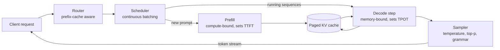

# 07 — Inference

Serving an LLM is a memory-bandwidth problem wearing a compute costume. This module derives the prefill/decode roofline, then walks through every mechanism a modern engine uses to beat it (continuous batching, PagedAttention, prefix caching, chunked prefill, disaggregation, speculative decoding, quantization, fused kernels, CUDA graphs) and finishes with a capacity plan you can defend in an interview.

Labs: [06 kernels](../labs/06_attention_kernels/README.md), [07 KV cache](../labs/07_kv_cache_sampling/README.md), [13 quantization](../labs/13_quantization/README.md), [14 speculative decoding](../labs/14_speculative_decoding/README.md). Prerequisites: the roofline and FLOP accounting in [02 Compute](02-compute-and-hardware.md) and [lab 03](../labs/03_napkin_math/README.md).

**Contents:** [1 Two phases](#1-two-phases-two-bottlenecks) · [2 Serving mechanics](#2-serving-system-mechanics) · [3 Speculative decoding](#3-speculative-decoding-done-correctly) · [4 Quantization](#4-quantization) · [5 Kernels](#5-kernels-why-flashattention-wins) · [6 Capacity planning](#6-capacity-planning-the-interview-question) · [7 Engines](#7-engines) · [Interview traps](#interview-traps) · [CPU vs GPU notes](#cpu-vs-gpu-notes) · [Check yourself](#check-yourself) · [Visual guides](#visual-guides) · [Read next](#read-next)



---

## 1. Two phases, two bottlenecks

### 1.1 The metrics

| metric | definition | dominated by |
|---|---|---|
| **TTFT** (time to first token) | request arrival → first output token | queueing + prefill |
| **TPOT / ITL** (time per output token, inter-token latency) | gap between consecutive output tokens | decode step time |
| **E2E latency** | $\text{TTFT} + (n_\text{out} - 1)\cdot\text{TPOT}$ | output length |
| **Throughput** | output (or total) tokens per second per GPU | batch size |
| **Goodput** | throughput counting only requests that met their SLOs | everything above |

Serving is a trade between the last two rows and the first two. Every optimization in this module either moves the trade-off curve or lets you pick a better point on it.

### 1.2 Prefill and decode on the roofline

Let $N$ be the parameter count, weights stored in 2-byte bf16. One forward pass costs about $2N$ FLOPs per token for the matmuls, plus attention, which is $4 \cdot L \cdot d_\text{attn} \cdot n_\text{ctx}$ FLOPs per token ($L$ layers, $d_\text{attn}$ = heads × head dim, $n_\text{ctx}$ tokens attended to) and is small next to $2N$ until contexts get long.

**Prefill** of a $P$-token prompt: FLOPs $\approx 2NP$, bytes $\approx 2N$ (the weights are read once for all $P$ tokens). Arithmetic intensity $\approx P$ FLOPs/byte. With $P$ in the hundreds or more, prefill sits above the ridge point (about 295 FLOP/byte for an H100 in dense bf16) and is **compute-bound**.

**Decode** step for a batch of $B$ sequences, each with $n_\text{ctx}$ cached tokens and $s_\text{kv}$ bytes of KV per token:

$$t_\text{step} \approx \max\left(\frac{2NB}{F_\text{peak}},\ \frac{2N + B\, n_\text{ctx}\, s_\text{kv}}{BW}\right) + t_\text{overhead}$$

The weights are read once per step and shared by the batch, so intensity grows like $B$; but every sequence adds its own KV bytes, which no batching amortizes. At small $B$ decode is **memory-bound**: the GPU spends the step streaming weights and cache.

```
 FLOP/s
   ^                          ______________ compute roof (F_peak)
   |                        /
   |                      /   prefill (P = 1000s): here
   |                    /
   |                  /  decode, batch 256: approaching the ridge
   |                /
   |              /  <- slope = memory bandwidth
   |            /
   |   decode, batch 1: here (intensity ~1)
   +-------------------------------------------------> FLOP/byte
              ~1        ~B        ridge ~295 (H100 bf16)
```

**Worked numbers, Llama-3-8B in bf16 on one H100** (8.0 B params, 16 GB of weights, 3.35 TB/s, 989 TFLOP/s dense bf16):

- Batch-1 decode: $16\ \text{GB} / 3.35\ \text{TB/s} \approx 4.8$ ms per token, so at most about 210 tokens/s, whatever the FLOPs.
- Batch 64 at 2,048 tokens of context: KV $= 64 \times 2048 \times 128\ \text{KiB} = 17.2$ GB, more than the weights. Step $\approx (16 + 17.2)/3.35 \approx 9.9$ ms, so about 6,500 tokens/s total, while the matmul FLOPs would take about 1 ms at peak. Still memory-bound, now because of the cache.
- Prefill of 1,000 tokens: $2 \times 8\text{B} \times 1000 = 16$ TFLOP, about 16 ms at peak, 30–40 ms at realistic utilization.

**Your RTX 5060** (about 448 GB/s on the desktop card; laptop parts differ, so measure with `tools/measure_gpu.py`): Qwen2.5-1.5B in bf16 is 3.1 GB, so batch-1 decode is bounded at $3.1/448 \approx 6.9$ ms per token, about 145 tokens/s. An 8 B model at 4 bits (about 4.1 GB) is bounded near 110 tokens/s. The bound is the bandwidth, which is why quantizing weights speeds up decode almost proportionally.

### 1.3 The KV cache: size it before anything else

Bytes of KV per token $= 2 \times L \times n_\text{kv} \times d_\text{head} \times \text{bytes per element}$ (the 2 is K and V).

| model | layers | KV heads × dim | KV per token (bf16) | 32k-token context |
|---|---|---|---|---|
| Qwen2.5-0.5B | 24 | 2 × 64 | 12 KiB | 0.4 GiB |
| Qwen2.5-1.5B | 28 | 2 × 128 | 28 KiB | 0.9 GiB |
| Llama-3-8B | 32 | 8 × 128 | 128 KiB | 4 GiB |
| Llama-3-70B | 80 | 8 × 128 | 320 KiB | 10 GiB |

Attention variants are KV-cache engineering: GQA shares each K/V head across a group of query heads (Llama-3 uses 8 KV heads instead of 32 or 64); MLA (DeepSeek-V2, [2405.04434](https://arxiv.org/abs/2405.04434)) caches a compressed 512-dimensional latent plus a 64-dimensional decoupled RoPE key per layer, instead of full per-head keys and values. Sliding-window layers cap $n_\text{ctx}$ for some layers. Lab 07's `test_cache_bytes_match_formula` checks this formula.

> [!TIP]
> For any serving question, write three numbers first: weight bytes, KV bytes per token, and HBM per GPU. Concurrency, maximum context and the memory-bound decode rate follow from them in one line each.

---

## 2. Serving system mechanics

### 2.1 Continuous batching

Static batching waits for the whole batch to finish; a batch with one 2,000-token answer and seven 50-token answers holds seven slots idle for most of its life. **Continuous (iteration-level) batching** (Orca, [OSDI 2022](https://www.usenix.org/conference/osdi22/presentation/yu)) re-forms the batch at every decode step: finished sequences leave, waiting ones join.

```
static batching                       continuous batching
step: 1 2 3 4 5 6 7 8                 step: 1 2 3 4 5 6 7 8
 A    x x x x x x x x                  A    x x x x x x x x
 B    x x . . . . . .   (idle)         B    x x D D D E E E    (new requests fill slots)
 C    x x x . . . . .                  C    x x x F F F F G
```

Implementation consequence: sequences in one step have different lengths and different positions, so attention kernels must handle ragged batches (variable-length or paged kernels), and the scheduler must decide each step which waiting requests fit in memory.

### 2.2 PagedAttention

Allocating each sequence a contiguous KV buffer sized for its maximum length wastes most of the memory: the output length is unknown, so you reserve for the worst case. **PagedAttention** (vLLM, [2309.06180](https://arxiv.org/abs/2309.06180)) borrows virtual memory from operating systems:

```
logical KV of sequence A (block size 16 tokens)      physical KV blocks in HBM
  block 0  tokens  0-15  ──────────────┐            [ 0 ][ 1 ][ 2 ][ 3 ][ 4 ][ 5 ] ...
  block 1  tokens 16-31  ─────────┐    └──────────►  A0        B0   A1
  block 2  tokens 32-37 (partial) │                            ▲
                                  └────────────────────────────┘ (block table: A -> [0, 3, 5])
```

- KV lives in fixed-size blocks (vLLM's default is 16 tokens); a per-sequence **block table** maps logical blocks to physical ones, and the attention kernel gathers through it.
- Waste is at most one partially filled block per sequence. The vLLM authors report that earlier systems wasted 60–80% of KV memory to fragmentation and over-reservation, and vLLM under 4%. More sequences fit, and batch size is what buys decode throughput.
- **Sharing with copy-on-write:** parallel samples of one prompt (and beam candidates) point at the same prompt blocks with reference counts; a block is copied only when one sequence writes to it.
- **Preemption:** when blocks run out, the scheduler evicts a sequence and later either recomputes its KV (prefill again) or swaps it back from CPU memory.

### 2.3 Prefix caching

Many requests share a prefix: the system prompt, tool definitions, a RAG document, earlier turns of a chat, the $G$ samples of a GRPO group. Reusing their KV skips that prefill entirely.

- **vLLM automatic prefix caching** identifies each full block by a hash of its tokens and of everything before it, so identical prefixes map to the same physical blocks.
- **SGLang's RadixAttention** ([2312.07104](https://arxiv.org/abs/2312.07104)) keeps a radix tree of cached token sequences with LRU eviction, which also handles branching conversations and few-shot prompts that share parts.
- **Cache-aware routing:** with many replicas, send requests with the same prefix to the same replica, or the hit rate collapses as you scale out.

> [!TIP]
> Prefix caching rewards prompt layout. Put the stable parts first (system prompt, tool schemas, long documents) and the variable parts last (the user's question, timestamps). One timestamp at the top of a system prompt makes every request a cache miss. API providers' prompt-caching discounts rest on exactly this mechanism.

### 2.4 Chunked prefill vs disaggregation

A long prompt arriving mid-stream is a problem: its prefill occupies the GPU for tens or hundreds of milliseconds, and every decoding user sees a stall (an ITL spike). Two answers:

**Chunked prefill** (Sarathi-Serve, [2403.02310](https://arxiv.org/abs/2403.02310)): split the prompt into chunks and give each iteration a fixed token budget, filled first with one decode token per running sequence and then with a prefill chunk. Decode steps never stall, and the compute-bound prefill chunk "piggybacks" on memory-bound decode steps, using FLOPs that would otherwise idle. Lab 07's `test_chunked_prefill_matches_single_prefill` proves chunking does not change the logits.

**Disaggregated prefill and decode** (DistServe, [2401.09670](https://arxiv.org/abs/2401.09670); Splitwise, [2311.18677](https://arxiv.org/abs/2311.18677); Mooncake, [2407.00079](https://arxiv.org/abs/2407.00079)): run prefill and decode on separate GPU pools and ship the KV cache from one to the other.

| | chunked prefill (colocated) | disaggregated prefill / decode |
|---|---|---|
| interference | bounded by the chunk size, not zero | none: phases never share a GPU |
| tuning | one parallelism and batch policy for both phases | each pool gets its own TP degree, batch size and even GPU type |
| extra cost | re-reading earlier chunks' KV; slightly higher TTFT for long prompts | KV transfer bandwidth; two pools to size and balance |
| best when | moderate scale, mixed traffic, one node | large scale, strict TTFT and TPOT SLOs, long prompts |

Size the KV transfer before choosing disaggregation. Llama-3-70B at 320 KiB per token: a 1,000-token prompt is 328 MB of KV. At 1,000 requests per second that is about 330 GB/s moving between pools, which needs RDMA networking (an InfiniBand NDR port is about 50 GB/s).

### 2.5 Parallelism for serving

- **Tensor parallelism** within a node (NVLink): cuts per-token latency, since each GPU streams $1/\text{TP}$ of the weights, at the cost of two all-reduces per layer. Use the smallest TP that fits the weights plus enough KV for your target batch.
- **Pipeline parallelism** across nodes: fits bigger models; adds latency per stage but keeps communication small.
- **Expert parallelism** for MoE: experts spread across GPUs, tokens routed with all-to-all. Load imbalance across experts becomes a latency problem.
- **Data parallelism** (replicas): throughput scales linearly; each replica needs its own weights.

### 2.6 CUDA graphs

A decode step of a small model at small batch is a few hundred tiny kernels, each doing microseconds of GPU work. The CPU must launch each one (several microseconds of driver and framework overhead per launch), so the GPU waits on Python. A **CUDA graph** records the whole step once and replays it with a single launch.

- Graphs need static shapes and fixed memory addresses, so engines capture one graph per batch-size bucket (1, 2, 4, 8, ...) and pad the live batch up to the nearest bucket. Prefill, with variable prompt lengths, usually runs without graphs.
- In PyTorch: `torch.compile(model, mode="reduce-overhead")` uses CUDA graphs; `torch.cuda.graphs` exposes them directly.
- Effect: large at batch 1–8 on small and medium models, where launch overhead is a big fraction of the step; small for large models at large batch, where each kernel is long.

> [!TIP]
> To see launch overhead, profile a batch-1 decode step with `torch.profiler` and look for gaps between kernels on the GPU timeline. Gaps mean the GPU is waiting on the CPU. Fusion and CUDA graphs remove them; more bandwidth does not.

### 2.7 Sampling and structured output

Sampling (temperature, top-k, top-p, min-p; built in lab 07) should run on the GPU, batched across sequences. **Grammar-constrained decoding** (JSON schemas, regexes) masks the logits at each step to tokens the grammar allows, by compiling the grammar to an automaton over the tokenizer's vocabulary. The mask computation must overlap with the forward pass, or it becomes the per-token bottleneck.

---

## 3. Speculative decoding, done correctly

Decode is memory-bound, so verifying several tokens in one target forward pass costs about the same as generating one. Speculative decoding (Leviathan et al., [2211.17192](https://arxiv.org/abs/2211.17192); Chen et al., [2302.01318](https://arxiv.org/abs/2302.01318)) exploits that with a cheap drafter $q$ and the target $p$:

```
1. Draft:  x1..xk ~ q autoregressively (cheap), keeping q(.) at each position
2. Verify: one target pass over prefix + x1..xk gives p(.) at all k+1 positions
3. For i = 1..k:  accept xi with probability min(1, p(xi) / q(xi))
                  on the first rejection: sample from norm(max(0, p - q)) at that position, stop
4. If all k accepted: sample one bonus token from p at position k+1
```

### 3.1 Why it is exactly lossless

Consider one position. Let $\alpha = \sum_x \min(p(x), q(x))$, so the rejection probability is $1 - \alpha = \sum_x \max(0, p(x) - q(x))$ (both equal the total-variation distance between $p$ and $q$). The probability of emitting token $x$ is

$$\underbrace{q(x)\min\Big(1, \frac{p(x)}{q(x)}\Big)}_{\text{drafted and accepted}} + \underbrace{(1-\alpha)\,\frac{\max(0, p(x)-q(x))}{1-\alpha}}_{\text{rejected, then resampled}} = \min(p(x), q(x)) + \max(0, p(x) - q(x)) = p(x)$$

Every emitted token is therefore distributed exactly as the target would sample it, given the same prefix. Accepted tokens extend the prefix exactly as target sampling would; after a rejection the round stops, so later drafts (conditioned on a token that was not emitted) are discarded. Induction over positions gives the full sequence distribution. Lab 14's `test_output_distribution_is_exactly_the_target` checks this over 30,000 runs by total-variation distance.

The greedy shortcut ("accept while the draft token equals the target's argmax") is lossless only for greedy decoding. With temperature > 0 you must use the rejection rule.

### 3.2 Expected tokens and speedup

If each draft token is accepted independently with probability $\alpha$, the round emits (accepted drafts + 1) tokens, and at least $i$ drafts are accepted with probability $\alpha^i$:

$$\mathbb{E}[\text{tokens per round}] = \sum_{i=0}^{k} \alpha^i = \frac{1 - \alpha^{k+1}}{1 - \alpha}$$

A round costs $k$ draft steps and one target pass. With $c$ = draft step cost / target step cost, and assuming the target verifies $k+1$ tokens for the price of one step (true when memory-bound):

$$\text{speedup} = \frac{1 - \alpha^{k+1}}{(1 - \alpha)(kc + 1)}$$

Worked: $\alpha = 0.8$, $k = 4$, $c = 0.05$ gives 3.36 tokens per round and a speedup of $3.36/1.2 = 2.8\times$. The best $k$ depends on both $\alpha$ and $c$:

| $\alpha$ | $c = 0.05$ | $c = 0.1$ | $c = 0.2$ |
|---|---|---|---|
| 0.6 | k = 4, 1.92× | k = 3, 1.67× | k = 2, 1.40× |
| 0.7 | k = 6, 2.35× | k = 4, 1.98× | k = 3, 1.58× |
| 0.8 | k = 8, 3.09× | k = 6, 2.47× | k = 4, 1.87× |
| 0.9 | k = 13, 4.67× | k = 10, 3.43× | k = 7, 2.37× |

Acceptance matters more than draft cost, and a slow drafter caps the gain quickly.

### 3.3 When it helps and when it hurts

- **Acceptance varies by content.** Code, structured output and text that copies from the prompt accept far more than open-ended creative text. The i.i.d. $\alpha$ is an average; measure it per workload.
- **Batch size erodes the gain.** At large batch, decode approaches the compute roof, verification of $k+1$ tokens per sequence is no longer free, and rejected drafts are wasted FLOPs. Engines reduce $k$ or turn speculation off under load.
- **Drafts cost memory and slots:** the draft model's weights and KV, plus KV for speculative tokens that may be thrown away.
- **Same tokenizer:** the drafter must share the target's vocabulary (or map between them).
- **Bitwise equality is not promised.** Batched verification runs different kernels and reduction orders than one-token decoding, so floating-point results can differ slightly. "Lossless" is a statement about distributions.

### 3.4 Where drafts come from

| drafter | how it works | notes |
|---|---|---|
| Small model from the same family | e.g. a 0.5 B draft for a 7 B target | simplest; costs its own KV |
| Medusa ([2401.10774](https://arxiv.org/abs/2401.10774)) | extra heads on the target predict tokens t+2, t+3, ... in parallel; a tree of candidates is verified with a tree attention mask | no separate model; heads need training |
| EAGLE ([2401.15077](https://arxiv.org/abs/2401.15077)), EAGLE-2 ([2406.16858](https://arxiv.org/abs/2406.16858)), EAGLE-3 ([2503.01840](https://arxiv.org/abs/2503.01840)) | a light autoregressive head drafts from the target's own hidden features; EAGLE-2 adapts the draft tree; EAGLE-3 fuses features from several layers and predicts tokens directly | among the highest acceptance rates; widely supported by engines |
| Multi-token prediction modules | a model pretrained with MTP (DeepSeek-V3, [2412.19437](https://arxiv.org/abs/2412.19437)) can use its MTP module as the drafter | free if the model has it |
| n-gram / prompt lookup | copy the continuation of a matching n-gram from the prompt or history | zero cost; excellent for editing, RAG and code refactors |
| Lookahead decoding ([2402.02057](https://arxiv.org/abs/2402.02057)) | Jacobi-style parallel guessing with n-gram pools, no draft model | exact; gains depend on the workload |

---

## 4. Quantization

### 4.1 The mechanics

Uniform quantization maps a real value to a $b$-bit integer with a scale $s$ and optional zero point $z$:

$$q = \mathrm{clamp}\big(\mathrm{round}(w/s) + z,\ q_\min,\ q_\max\big), \qquad \hat w = s\,(q - z)$$

Symmetric quantization uses $z = 0$ and $s = \max|w| / (2^{b-1} - 1)$. Rounding error is uniform on $[-s/2, s/2]$, so the mean squared error is about $s^2/12$. Everything in this section is a fight over $s$: **one outlier sets the scale for every value that shares it**, and the rest lose resolution.

- **Granularity:** per-tensor (one scale), per-channel (one per output row of a weight, or per input channel), per-group (one per 32–128 consecutive weights), per-token (one per activation row, computed on the fly). Finer groups cost more scale storage: INT4 with a 16-bit scale per 128 weights is $4 + 16/128 = 4.125$ bits per weight.
- **Weights vs activations:** weights are static and roughly Gaussian, so they quantize well offline. Activations in LLMs have a few channels with magnitudes far larger than the rest (Dettmers et al. saw these emerge around 6.7 B parameters), which is what makes activation quantization hard.

### 4.2 Which phase speeds up

- **Weight-only** (W4A16, W8A16): the kernel loads 4-bit weights, dequantizes in registers and multiplies in bf16. Decode streams 4× fewer weight bytes than bf16, so memory-bound decode gets close to that speedup. Prefill is compute-bound and gains nothing (dequantization even costs a little). At large batch the advantage shrinks as decode approaches the compute roof.
- **Weights and activations** (W8A8 INT8, FP8, FP4): the matmul itself runs in low precision on tensor cores with about 2× (FP8 vs bf16) the throughput, so prefill and large-batch decode speed up too.
- **KV cache** (FP8, INT8, INT4 or lower): fits more sequences or longer contexts in the same memory and cuts the bytes read per decode step at long context.

### 4.3 Methods compared

| method | quantizes | typical bits | calibration | how it handles outliers | speeds up | where you meet it |
|---|---|---|---|---|---|---|
| RTN (round-to-nearest) | weights | 8, 4 (grouped) | none | finer granularity only | decode | baseline for everything |
| LLM.int8() ([2208.07339](https://arxiv.org/abs/2208.07339)) | weights + activations | 8 | none | outlier feature dimensions computed in fp16 (mixed-precision decomposition) | memory, not speed | bitsandbytes |
| GPTQ ([2210.17323](https://arxiv.org/abs/2210.17323)) | weights | 4, 3 | a few hundred sequences | quantizes columns in order and spreads each column's error onto the remaining columns using the inverse Hessian $H = 2X^\top X$ | decode | GPTQ checkpoints; lab 13 |
| AWQ ([2306.00978](https://arxiv.org/abs/2306.00978)) | weights | 4 | small | finds the ~1% of salient weight channels by activation magnitude and scales them up before quantizing (no mixed precision, no backprop) | decode | AWQ checkpoints, most engines |
| SmoothQuant ([2211.10438](https://arxiv.org/abs/2211.10438)) | weights + activations | 8 (W8A8) | activation statistics | migrates scale from activations to weights: $s_j = \max\lvert X_j\rvert^\alpha / \max\lvert W_j\rvert^{1-\alpha}$, $\hat X = X/s$, $\hat W = sW$ | prefill and decode | INT8 serving; lab 13 |
| FP8 ([2209.05433](https://arxiv.org/abs/2209.05433)) | weights + activations (+ KV) | 8 (E4M3 for inference) | scales only | floating point spreads relative error evenly; per-tensor, per-channel or per-block scales | prefill and decode on Hopper, Ada, Blackwell | the default datacenter precision for serving |
| NF4 (QLoRA, [2305.14314](https://arxiv.org/abs/2305.14314)) | weights (storage) | 4 | none | levels at normal quantiles; per-block absmax (block 64) | memory; compute in bf16 | QLoRA fine-tuning; lab 13 |
| GGUF k-quants | weights | 2–8, mixed per tensor | optional importance matrix | super-blocks with quantized sub-block scales | decode on CPU, Apple, consumer GPUs | llama.cpp, Ollama |
| Rotations: QuaRot ([2404.00456](https://arxiv.org/abs/2404.00456)), SpinQuant ([2405.16406](https://arxiv.org/abs/2405.16406)) | weights + activations + KV | 4 | small | multiply by orthogonal (Hadamard or learned) rotations that spread outliers across channels, then quantize | prefill and decode | research and recent engines |
| MXFP4 / NVFP4 ([2310.10537](https://arxiv.org/abs/2310.10537)) | weights + activations | 4 (FP4 E2M1) | scales only | block scaling: MXFP4 shares a power-of-two (E8M0) scale per 32 values; NVFP4 an FP8 E4M3 scale per 16 values plus a per-tensor scale | prefill and decode on Blackwell | gpt-oss ships MoE weights in MXFP4 |
| KV cache: FP8, KIVI ([2402.02750](https://arxiv.org/abs/2402.02750)), KVQuant ([2401.18079](https://arxiv.org/abs/2401.18079)) | K and V | 8 down to 2 | none or small | KIVI quantizes keys per channel (keys have outlier channels) and values per token | capacity, long-context decode | most engines support FP8 KV |

FP8 formats: **E4M3** (max ±448, more mantissa) for weights and activations, **E5M2** (max ±57,344, more range) for gradients in training.

### 4.4 Memory numbers to know

| model | bf16 | FP8 / INT8 | INT4, group 128 (4.125 bits) |
|---|---|---|---|
| 8 B | 16 GB | 8 GB | 4.1 GB |
| 70 B | 141 GB | 71 GB | 36 GB |

Add the KV cache and 1–2 GB of activations and workspace on top. On an 8 GB card, an 8 B model fits only at 4 bits, with a few GB left for KV.

### 4.5 Evaluate on your task

Perplexity is a coarse average and can hide damage that shows up in long-context retrieval, multi-step math, code and non-English text. Evaluate the quantized model on your own task with paired comparisons and confidence intervals ([lab 15](../labs/15_eval_stats/README.md)), and compare against the right baseline: an INT4 70 B model should be compared with a bf16 model of the same memory footprint, not only with its own bf16 version.

> [!TIP]
> Before trusting a quantized checkpoint, check three things: which layers were left in high precision (embeddings, `lm_head` and sometimes the first and last blocks usually are), the group size, and what calibration data was used. Calibrating on English web text and serving code or Telugu is a common source of unexplained regressions.

---

## 5. Kernels: why FlashAttention wins

### 5.1 The IO argument

Standard attention writes the $T \times T$ score matrix $S$ to HBM, reads it back for the softmax, writes $P$, and reads $P$ again to multiply by $V$. For $T = 8192$ in bf16, $S$ is 128 MiB per head per sequence; across 32 heads and a batch of 8 that is 32 GiB, moved several times. The FLOPs are ordinary; the bytes are the cost.

FlashAttention ([2205.14135](https://arxiv.org/abs/2205.14135)) tiles $Q$, $K$ and $V$ into on-chip SRAM, computes $S$ and $P$ tile by tile in registers, and uses the **online softmax** (running max $m$, running sum $\ell$, rescaled accumulator) so the full matrix never exists. HBM traffic drops from $\Theta(Td + T^2)$ to $\Theta(T^2 d^2 / M)$ for SRAM size $M$, and extra memory from $\Theta(T^2)$ to $\Theta(T)$. The backward pass recomputes $P$ tile by tile from the saved log-sum-exp; it spends more FLOPs to save far more bytes, which is the right trade whenever you are below the ridge. It is exact, not an approximation. You derive and build all of it in [lab 06](../labs/06_attention_kernels/README.md).

### 5.2 FlashAttention-2 and -3

- **FlashAttention-2** ([2307.08691](https://arxiv.org/abs/2307.08691)): fewer non-matmul FLOPs (normalize once at the end instead of every tile), parallelism over the sequence dimension as well as batch × heads, and work split across warps so they do not exchange partial results through shared memory.
- **FlashAttention-3** ([2407.08608](https://arxiv.org/abs/2407.08608)): built for Hopper's asynchrony. Producer warps load tiles with the TMA while consumer warps run the matmuls (warp specialization); softmax of one tile overlaps with the matmul of the next; FP8 support uses incoherent processing (Hadamard rotations) to reduce quantization error.

### 5.3 Decode attention and FlashDecoding

During decode each sequence has one query token per head. With multi-head attention every K and V element loaded from HBM is used for about 2 FLOPs, about 1 FLOP per byte in bf16: purely bandwidth-bound. GQA raises this to about $g$ FLOPs/byte for $g$ query heads per KV head, and MLA raises it further; that is part of why they exist.

The parallelism problem: a kernel that assigns one thread block per (sequence, head) launches only 32 blocks for a batch-1, 32-head model, on a GPU with 132 SMs (H100): three quarters of the chip idles while each block walks the whole context. **FlashDecoding** splits the KV sequence into chunks processed by separate blocks, each producing a partial $(m, \ell, \text{acc})$, and a second small kernel merges them with the same rescaling rule as the online softmax. Paged variants gather K and V through the block table; FlashInfer ([2501.01005](https://arxiv.org/abs/2501.01005)) packages these kernels for serving engines, with paged and ragged layouts and shared-prefix optimizations.

### 5.4 Everything else that gets fused

Per decode step, the remaining launches and HBM round trips come from small ops: RMSNorm plus the residual add, RoPE applied to Q and K, the SwiGLU activation, sampling, dequantization in weight-only GEMMs. Each fusion removes one write and one read of an activation tensor and one kernel launch. Triton makes these fusions a one-afternoon job ([lab 06](../labs/06_attention_kernels/README.md) writes a fused softmax); CUDA with CUTLASS or CuTe is where the last 20% lives.

---

## 6. Capacity planning (the interview question)

> Serve Llama-3-70B at 1,000 requests/s, 1,000 input and 300 output tokens each, p95 TTFT under 1 s, on H100 80 GB GPUs. How many GPUs, and what does a million tokens cost?

Write assumptions down, then compute. The point is the method; state that every number is an estimate to validate with a benchmark.

**Step 1: the model.** 70.6 B parameters: 141 GB in bf16. KV: $2 \times 80 \times 8 \times 128 \times 2 = 320$ KiB per token. Forward cost about $2N = 141$ GFLOP per token (attention adds about 1% at these context lengths).

**Step 2: the load.** Prefill: $1000 \times 1000 = 10^6$ tokens/s. Decode: $1000 \times 300 = 3 \times 10^5$ tokens/s.

**Step 3: prefill (compute-bound).** $10^6 \times 141\ \text{GFLOP} = 141$ PFLOP/s. At 50% of 989 TFLOP/s, one H100 delivers about 495 TFLOP/s, so prefill needs about **285 GPUs** of pure compute. Prefilling one 1,000-token prompt on an 8-GPU replica takes $1.41 \times 10^{14} / (8 \times 495 \times 10^{12}) \approx 36$ ms, so the TTFT budget is spent on queueing, not compute. Run the pool at about 80% utilization to keep p95 queueing short under bursty arrivals: about **360 GPUs**.

**Step 4: decode (memory-bound).** One replica = TP 8 = 640 GB HBM. Keep about 10% for activations, graphs and fragmentation, and the weights take 141 GB, leaving about 435 GB of KV: 1.33 M tokens, or about 1,150 sequences at the average decode context of 1,150 tokens (1,000 prompt + half of 300 output). Now choose the batch from the step-time model:

| batch per replica | KV read per step | memory time (8 × 3.35 TB/s) | compute time at 50% MFU | step (take the larger, plus overhead) | tokens/s per replica |
|---|---|---|---|---|---|
| 128 | 48 GB | 7.1 ms | 4.6 ms | ~9 ms | ~14 k |
| 256 | 96 GB | 8.9 ms | 9.1 ms | ~12 ms | ~21 k |
| 512 | 193 GB | 12.5 ms | 18.3 ms | ~21 ms | ~24 k |

Batch 256 gives a 12 ms TPOT and about 21 k tokens/s per replica; 512 buys little throughput for almost double the TPOT, because the step turns compute-bound. $3 \times 10^5 / 21\text{k} \approx 15$ replicas = 120 GPUs, about **150 GPUs** at 80% utilization.

**Step 5: total and cost.** About 510 H100s in bf16, disaggregated (prefill ~360, decode ~150). Assume $2.50 per GPU-hour (an assumption for the arithmetic; real prices vary widely by provider, commitment and date): about $1,275/hour. The system emits $3 \times 10^5 \times 3600 = 1.08$ B output tokens per hour, so about **$1.20 per million output tokens** if you charge the whole cost to output, or about $0.27 per million tokens counting input and output together.

**Step 6: the levers.** FP8 weights and activations roughly double prefill FLOP/s and halve weight bytes: prefill falls to about 180 GPUs and the decode step at batch 256 falls to about 7 ms (6.2 ms memory, 4.6 ms compute at 50% of FP8 peak), so decode needs about 10 replicas. The system roughly halves. Prefix caching lowers prefill in proportion to the hit rate. Speculative decoding helps TPOT at low load, less at batch 256.

**Step 7: the failure modes.**

- **Long-prompt bursts:** one 100 k-token prompt is 100× the average prefill. Use chunked prefill, a separate long-context pool, or admission control.
- **Output-length tails:** plan KV for the p95 output length, not the mean, or the scheduler will preempt and recompute under load (cache thrash).
- **KV transfer:** disaggregation moves about 330 GB/s of KV here (320 KiB × 10⁶ tokens/s), about 22 GB/s per decode replica: plan the RDMA fabric.
- **Prefix-cache hit rate** changes with traffic mix; a hit rate that drops from 50% to 0 doubles prefill load.
- **Stragglers** in TP groups and uneven expert load in MoE set the step time for everyone in the batch.

**The same method on your RTX 5060:** Qwen2.5-1.5B in bf16 (3.1 GB) leaves about 3.5–4 GB for KV at 28 KiB per token, about 130 k tokens: 64 concurrent chats of 2 k tokens. Batch-1 decode is bounded at about 6.9 ms per token. At batch 32 with 2 k context, the KV read is 1.9 GB and the memory-bound step is about 11 ms, about 2,900 tokens/s in total. Compute the FLOPs per step ($2 \times 1.54\text{B} \times 32 \approx 99$ GFLOP) and compare with your measured peak to see whether batch 32 is still memory-bound.

---

## 7. Engines

As of September 2026; engines change monthly, so check release notes before relying on a feature.

| engine | strengths | where you meet it |
|---|---|---|
| [vLLM](https://github.com/vllm-project/vllm) | PagedAttention originated here; broad model and hardware support; prefix caching, speculative decoding, disaggregated prefill | default open-source server; RL rollout workers |
| [SGLang](https://github.com/sgl-project/sglang) | RadixAttention prefix caching, fast structured outputs, strong on multi-turn and agent workloads | production serving; RL rollout workers |
| [TensorRT-LLM](https://github.com/NVIDIA/TensorRT-LLM) | NVIDIA's optimized kernels, FP8 and FP4 on NVIDIA hardware; NVIDIA Dynamo orchestrates disaggregated serving at data-center scale | NVIDIA-centric deployments |
| [llama.cpp](https://github.com/ggml-org/llama.cpp) | GGUF k-quants, CPU, Apple Silicon and consumer GPUs, minimal dependencies (Ollama builds on it) | local and edge inference; your laptop |
| [MLC LLM](https://github.com/mlc-ai/mlc-llm) | compiler-based; phones and browsers (WebGPU) | on-device |

On your 8 GB card: llama.cpp for 7–8 B models at 4-bit (roughly 5 GB for the weights); vLLM or SGLang for models up to about 3 B in bf16, when your build supports Blackwell (sm_120) GPUs. Your own lab 07 engine is the one you understand best: add paging and continuous batching to it as a stretch.

---

## Interview traps

- **"Decode is slow because it is sequential."** It is slow because each step reads every weight and the whole KV cache to produce one token per sequence. The sequential dependency is why batching across *users* (not within a sequence) is the fix.
- **"Quantizing to INT4 makes everything 4× faster."** Weight-only INT4 speeds up memory-bound decode, not compute-bound prefill, and the gain shrinks at large batch.
- **"FlashAttention reduces FLOPs."** It adds some (backward recomputation). It reduces HBM traffic and memory.
- **"Speculative decoding changes the output distribution a little."** With the rejection rule it is exact in distribution. The greedy-match variant is exact only for greedy decoding.
- **"Speculative decoding always helps."** At high batch the verification pass is no longer free; the gain can vanish or reverse.
- **"More GPUs per replica means more throughput."** TP cuts latency but adds all-reduces; throughput per GPU is often higher with more, smaller replicas.
- **"KV cache memory is small next to the weights."** At batch 64 and 2 k context, Llama-3-8B's KV (17 GB) is larger than its weights (16 GB).
- **"Temperature 0 means deterministic output."** Batch composition changes kernel reduction orders, so results can differ run to run unless the engine uses batch-invariant kernels.

## CPU vs GPU notes

- **CPU only:** lab 07 (KV cache and sampling), lab 13 (quantization) and lab 14 (speculative decoding) run entirely on CPU. Lab 06's Triton kernels run in the Triton interpreter (`TRITON_INTERPRET=1`, set automatically by the tests) for correctness, not speed. llama.cpp serves 1–8 B models at 4-bit on a laptop CPU; decode speed is bounded by your RAM bandwidth exactly as GPU decode is bounded by HBM bandwidth, so the roofline method is the same.
- **8 GB GPU (RTX 5060):** benchmark your Triton FlashAttention against `scaled_dot_product_attention`, measure cached vs uncached decode, compare INT8/INT4 quality against tokens/s, and measure real speculative speedups with a 0.5 B draft and a 1.5 B target.
- **Datacenter GPUs:** FP8 tensor cores (Hopper and later), FP4 (Blackwell), NVLink for tensor parallelism and fast KV transfer. The formulas in this module are the same; only $F_\text{peak}$, $BW$ and HBM change.

## Check yourself

<details><summary>1. Why is prefill compute-bound and decode memory-bound, in one equation each?</summary>

Prefill intensity is about $2NP / 2N = P$ FLOPs per byte, above the ridge for prompts of hundreds of tokens. Decode intensity is about $2NB / (2N + B\,n_\text{ctx}\,s_\text{kv})$, at most $B$, and each sequence's KV bytes push it down further.
</details>

<details><summary>2. Batch-1 decode bound for Llama-3-8B in bf16 on an H100? On your RTX 5060 with a 4-bit 8 B model?</summary>

$16\ \text{GB}/3.35\ \text{TB/s} \approx 4.8$ ms, about 210 tokens/s. About $4.1\ \text{GB}/448\ \text{GB/s} \approx 9$ ms, about 110 tokens/s, before KV reads and overheads.
</details>

<details><summary>3. What does PagedAttention fix, and what does it cost?</summary>

It removes contiguous per-sequence reservation, so waste is at most one partial block per sequence, and enables block sharing with copy-on-write. The cost is an indirection: attention kernels gather K and V through a block table, and the engine needs an allocator and a preemption policy.
</details>

<details><summary>4. Prove speculative decoding is lossless for one token.</summary>

$P(x) = q(x)\min(1, p(x)/q(x)) + (1-\alpha)\,\max(0, p(x) - q(x))/(1-\alpha) = \min(p, q)(x) + \max(0, p - q)(x) = p(x)$, where $1 - \alpha = \sum_x \max(0, p(x) - q(x))$.
</details>

<details><summary>5. α = 0.8, k = 4, draft cost 5% of the target. Expected tokens per round and speedup?</summary>

$(1 - 0.8^5)/(1 - 0.8) = 3.36$ tokens; speedup $3.36 / (1 + 4 \times 0.05) = 2.8\times$.
</details>

<details><summary>6. Chunked prefill or disaggregation for a single 8-GPU node serving mixed chat traffic? For a large fleet with strict TTFT and TPOT SLOs?</summary>

Chunked prefill on the single node: no KV transfer, and decode steps are protected. Disaggregation for the fleet: each pool is tuned for its phase and the two never interfere, if you can pay for the KV transfer bandwidth.
</details>

<details><summary>7. Why does weight-only INT4 not speed up prefill?</summary>

Prefill is compute-bound, and W4A16 kernels still multiply in bf16 after dequantizing, so the FLOP rate is unchanged and dequantization adds work. Only W8A8, FP8 or FP4 matmuls raise the compute roof.
</details>

<details><summary>8. Why does batch-1 decode attention need FlashDecoding?</summary>

One query per (sequence, head) gives batch × heads thread blocks, often far fewer than the SMs, each walking the entire context. Splitting the KV sequence across blocks and merging partial softmax statistics uses the whole GPU.
</details>

<details><summary>9. What do CUDA graphs remove, and why do engines capture one per batch size?</summary>

CPU launch overhead between hundreds of small kernels per decode step. Graphs fix shapes and memory addresses at capture time, so each batch-size bucket needs its own graph, and the live batch is padded to the nearest bucket.
</details>

<details><summary>10. Your capacity plan used mean output length. What breaks in production?</summary>

Output lengths are heavy-tailed. KV use exceeds the plan, the scheduler preempts and recomputes sequences (throughput drops and latency spikes). Plan KV for the p95 or p99 length and set admission control.
</details>

## Visual guides

- Aleksa Gordić, [Inside vLLM: Anatomy of a High-Throughput LLM Inference System](https://www.aleksagordic.com/blog/vllm): scheduling, paged KV, prefix caching, speculative decoding and disaggregation, with diagrams of the real code paths.
- vLLM team, [vLLM: Easy, Fast, and Cheap LLM Serving with PagedAttention](https://blog.vllm.ai/2023/06/20/vllm.html): the block-table animation.
- Maarten Grootendorst, [A Visual Guide to Quantization](https://newsletter.maartengrootendorst.com/p/a-visual-guide-to-quantization): scales, zero points, GPTQ, GGUF and more, drawn.
- Tri Dao et al., [Flash-Decoding for long-context inference](https://crfm.stanford.edu/2023/10/12/flashdecoding.html): the split-KV animation.
- Horace He, [Making Deep Learning Go Brrrr From First Principles](https://horace.io/brrr_intro.html): compute-, memory- and overhead-bound, the three regimes.
- kipply, [Transformer Inference Arithmetic](https://kipp.ly/transformer-inference-arithmetic/): the napkin math for latency and KV in one page.
- Google DeepMind, [How to Scale Your Model: All About Transformer Inference](https://jax-ml.github.io/scaling-book/inference/): a rigorous treatment of the same rooflines.
- More per-topic visual material: [library](../library/README.md).

## Read next

- **Papers, in this order:** Pope et al. 2022 ([2211.05102](https://arxiv.org/abs/2211.05102)) → vLLM → Sarathi-Serve → DistServe → Leviathan et al. → FlashAttention 1 and 2 → GPTQ → AWQ → SmoothQuant. Full list in [papers.md](papers.md#inference-07).
- **Build:** [lab 07](../labs/07_kv_cache_sampling/README.md) → [lab 06](../labs/06_attention_kernels/README.md) → [lab 13](../labs/13_quantization/README.md) → [lab 14](../labs/14_speculative_decoding/README.md).
- **Previous module:** [06 Post-training](06-post-training.md): RL rollouts are an inference workload.
- **Design practice:** [ML system design](../tracks/research-engineer/ml-system-design.md) for serving-system interview questions.
