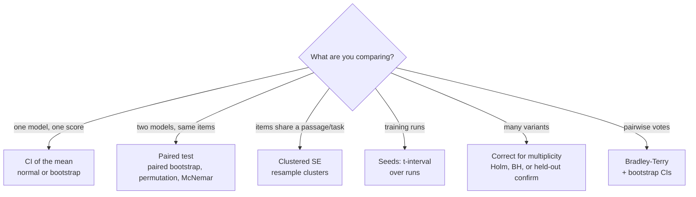
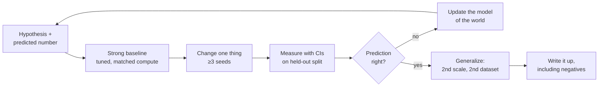

# 08 — Evaluation and research method

How to measure a model so the number means something, how to tell a real improvement from noise, and how to run research that survives review. This module is what turns an engineer into a member of technical staff: every frontier-lab loop probes it, and every AI product lives or dies by it.

Lab: [15 eval statistics](../labs/15_eval_stats/README.md) · Template: [journal/templates/experiment.md](../journal/templates/experiment.md) · Visual guides: [library](../library/README.md)

**Contents**
1. [What an eval measures](#1-what-an-eval-measures) · validity, the benchmark landscape, contamination, LLM judges, harness sensitivity
2. [Statistics: error bars or it didn't happen](#2-statistics-error-bars-or-it-didnt-happen) · CIs, paired tests, clustered SEs, seeds, power, pass@k, multiple comparisons, arenas
3. [Product evals](#3-product-evals-founder-critical)
4. [The experiment discipline](#4-the-experiment-discipline)
5. [Reproducing papers](#5-reproducing-papers)
6. [Writing](#6-writing)
7. [Research taste](#7-research-taste)
8. [Research projects that fit an 8 GB GPU](#research-projects-that-fit-an-8-gb-gpu)
9. [Interview traps](#interview-traps) · [Check yourself](#check-yourself) · [CPU vs GPU notes](#cpu-vs-gpu-notes) · [Visual guides](#visual-guides) · [Read next](#read-next)

---

## 1. What an eval measures

### 1.1 Validity before precision

An eval is a measuring instrument. Before asking "how precise is it?" (section 2), ask "does it measure the thing?"

| Property | Question | Typical failure |
|---|---|---|
| **Construct validity** | Does the score track the capability you care about? | A multiple-choice "reasoning" set solvable by answer-option elimination; a coding benchmark whose tests accept wrong patches |
| **Content validity** | Does the item set cover the space of the capability? | 500 math items that are 80% algebra |
| **Internal validity** | Is a score difference caused by the model, not the harness? | Model A got a 5-shot prompt, model B zero-shot; different answer extraction regexes |
| **External validity** | Does it predict performance in your deployment? | Benchmark prompts are clean English; your users write code-mixed Hindi and English |
| **Reliability** | Would you get the same number again? | Sampling at temperature 1 on 100 items, one run |
| **Freshness** | Could the model have seen the answers? | Test items on GitHub since 2021 (section 1.3) |

An eval is a pipeline, and every stage is a place for a silent bug:


> [!TIP]
> Before trusting any eval, **read 20 raw transcripts end to end**: the prompt exactly as the model saw it, the completion, the extracted answer and the grade. Most eval bugs (truncated generations, a regex that grabs the first number instead of the last, a chat template applied twice) are visible in the first ten.

### 1.2 The benchmark landscape (as of September 2026)

Benchmarks have a half-life. A benchmark is useful while scores are spread out, below ceiling, and uncontaminated; after that it becomes a regression test. Status below is a judgement as of September 2026; re-check leaderboards such as [Epoch AI's benchmarking hub](https://epoch.ai/benchmarks) before quoting a number.

| Category | Examples (year) | What it measures | Status and caveats |
|---|---|---|---|
| Knowledge, multiple choice | MMLU (2020, 57 subjects), MMLU-Pro (2024, 10 options, harder) | Breadth of recall and simple reasoning | MMLU saturated at the frontier and has known label errors; still useful for small models and regression checks |
| Expert reasoning | GPQA (2023; the 198-question Diamond subset is the one reported), Humanity's Last Exam (2025) | Graduate-level, search-resistant questions | GPQA Diamond near ceiling at the frontier; small n means wide CIs (±~6 points at 70%) |
| Math with verifiers | GSM8K (2021), MATH (2021), AIME (30 problems a year), FrontierMath (2024) | Multi-step math with checkable final answers | GSM8K and MATH saturated; AIME is fresh each year but tiny, so report CIs and use many samples |
| Code with tests | HumanEval (2021, 164 problems), LiveCodeBench (2024, continuously collected), SWE-bench (2023) and SWE-bench Verified (2024, 500 human-validated tasks) | Program synthesis; real repository issue resolution | HumanEval saturated and contaminated; SWE-bench scores depend heavily on the agent scaffold, so compare scaffolds, not just models |
| Instruction following | IFEval (2023) | Verifiable constraints ("answer in exactly 3 bullets") | Programmatic grading, cheap; narrow construct |
| Agentic and tool use | τ-bench (2024), GAIA (2023), OSWorld (2024), MLE-bench (2024), RE-Bench (2024) | Multi-step tasks in environments | Expensive, high variance, scaffold-dependent; τ-bench's **pass^k** measures reliability, not peak |
| Long tasks | METR's time-horizon metric (Kwa et al. 2025) | The human task length at which an agent succeeds 50% of the time | Their 2025 paper found the horizon doubling roughly every 7 months over 2019–2024; the trend itself is the object of study |
| Abstraction | ARC-AGI (2019 onward) | Few-shot program induction on grid puzzles | Private held-out sets; compute per task matters for comparisons |
| Human preference | Chatbot Arena / LMArena (2024) | Pairwise human votes aggregated with Bradley–Terry | Style and length effects; *The Leaderboard Illusion* (2025) documents private testing and selective disclosure that bias rankings |
| Safety and dangerous capabilities | Refusal and over-refusal sets, cyber CTFs, bio uplift studies | Harmful compliance and capability thresholds | Mostly run by labs and AI security institutes; see [module 09](09-interpretability-and-safety.md#4-governance-frameworks) |
| **Your product's own evals** | Built from your traces | Exactly what your users need | The only eval that cannot be contaminated by the public web; section 3 |

> [!NOTE]
> "Saturated" means the frontier scores are within noise of the ceiling or of each other, *or* the remaining errors are mostly label noise. A saturated benchmark can still show that a small model is broken.

### 1.3 Contamination: detection and defence

Contamination means test items (or close paraphrases) were in the training data, so the score measures memory instead of capability. It is the default, not the exception, for any benchmark older than the model's data cutoff.

| Method | How it works | Needs | Blind spot |
|---|---|---|---|
| **n-gram overlap** | Flag test items sharing long n-grams with the training corpus (GPT-3 used 13-grams) | Training data access | Misses paraphrases and translations; Yang et al. (2023) showed rephrased test items pass n-gram decontamination and still inflate scores |
| **Canary strings** | Benchmarks embed a unique GUID (BIG-bench does); ask the model to complete it | Nothing | Only proves the canary document was seen; absence proves little |
| **Min-K% probability** (Shi et al. 2023) | Average log-probability of the k% least likely tokens; seen text has few very surprising tokens | Logprobs | Threshold calibration; weak on short items |
| **Exchangeability test** (Oren et al. 2023) | If the model saw the test set in its canonical order, the likelihood of that order is higher than for random shuffles | Logprobs, the benchmark's published order | Only detects verbatim, ordered inclusion |
| **Post-cutoff split** | Compare accuracy on items created before vs after the training cutoff (LiveCodeBench dates every problem) | Dated items | Difficulty may drift over time; control for it |
| **Fresh parallel set** | Write new items from the same distribution and compare (GSM1k, Zhang et al. 2024, for GSM8K) | Effort | Matching difficulty is hard; the gap is an upper bound on contamination plus distribution shift |
| **Completion probe** | Give the first half of a test item; check whether the model reproduces the rest verbatim | Generation only | Chat-tuned models may refuse or paraphrase |

> [!TIP]
> For your own evals: keep the test set out of any repo you might later crawl or fine-tune on, add a canary string, date every item, and keep a small **private** held-out split you look at rarely. If performance on the public split rises and the private split does not, you are overfitting to the benchmark, even without any leak.

### 1.4 LLM-as-judge: calibrate it like any instrument

Model graders are unavoidable for open-ended output, and they are biased in known ways:

| Bias | Evidence | Mitigation |
|---|---|---|
| **Position** | Judges prefer the first (or second) answer in pairwise comparisons (Wang et al. 2023; Zheng et al. 2023) | Evaluate both orders; count a win only if it survives the swap, otherwise a tie |
| **Verbosity** | Longer answers win regardless of quality | Rubrics that penalize padding; length-controlled win rates (Dubois et al. 2024 regress out length) |
| **Self-preference** | Models rate their own generations higher and can recognize them (Panickssery et al. 2024) | Use a judge from a different family than the models being compared |
| **Surface cues** | Confident tone, markdown formatting, citations that look real | Reference answers; grade specific claims, not the overall impression |

**The calibration protocol.**

1. Write a rubric with **binary or 3-level criteria** ("Does the answer cite the correct clause? yes/no"). Likert scales of 1–10 are poorly calibrated for both humans and models.
2. Have humans (you, then a second person) label 100–200 items. Measure human–human agreement first: it is the ceiling for the judge.
3. Run the judge on the same items. Report the confusion matrix, **true positive rate and true negative rate**, and Cohen's κ:
   $$\kappa = \frac{p_o - p_e}{1 - p_e}$$
   where $p_o$ is observed agreement and $p_e$ is agreement expected by chance from the marginals.
4. Iterate on the rubric using a *development* split of the labels, then report agreement on a held-out split. Otherwise you have overfit the judge prompt to your labels.

**Worked example: why raw agreement misleads.** A judge agrees with humans on 85% of items. Both label 80% of items "pass". Chance agreement is $p_e = 0.8 \cdot 0.8 + 0.2 \cdot 0.2 = 0.68$, so $\kappa = (0.85 - 0.68)/(1 - 0.68) = 0.53$: moderate, not good. A judge that says "pass" to everything would score 80% raw agreement and κ = 0.

**Correcting a biased judge's pass rate.** If the judge has true positive rate TPR and true negative rate TNR (measured on your labeled set), an observed pass rate $\hat p_{\text{obs}}$ implies a true pass rate

$$\hat p = \frac{\hat p_{\text{obs}} + \text{TNR} - 1}{\text{TPR} + \text{TNR} - 1}.$$

With TPR = 0.95, TNR = 0.80 and an observed 70% pass rate: $\hat p = (0.70 + 0.80 - 1)/(0.95 + 0.80 - 1) = 0.667$. The judge was inflating the pass rate by about 3 points. Propagate the uncertainty in TPR and TNR by bootstrapping the labeled set too.

> [!WARNING]
> A judge that is accurate on average can still be wrong on the *difference* between two systems. If model B's failures are subtler than model A's, a judge with a low TNR will under-penalize B. Check agreement separately on items where the two systems disagree.

### 1.5 The harness is part of the result

Scores move by several points with prompt format, few-shot selection, answer ordering and extraction rules. Sclar et al. (2023) found large swings from formatting changes alone, Alzahrani et al. (2024) showed that reordering multiple-choice options changes leaderboard rankings, and Biderman et al. (2024) document how implementation details in lm-evaluation-harness change results. Rules:

- Fix the harness (template, few-shot set, decoding parameters, extraction) and **report it**. Ideally, publish the prompts and per-item outputs.
- Compare models **under the same harness**. Quoting a vendor's number next to your own is not a comparison.
- For chat models, apply the model's own chat template. For reasoning models, set a generous max-token budget: truncation is scored as wrong.
- Report sensitivity: rerun with 3 prompt variants and show the spread. If the spread is larger than the gap between models, you have no result.

---

## 2. Statistics: error bars or it didn't happen

Every eval score is an estimate from a sample of items (and often of sampled generations and training seeds). Without an interval, "62.1 vs 60.8" is not a result. Miller (2024), *Adding Error Bars to Evals*, is the reference; lab 15 implements every tool below.



### 2.1 Confidence interval for accuracy

For $n$ independent items with accuracy $\hat p$, the standard error is $\text{SE} = \sqrt{\hat p(1-\hat p)/n}$ and the 95% CI is $\hat p \pm 1.96\,\text{SE}$.

| n items | accuracy | 95% half-width |
|---|---|---|
| 100 | 50% | ±9.8 points |
| 198 (GPQA Diamond) | 70% | ±6.4 points |
| 500 | 60% | ±4.3 points |
| 1,000 | 70% | ±2.8 points |
| 2,000 | 70% | ±2.0 points |

Halving the interval costs 4× the items. For small $n$ or accuracy near 0 or 1, use the Wilson interval or a bootstrap; the normal approximation can produce intervals outside [0, 1].

When each item is scored from several samples (say 5 generations per question), average **within** the item first and compute the SE over items. Treating 5 × 500 generations as 2,500 independent items understates the SE, because generations on the same question are correlated.

### 2.2 Paired comparisons: use the same items

Two models evaluated on the same items share the item difficulty, which cancels in the difference. Compute per-item differences $d_i = a_i - b_i$ and the SE of their mean.

**Worked example.** 1,000 items. Model A: 72%, model B: 70%. Both right on 630, both wrong on 210, A-only right on 90, B-only right on 70.

- Unpaired 95% CI on the difference: $0.02 \pm 1.96\sqrt{0.72 \cdot 0.28/1000 + 0.70 \cdot 0.30/1000} = 0.02 \pm 0.040$.
- Paired: $d_i \in \{+1, -1, 0\}$ with 160 nonzero. $\text{SD}(d) = 0.40$, so the CI is $0.02 \pm 1.96 \cdot 0.40/\sqrt{1000} = 0.02 \pm 0.025$.
- McNemar exact test on the discordant pairs (90 vs 70): p ≈ 0.13. A paired permutation test agrees (p ≈ 0.13).

Pairing shrank the interval by 38%, and the 2-point gain is **still not significant**. Only the 160 items where the models disagree carry information; McNemar makes that explicit.

> [!TIP]
> Always log **per-item** scores, not just aggregates. Every paired test, clustered SE, slice analysis and later re-analysis needs them. An eval pipeline that writes only a final accuracy throws away most of its value.

### 2.3 Clustered standard errors

When items share context (5 questions per reading passage, 20 test cases per repository, several turns per conversation), outcomes within a cluster correlate. The naive SE assumes $n$ independent items and is too small. The cluster-robust SE of the mean is

$$\text{SE}_{\text{cluster}} = \frac{1}{n}\sqrt{\sum_{c} \Big(\sum_{i \in c} (x_i - \bar x)\Big)^2}.$$

The **design effect** gives intuition: with clusters of size $m$ and intra-cluster correlation $\rho$, the variance inflates by $1 + (m-1)\rho$. With $m = 5$ and $\rho = 0.3$ the variance is 2.2× larger and the SE 1.48× larger. Your 1,000 questions are worth about 450 independent ones. Bootstrapping works too, if you **resample clusters**, not items.

### 2.4 Seeds and training noise

Eval noise (which items) and training noise (which seed, data order, initialization) are different sources. A fine-tuning result from one seed confounds the method with luck.

- Train at least 3 seeds per arm for small-scale claims (5 if the effect is small), and report mean and spread over seeds.
- With $k$ seeds, the CI uses Student's t with $k-1$ degrees of freedom: $t_{0.975,2} = 4.30$ for 3 seeds, not 1.96. Three seeds give a wide interval; that is the honest answer.
- Separate the two variance sources: evaluate each seed's checkpoint on the same items, then compare seed-to-seed spread with the item-level SE. If seed spread dominates, more eval items will not help.
- Change one seed at a time when debugging: data-order seed and init seed can have very different effects.

### 2.5 Power: decide n before you collect data

Power is the probability of detecting a real effect of a given size. For an unpaired two-proportion z-test at level α and power $1-\beta$:

$$n \text{ per arm} = \frac{\left(z_{1-\alpha/2}\sqrt{2\bar p(1-\bar p)} + z_{1-\beta}\sqrt{p_1(1-p_1) + p_2(1-p_2)}\right)^2}{(p_1 - p_2)^2}$$

| Detect | α = 0.05, power 0.8, unpaired | Paired (discordance 16%) |
|---|---|---|
| 50% vs 60% | 388 items | — |
| 80% vs 85% | 906 items | — |
| 70% vs 72% | 8,080 items | ≈ 3,140 items |

For paired binary outcomes, the requirement depends on the discordance rate ψ (fraction of items where the models disagree): $n \approx \big(z_{1-\alpha/2}\sqrt{\psi} + z_{1-\beta}\sqrt{\psi - \delta^2}\big)^2 / \delta^2$. Similar models disagree less, which helps: at ψ = 8%, a 2-point gap needs about 1,570 items.

The practical inverse: given the items you have, compute the **minimum detectable effect**. On a 200-item eval you cannot detect anything smaller than roughly 10 points unpaired. Say so up front instead of running the experiment and squinting.

### 2.6 pass@k and pass^k

With $n$ samples per problem of which $c$ pass, the unbiased estimator of pass@k (Chen et al. 2021) is

$$\text{pass@}k = 1 - \frac{\binom{n-c}{k}}{\binom{n}{k}}$$

averaged over problems. Compute it as a product, $1 - \prod_{i=n-c+1}^{n}(1 - k/i)$, to avoid overflowing binomials.

**Worked example.** $n = 20$, $c = 3$, $k = 5$: $1 - \binom{17}{5}/\binom{20}{5} = 1 - 6188/15504 = 0.601$. The tempting plug-in $1 - (1 - 3/20)^5 = 0.556$ is biased low, because it samples with replacement from an estimated rate. Generate $n \gg k$ samples (the Codex paper used n = 200 for k ≤ 100).

pass@k measures *peak* capability: the problem is solved if any of k tries works. For agents and products you usually want **pass^k** (τ-bench): the probability that *all* k independent tries succeed, estimated per task as $\binom{c}{k}/\binom{n}{k}$. A model with 60% pass@1 can have far lower pass^8. Users experience pass^k.

### 2.7 Multiple comparisons

If you test 10 ablations that do nothing at α = 0.05, the chance that at least one looks significant is $1 - 0.95^{10} = 40\%$, and you expect 0.5 false positives. Checking many metrics, slices, checkpoints or prompt variants does the same thing quietly (the "garden of forking paths").

- **Holm–Bonferroni** controls the family-wise error rate. Sort p-values ascending; compare the $r$-th smallest (r = 0, 1, …) with $\alpha/(m - r)$; stop at the first failure. Example with $m = 5$: p = (0.001, 0.012, 0.02, 0.04, 0.3) against thresholds (0.010, 0.0125, 0.0167, 0.025, 0.05) rejects only the first two.
- **Benjamini–Hochberg** controls the false discovery rate instead: more power when you screen many hypotheses and can tolerate some false leads.
- **Best practice:** explore freely on a development split, pick the winner, then run **one confirmatory comparison** on a held-out split. The confirmatory p-value is clean.

### 2.8 Arenas and Bradley–Terry

Pairwise-vote leaderboards fit a Bradley–Terry model: $P(i \text{ beats } j) = s_i/(s_i + s_j) = \sigma(\theta_i - \theta_j)$ with $\theta = \log s$. On the Elo scale, a 100-point gap means a 64% expected win rate and a 30-point gap only 54%. Two practical consequences: small Elo gaps need thousands of votes to resolve, and CIs should come from bootstrapping the votes and refitting. Rankings whose CIs overlap are ties, however the table is sorted.

### 2.9 Reporting checklist

```text
Model and exact version · harness (template, few-shot, decoding, max tokens) · n items (and n clusters)
Score ± 95% CI (method) · paired difference ± CI and test for comparisons
Seeds (k) and seed spread · number of variants tried (for multiplicity) · compute used
Per-item outputs saved at: <path>
```

---

## 3. Product evals (founder-critical)

Public benchmarks tell you which model to *try*. Your own evals tell you what to *ship*.

1. **Collect real traces.** Log inputs, retrieved context, tool calls, outputs and user reactions (edits, retries, thumbs).
2. **Read them.** Open-code 100 traces: write one line per trace on what went wrong. This is the highest-return hour in AI product work.
3. **Cluster failures into a taxonomy** ("wrong clause retrieved", "correct facts, wrong format", "hallucinated account number"). Count them; fix the biggest bucket first.
4. **Build a targeted eval set per failure mode**, 30–100 items each, including items that currently pass (regression guards).
5. **Write graders in order of preference:** exact or programmatic checks (JSON validates, the number matches, the SQL runs) → reference-based comparison → a model judge calibrated as in section 1.4.
6. **Run evals in CI** on every prompt, model, retrieval or tool change, and on a schedule against production samples. Gate deploys on no statistically significant regression per failure mode.

The payoff: when a new frontier model is released, switching becomes a 30-minute decision backed by numbers. See [tracks/founder/02](../tracks/founder/02-ai-product-engineering.md) and [module 10](10-applied-llm-systems.md#1-rag-that-actually-works) for RAG and agent evals.

> [!TIP]
> Put a dollar and latency column next to every quality number. "Model B is 1.5 points better at 4× the cost per task" is a product decision; "Model B is better" is not.

---

## 4. The experiment discipline

Research is a loop, and the discipline is in the parts people skip: writing the prediction first and writing down the negative result after.



1. **Hypothesis and prediction first.** "Removing std normalization in GRPO will change final accuracy by less than 1 point at 0.5B, because the advantage scale mainly affects step size, which Adam normalizes." A prediction with a reason is falsifiable and teaches you something whichever way it goes.
2. **A strong, tuned baseline.** Most published "wins" are an under-tuned baseline. Give the baseline the same hyperparameter sweep budget as your method. If you swept 20 learning rates for yours, sweep 20 for theirs.
3. **Compute-matched comparisons.** Compare at equal training FLOPs (or equal tokens, or equal wall-clock; state which) and equal inference cost where relevant. A method that trains 1.3× longer or samples 4× more at test time must beat a baseline given the same budget. Plot quality against compute rather than reporting one point.
4. **Ablations.** Change one thing at a time and keep an ablation table: full method, then minus each component. Add components cumulatively from the baseline too; interactions show up when the two orderings disagree.
5. **Seeds and CIs.** Section 2.4. Decide the number of seeds before looking at results.
6. **Generalize.** Check the effect at two scales and on two datasets. Effects that vanish at 2× scale are common in small-model research, and saying so is a contribution.
7. **Log everything.** Config, git hash, data version, seed, hardware, wall-clock. Any number in your write-up should be reproducible from the journal ([template](../journal/templates/experiment.md)).
8. **Report negative results and the compute used.**

> [!TIP]
> Keep a **sanity-check ladder** before any real run: overfit one batch (loss → ~0), check the loss at step 0 equals ln(vocab) for a fresh LM, check that the eval of the unmodified baseline reproduces a known number. Each rung takes minutes and catches bugs that otherwise cost days.

---

## 5. Reproducing papers

Reproduction is the fastest way to build research skill, and a careful one is real signal to hiring managers.

1. **Pick well.** A paper whose core claim shows up at small compute (a mechanism, a loss, an eval finding) rather than one that needs 1,000 GPUs. Good first targets in this curriculum: DPO on a small model ([lab 11](../labs/11_dpo/README.md)), induction-head formation ([lab 16](../labs/16_interpretability/README.md)), a Chinchilla-style fit at tiny scale ([lab 08](../labs/08_scaling_laws/README.md)).
2. **Choose one figure** and state in advance what "reproduced" means (the same qualitative trend? the number within its CI?).
3. **Write the unstated details down** as you guess them: tokenizer, warmup, weight decay on norms, eval prompt, how ties were broken. This list is often the most valuable output.
4. **Start from the authors' code if it exists**, get their number, then re-implement the core. Disagreements between the two are where you learn the most.
5. **Report honestly**: reproduced, partially reproduced (and under which conditions), or not reproduced (and what you ruled out). Contact the authors politely with specific questions; many answer.

---

## 6. Writing

A paper or post is an argument: **claim → evidence → limits**.

- Put the main result, with its number and CI, in the first two sentences.
- Draft the figures first. If the key figure does not make the point on its own, the experiment is not done.
- One idea per paragraph. Define every symbol once. Prefer a table to a paragraph of numbers.
- State compute, seeds, n and the harness. State what you did not test.
- Figures: label axes with units, show error bars and say what they are (95% CI over seeds? over items?), use the same color for the same method across figures.
- Get one person outside your project to read it and tell you the main claim in one sentence. If they can't, rewrite.

---

## 7. Research taste

Taste is choosing problems where a result would matter and is within reach.

- **Unfair advantages.** Work where you know something others don't: Indic languages and tokenization, document AI and scanned forms, consumer-GPU efficiency, a domain you worked in.
- **Chase anomalies.** A loss spike, an eval that disagrees with human judgement, a method that works for the wrong reason. Most good projects start as "that's weird".
- **Simple ideas that scale** beat clever ones that don't. Ask: would this still matter at 100× the compute?
- **Kill projects early.** Set a checkpoint ("if the effect is not visible at 10M parameters in a week, stop") and honor it.
- **Read broadly, implement narrowly.** Skim 20 abstracts a week; reproduce one figure a month.

---

## Research projects that fit an 8 GB GPU

Each project below is a mini-proposal. Budgets assume an RTX 5060 8 GB laptop GPU; measure your real throughput with `python tools/measure_gpu.py` and scale. FLOP estimates use $6ND$ for training ($N$ parameters, $D$ tokens). As a planning figure, assume 20 TFLOP/s achieved in bf16 for small models (often less; measure). All of these are blog-worthy if done carefully with CIs; two done well can become a workshop paper.

### 1. Tokenizer fairness for Telugu
- **Question:** At equal training compute, how much worse is a small LM on Telugu when trained with a GPT-4-style vs an o200k-style pre-tokenizer, and how much of the gap is explained by tokens per byte?
- **Method:** Train BPE tokenizers with both pre-tokenization regexes ([lab 04](../labs/04_tokenizer/README.md)) at 2–3 vocabulary sizes on the same mixed English–Telugu corpus. Train a ~20M-parameter model per tokenizer for the same FLOPs. Compare **bits per byte** (not per token, which is not comparable across tokenizers) on held-out Telugu and English.
- **Compute:** 20M params × 300M tokens → 6 × 2×10⁷ × 3×10⁸ ≈ 3.6×10¹⁶ FLOPs ≈ 30 min per run; 2 tokenizers × 3 vocab sizes × 3 seeds ≈ 9 GPU-hours.
- **Expected figure:** bits-per-byte (y) vs vocabulary size (x), one line per pre-tokenizer, separate panels for Telugu and English, with seed CIs.
- **Pitfalls:** comparing per-token loss; unequal token counts at equal FLOPs (fix FLOPs, let tokens vary, report both); Unicode normalization differences (NFC vs NFD) in Telugu text.

### 2. Scaling laws for byte-level vs BPE models
- **Question:** Do byte-level models have a different scaling exponent from BPE models on TinyStories-scale data, or only a constant offset?
- **Method:** Train 5 sizes (1M–30M parameters) × 2 tokenizations, each at roughly compute-optimal token counts. Fit $L(C) = E + A\,C^{-\alpha}$ per family ([lab 08](../labs/08_scaling_laws/README.md)) in bits per byte, with bootstrap CIs on α.
- **Compute:** about 10 runs, the largest ~3×10¹⁶ FLOPs; 4–8 GPU-hours total.
- **Expected figure:** log-log bits-per-byte vs training FLOPs, two families with fitted curves and the α CIs in the legend.
- **Pitfalls:** byte-level context covers ~4× less text per sequence at the same length, so match context in bytes or discuss it; too few sizes to fit three parameters; learning rate not retuned per size (use a small sweep or μP).

### 3. GRPO ablations on small models
- **Question:** Which GRPO design choices (loss aggregation per token vs per sequence, std normalization of advantages, KL penalty on or off) matter for final accuracy and length drift at 0.5B?
- **Method:** Start from lab 12's GRPO on a verifiable task ([lab 12](../labs/12_grpo/README.md)), then a 0.5B instruct model with LoRA on a math or arithmetic dataset with a programmatic checker. 2³ factorial design, 3 seeds per cell; track accuracy, mean response length and KL to the reference.
- **Compute:** a 0.5B model in bf16 with LoRA, 8 samples per prompt, short responses: a few hours per run. Budget 24 runs over two weeks, or halve with a fractional factorial.
- **Expected figure:** accuracy vs training step per variant with seed bands; a bar chart of main effects with CIs.
- **Pitfalls:** the eval set overlapping with training prompts; judging by training reward instead of held-out accuracy; response-length changes masquerading as capability (Dr. GRPO and DAPO discuss exactly this); too few seeds for RL's high variance.

### 4. KV-cache quantization quality vs speed on consumer Blackwell
- **Question:** For a 1–3B model on an 8 GB card, what do FP8 and INT4 KV caches cost in quality (perplexity, long-context retrieval accuracy) and buy in max context and tokens/s?
- **Method:** Implement per-head, per-token (or per-channel for K) quantization of the KV cache ([lab 13](../labs/13_quantization/README.md), [lab 07](../labs/07_kv_cache_sampling/README.md)); compare with serving-framework implementations where available. Measure perplexity on held-out text and a needle-in-a-haystack-style retrieval task at 4k–32k context.
- **Compute:** inference only; a few GPU-hours.
- **Expected figure:** Pareto plot of quality loss vs memory per token, one point per scheme, with context-length panels.
- **Pitfalls:** K has outlier channels (quantize K per channel, V per token); measuring speed with an unfused dequantize step that dominates; reporting perplexity only, which hides long-context degradation.

### 5. Speculative decoding acceptance vs domain
- **Question:** How does the acceptance rate of a small draft model vary across code, chat and Telugu text, and how well does acceptance predict end-to-end speedup?
- **Method:** Use your exact rejection sampler ([lab 14](../labs/14_speculative_decoding/README.md)) with a 0.5B draft and a 1.5–3B target from the same family (4-bit target if memory is tight). Sweep draft length γ = 1…8 per domain.
- **Compute:** inference only; 2–4 GPU-hours.
- **Expected figure:** acceptance rate α per domain (bars with CIs over prompts) and measured speedup vs γ against the theoretical $(1-\alpha^{\gamma+1})/((1-\alpha)(\gamma c + 1))$ curve, where $c$ is the draft-to-target cost ratio.
- **Pitfalls:** mismatched tokenizers between draft and target; treating tokens as independent when computing CIs (cluster by prompt); greedy vs sampled acceptance differ.

### 6. SAE features of a TinyStories model
- **Question:** How do SAE features split as dictionary size grows, and what fraction of features are interpretable, dead or dense at each size?
- **Method:** Collect residual-stream activations from your lab 05 TinyStories model at one middle layer. Train ReLU+L1 and TopK SAEs ([lab 16](../labs/16_interpretability/README.md)) at widths 4×, 8×, 16×, 32× the model dimension. Track L0, fraction of variance explained, cross-entropy loss recovered, dead-latent fraction. Hand-label 30 random features per width and trace parent–child splits by decoder cosine similarity.
- **Compute:** activation caching (tens of millions of tokens fits on disk in fp16), SAE training minutes to an hour per width.
- **Expected figure:** loss recovered vs L0 frontier per architecture; a tree of one feature splitting across widths.
- **Pitfalls:** labeling features from top activations only (look at random activating examples too); comparing SAEs at different L0; forgetting to normalize activations.

### 7. Error bars on a public leaderboard
- **Question:** Which rank orderings on a public leaderboard survive paired CIs and multiple-comparison correction?
- **Method:** Obtain per-item results (run lm-evaluation-harness with `--log_samples` on a few open models yourself, or use leaderboards that publish per-item outputs). Compute per-model CIs, pairwise paired tests for adjacent models, Holm correction, and clustered SEs where items share a source ([lab 15](../labs/15_eval_stats/README.md)).
- **Compute:** CPU is enough if per-item results exist; otherwise a few GPU-hours of inference for small models.
- **Expected figure:** the leaderboard as a dot plot with 95% CIs and brackets for statistically distinguishable groups.
- **Pitfalls:** unpaired tests on paired data; ignoring prompt-sensitivity variance (rerun 2–3 templates); overstating: "not significantly different" is not "equal".

> [!TIP]
> Write the one-page proposal (question, prediction, method, budget, figure, kill criterion) in your journal *before* the first run, and link it from the final post. Readers and interviewers trust results that were predicted.

---

## Interview traps

- **"Model B scored 1.2 points higher on MMLU, so it's better."** Ask for n, the CI and whether the test was paired. At n ≈ 14,000 a 1.2-point gap can be real; on a 200-item subset it cannot.
- **Averaging generations as independent items.** 5 samples × 500 questions is 500 units, not 2,500.
- **Using 1.96 with 3 seeds.** Use $t_{0.975,2} = 4.30$.
- **"Ten ablations at p < 0.05 give one false positive."** They give 0.5 expected false positives, and a 40% chance of at least one.
- **Naive pass@k from $1-(1-\hat p)^k$.** Biased; use the combinatorial estimator with $n \gg k$.
- **Trusting a judge because raw agreement is 85%.** Report κ, TPR and TNR; a constant "pass" judge can reach high raw agreement.
- **Comparing per-token losses across tokenizers.** Use bits per byte.
- **Claiming a method beats a baseline** that got less tuning or less compute.
- **"No contamination because we did n-gram decontamination."** Paraphrases and translations pass n-gram filters.

## Check yourself

<details><summary>1. A 500-item eval gives 60%. What is the 95% CI, and how many items to halve it?</summary>

SE = √(0.6 · 0.4 / 500) = 0.0219, so ±4.3 points. Halving the width needs 4× the items: 2,000.
</details>

<details><summary>2. Why does pairing reduce variance, and when does it not help?</summary>

Var(a − b) = Var(a) + Var(b) − 2 Cov(a, b). On the same items, per-item difficulty makes a and b positively correlated, so the covariance term subtracts. If the models' errors were independent of item difficulty (covariance near zero), pairing would help little.
</details>

<details><summary>3. You have 200 passages with 5 questions each. Your naive SE is 1.4 points. What might the real SE be?</summary>

With intra-passage correlation ρ, the design effect is 1 + 4ρ. At ρ = 0.3 the variance is 2.2× larger, so the SE is about 1.4 × 1.48 ≈ 2.1 points. Compute it with the clustered formula or by resampling passages.
</details>

<details><summary>4. What is pass@5 with n = 20 samples of which 3 pass? Why not 1 − 0.85⁵?</summary>

1 − C(17,5)/C(20,5) = 0.601. The plug-in estimator 0.556 treats the estimated rate as exact and samples with replacement; the combinatorial estimator is unbiased for sampling k without replacement from the n generations.
</details>

<details><summary>5. An LLM judge agrees with humans 90% of the time. What else do you need before trusting it?</summary>

The base rate (to compute κ), TPR and TNR separately, agreement on the items where the compared systems differ, a held-out split not used to tune the judge prompt, and human–human agreement as the ceiling. Also check position and length bias with swapped and length-controlled comparisons.
</details>

<details><summary>6. How would you detect that a model saw a benchmark during training, with only API access and logprobs?</summary>

Min-K% probability on test items vs matched fresh items; the exchangeability test (canonical order vs shuffled likelihood); completion probes on item prefixes; and comparing accuracy on a freshly written parallel set or post-cutoff items. None is conclusive alone; converging evidence is.
</details>

<details><summary>7. Your new method beats the baseline by 2 points with one seed each. What do you do before claiming it?</summary>

Tune the baseline with the same budget, match compute, run ≥3 seeds per arm, compute a paired CI on a held-out split, check a second scale or dataset, and count how many variants you tried to judge multiplicity.
</details>

<details><summary>8. How many items do you need to detect 70% vs 72% with 80% power?</summary>

About 8,080 per arm unpaired. Paired, with 16% discordance, about 3,140. If you have 1,000 items, the minimum detectable effect is roughly 5–6 points unpaired, so say that instead.
</details>

<details><summary>9. Two arena models differ by 20 Elo with overlapping bootstrap CIs. What should the leaderboard show?</summary>

A tie. 20 Elo is about a 53% expected win rate. Show CIs and group models that are not distinguishable; sorting by point estimate implies an ordering the data do not support.
</details>

## CPU vs GPU notes

- **Everything in section 2 is CPU work.** Lab 15 runs in seconds on any laptop; re-scoring a leaderboard from per-item results needs no GPU.
- **Generating eval outputs** is where the GPU matters. On 8 GB, small models (≤ 3B in bf16, ≤ 7–8B in 4-bit) run locally; use batched inference (vLLM or SGLang where they support your card, or Hugging Face `generate` with batching) and cache every output so re-grading never re-generates.
- **CPU-only learners:** use per-item result files published with open evals, or API models with a hard budget; all statistics, judge calibration and contamination tests on logprobs work unchanged.
- **Reasoning models are expensive to evaluate.** Budget output tokens: 500 items × 8 samples × 4k tokens is 16M generated tokens.

## Visual guides

- [Library: visual guides and PDFs per topic](../library/README.md) (evaluation, statistics, research method).
- The CI-width and power tables above are worth redrawing yourself as plots: half-width vs n, and required n vs effect size, for a few base rates.

## Read next

- **Read first:** Miller 2024, [*Adding Error Bars to Evals*](https://arxiv.org/abs/2411.00640); Chen et al. 2021, [Codex / pass@k](https://arxiv.org/abs/2107.03374) (section 2.1 and appendix A); Zheng et al. 2023, [*Judging LLM-as-a-Judge*](https://arxiv.org/abs/2306.05685).
- Then: Biderman et al. 2024, [*Lessons from the Trenches on Reproducible Evaluation*](https://arxiv.org/abs/2405.14782); Oren et al. 2023, [*Proving Test Set Contamination*](https://arxiv.org/abs/2310.17623); Card et al. 2020, [*With Little Power Comes Great Responsibility*](https://arxiv.org/abs/2010.06595); Kwa et al. 2025, [METR time horizons](https://arxiv.org/abs/2503.14499).
- Full list: [papers.md, evaluation](papers.md#08-evaluation-and-research).
- Next module: [09 Interpretability and safety](09-interpretability-and-safety.md). Apply section 2 to RAG and agents in [10 Applied LLM systems](10-applied-llm-systems.md).
