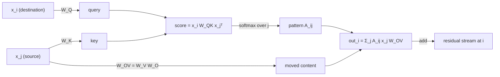
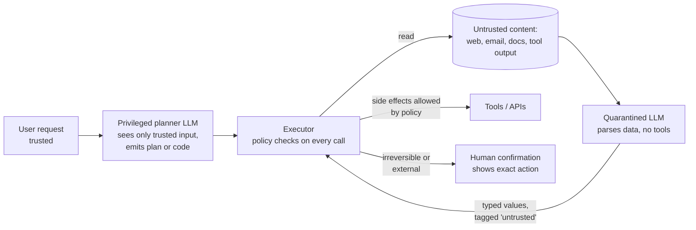

# 09 — Interpretability and safety

How to find out what a network computes (circuits, features, causal interventions), how deployed models fail (misalignment, misuse, prompt injection), and how labs and governments try to manage the risk. It is essential for Anthropic-style roles, useful at every frontier lab, and non-negotiable for anyone shipping agents.

Lab: [16 interpretability](../labs/16_interpretability/README.md) · Visual guides: [library](../library/README.md) · Course: ARENA (free; the mechanistic interpretability chapter)

**Contents**
1. [Mechanistic interpretability](#1-mechanistic-interpretability) · residual stream, QK/OV circuits, induction heads, superposition, SAEs, probing, patching, steering, attribution graphs
2. [Alignment failure modes to be able to discuss concretely](#2-alignment-failure-modes-to-be-able-to-discuss-concretely)
3. [Misuse and security](#3-misuse-and-security-agent-builders-must-master-this) · jailbreaks, prompt-injection defenses for agents
4. [Governance frameworks](#4-governance-frameworks)
5. [Your position](#5-your-position)
6. [Interview traps](#interview-traps) · [Check yourself](#check-yourself) · [CPU vs GPU notes](#cpu-vs-gpu-notes) · [Visual guides](#visual-guides) · [Read next](#read-next)

---

## 1. Mechanistic interpretability

The goal is to reverse-engineer a trained network into human-understandable variables (**features**) and the computations over them (**circuits**), and to *verify* the story with causal interventions. The field's working hypotheses: features are roughly linear directions in activation space, and circuits are sparse paths between them.

### 1.1 The residual stream view

In a pre-norm transformer, every layer reads from and adds to one shared vector per position, the residual stream:

$$x^{(\ell+1)} = x^{(\ell)} + \sum_h \text{head}_h(x^{(\ell)}) + \text{MLP}(\cdot).$$

Because every component *adds* its output, the final logits are a sum of contributions from every path through the network. That linearity is what makes the analysis tractable: you can attribute a logit to individual heads (direct logit attribution: project a head's output onto the unembedding direction of a token), and components communicate by writing to and reading from linear subspaces of the stream. The residual stream has no privileged basis (any rotation gives an equivalent model), while MLP neurons do (the elementwise nonlinearity picks the basis), which is why looking at single residual dimensions is meaningless but looking at single neurons is at least a reasonable first try.

The **logit lens** (decode intermediate residual streams with the final unembedding) and the **tuned lens** (Belrose et al. 2023; learn a per-layer affine translator first) show how the prediction forms layer by layer.

### 1.2 QK and OV circuits

Take one attention head with $W_Q, W_K, W_V \in \mathbb{R}^{d \times d_h}$ and $W_O \in \mathbb{R}^{d_h \times d}$ (row-vector convention, $x_i \in \mathbb{R}^{1 \times d}$). Then

$$\text{score}(i, j) = \frac{x_i W_Q W_K^\top x_j^\top}{\sqrt{d_h}} = \frac{x_i\, W_{QK}\, x_j^\top}{\sqrt{d_h}}, \qquad \text{out}_i = \sum_j A_{ij}\, x_j\, W_V W_O = \sum_j A_{ij}\, x_j\, W_{OV}.$$

- $W_{QK} = W_Q W_K^\top$ (a $d \times d$ bilinear form of rank ≤ $d_h$) decides **where to look**.
- $W_{OV} = W_V W_O$ (a $d \times d$ linear map of rank ≤ $d_h$) decides **what to move** once the head looks.
- Given the attention pattern $A$, the head is *linear* in its input. The only nonlinearity is the softmax that produces $A$.



Multiplying through the embeddings gives vocabulary-level matrices (Elhage et al. 2021). For a one-layer attention-only model, $W_E W_{QK} W_E^\top$ says which tokens attend to which, and $W_E W_{OV} W_U$ says how attending to token $b$ changes the logits. A **copying head** has an OV circuit with a large positive diagonal (attending to "Paris" raises the logit of "Paris"); summarize it with the eigenvalues of $W_{OV}$ (mostly positive means copying).

**Composition.** A layer-2 head can read what a layer-1 head wrote. If the layer-1 output feeds the layer-2 **queries** it is Q-composition, the **keys** K-composition, the **values** V-composition. Composition is what lets two layers implement algorithms that one layer cannot.

### 1.3 Induction heads: the mechanism

Induction heads complete patterns: having seen `... A B ... A`, predict `B`. The two-head circuit:

```text
position:        ...  j-1   j   ...   i
token:           ...   A    B   ...   A      -> predict B

layer 1  previous-token head at j: attends to j-1, its OV writes "previous token = A" into resid[j]
layer 2  induction head at i:     query "current token = A" matches key "previous token = A" at j
                                  (K-composition), so it attends to j; its OV copies "B" -> logit(B) rises
```

- It is **K-composition**: the key at position j is built from information moved there by the previous-token head.
- It works for **any** tokens, including ones never seen together in training, so it is a genuine in-context algorithm rather than memorized bigrams. That is why lab 16 trains on *random* repeated sequences with a *varying* period: with random tokens nothing but copying can lower the second-half loss, and with a varying period no fixed positional offset can do the copying.
- The **induction score** measures it directly: on a sequence repeated with period T, the head at position i should attend to $i - T + 1$ (the token after the previous occurrence of the current token). Chance is about $1/i$.
- Olsson et al. (2022) found that induction heads form in a sudden **phase change** early in training, visible as a bump in the training loss, at the same time as a jump in in-context learning (loss on late tokens in the context falls relative to early tokens). They argue induction heads (and fuzzier variants that copy by meaning, not exact token) account for much of in-context learning.

> [!TIP]
> In lab 16, plot each head's attention pattern on a repeated sequence. The previous-token head shows a sub-diagonal stripe; the induction head shows a stripe offset by T − 1. Then zero-ablate the previous-token head and measure how far the induction scores fall and the second-half loss rises: that is the causal test of K-composition. In a model that small the drop is partial, because other paths carry part of the signal. Also train the lab's fixed-period variant: it passes the induction-head test with a positional shortcut and no circuit at all, a reminder to test a claimed mechanism on inputs a shortcut cannot solve.

### 1.4 Superposition

*Toy Models of Superposition* (Elhage et al. 2022) compresses $n$ sparse features into $m < n$ dimensions and reconstructs them:

$$h = W x, \qquad x' = \text{ReLU}(W^\top h + b), \qquad \mathcal{L} = \sum_i I_i\,(x_i - x'_i)^2,$$

with feature importances $I_i$ and each feature active with small probability.

- **Dense features:** the model stores the $m$ most important features orthogonally and drops the rest (like PCA).
- **Sparse features:** the model stores *more* features than dimensions in almost-orthogonal directions, accepting interference because two features are rarely active together. The ReLU and a negative bias filter out the small interference terms.
- Geometry emerges: antipodal pairs, triangles, pentagons; and there are phase changes in whether a feature gets a dedicated direction, depending on sparsity and importance.
- High-dimensional spaces allow exponentially many almost-orthogonal directions (Johnson–Lindenstrauss), so real models can hold far more features than they have neurons.

The consequence: **polysemantic neurons** are expected, not a bug. A neuron that fires for both "DNA sequences" and "legal citations" is a projection of several feature directions onto one basis vector. To find the features you need to undo the compression, which is what sparse dictionary learning tries to do.

### 1.5 Sparse autoencoders (SAEs)

An SAE learns an overcomplete dictionary (width $F \gg d$) such that each activation is a sparse non-negative combination of dictionary directions:

$$f = \text{ReLU}\big((x - b_{\text{dec}}) W_{\text{enc}} + b_{\text{enc}}\big), \qquad \hat x = f\, W_{\text{dec}} + b_{\text{dec}},$$
$$\mathcal{L} = \lVert x - \hat x \rVert_2^2 + \lambda \sum_i f_i\, \lVert W_{\text{dec},i} \rVert_2 .$$

The decoder-norm factor stops the model from cheating the L1 penalty by shrinking $f$ and growing decoder rows; lab 16 instead keeps decoder rows at unit norm, which is equivalent. Each latent $i$ is a candidate feature with direction $W_{\text{dec},i}$.

**Variants.**

| Variant | Idea | Why |
|---|---|---|
| ReLU + L1 (Bricken et al. 2023; Cunningham et al. 2023) | The objective above | Simple; but L1 shrinks activations toward zero (**shrinkage**) |
| **TopK** (Gao et al. 2024) | Keep the k largest pre-activations, zero the rest | Sets L0 = k directly, no shrinkage, clean scaling laws; an auxiliary loss (AuxK) revives dead latents |
| BatchTopK (Bussmann et al. 2024) | Top k × B across the whole batch | Lets L0 vary per token; use a fixed threshold at inference |
| Gated (Rajamanoharan et al. 2024) | Separate "is it on?" gate from "how much?" magnitude; L1 only on the gate | Removes shrinkage |
| **JumpReLU** (Rajamanoharan et al. 2024) | $f = z \cdot H(z - \theta)$ with learned thresholds; L0 penalty via straight-through estimators | Strong reconstruction–sparsity frontier; used for Gemma Scope |
| Transcoders (Dunefsky et al. 2024) | Sparse map from an MLP's input to its output | Features that *compute*, which makes circuits easier to trace |
| Cross-layer transcoders, crosscoders | Read at one layer, write to many layers (or across models) | The basis of attribution graphs (1.8) and model diffing |

**Metrics (always report several, at matched L0).**

- **L0:** mean number of active latents per token. Interpretability and reconstruction trade off along it.
- **Reconstruction:** fraction of variance unexplained $\lVert x - \hat x\rVert^2 / \lVert x - \bar x \rVert^2$.
- **Downstream loss:** splice $\hat x$ back into the model and measure the cross-entropy increase $\Delta\text{CE} = L_{\text{SAE}} - L_{\text{clean}}$. "Loss recovered" $= (L_{\text{ablate}} - L_{\text{SAE}})/(L_{\text{ablate}} - L_{\text{clean}})$ is common but flattering, because zero-ablating a residual stream is catastrophic; also report $\Delta\text{CE}$ in nats, or the size of a smaller model with the same loss.
- **Dead and dense latents:** fraction that never fire over millions of tokens, or fire on a large fraction of tokens.
- **Interpretability:** automated interpretability (a model writes an explanation from activating examples, then is scored on predicting activations on held-out text), plus human spot checks.
- **Usefulness:** does the SAE help a downstream task (probing, concept removal, circuit finding)? SAEBench (Karvonen et al. 2025) bundles such tests.

**Pitfalls.**

- **Dead latents** waste capacity; use sensible initialization (encoder = decoder transpose), resampling, or AuxK.
- **Feature splitting:** as width grows, a "math" latent splits into "algebra", "geometry" and so on. There is no single "true" dictionary size.
- **Feature absorption** (Chanin et al. 2024): a general latent ("starts with S") fails to fire on tokens where a more specific latent ("short") absorbed it, so the general latent is an unreliable classifier.
- **Dark matter:** the reconstruction error is structured, not noise; some of the computation you care about may live there.
- **Top-activation illusions:** labels from the top 20 activations describe the latent's extreme, not its typical behavior. Look at random activating examples at several quantiles.
- **Baselines:** on downstream probing, SAE-based probes did not beat plain logistic regression on activations (Kantamneni et al. 2025). Always compare with the simple baseline.

### 1.6 Probing

A probe is a small classifier (usually linear) trained on activations to predict a property: part of speech, truth of a statement, board state in a game.

- **Accuracy is correlation, not use.** A probe can decode information the model never uses, especially with high-capacity (nonlinear) probes. Measure **selectivity** against control tasks (Hewitt & Liang 2019) and a randomly initialized model.
- **Difference of means** (mass-mean) directions often generalize and act causally better than logistic-regression directions (Marks & Tegmark 2023, *The Geometry of Truth*).
- **Make it causal:** ablate or add the probe direction and check that behavior changes the way the probe predicts.
- Unsupervised variants such as contrast-consistent search (Burns et al. 2022) look for directions satisfying logical consistency; later work showed they can latch onto other salient features, so validate them.
- Probes are cheap **monitors**: a linear probe on activations can flag a behavior at almost no inference cost, which is one practical safety use of interpretability.

### 1.7 Causal methods: patching variants

Activation patching runs the model on two inputs, **clean** (behavior present) and **corrupted** (behavior absent, minimal change), and swaps an activation from one run into the other.

| Variant | Operation | Tells you |
|---|---|---|
| **Denoising** (clean → corrupted) | Run corrupted, patch in the clean activation at one site | Is this site *sufficient* to restore the behavior? |
| **Noising** (corrupted → clean) | Run clean, patch in the corrupted activation | Is this site *necessary*? |
| Zero / mean / resample ablation | Replace with 0, the dataset mean, or an activation from a random other input | Importance; zero ablation is off-distribution, so prefer mean or resample |
| **Path patching** (Wang et al. 2022) | Patch only the effect of sender → receiver, freezing other paths | Which *edges* form the circuit (the IOI circuit was mapped this way) |
| **Attribution patching** | First-order Taylor: $\Delta m \approx (a_{\text{clean}} - a_{\text{corr}}) \cdot \partial m / \partial a\,\big|_{\text{corr}}$ | Estimates every site with 2 forward and 1 backward pass; unreliable where the softmax saturates. AtP* (Kramár et al. 2024) adds fixes |
| ACDC (Conmy et al. 2023) | Iteratively prune edges whose patching changes the metric less than a threshold | Automated circuit discovery |
| Causal tracing (Meng et al. 2022, ROME) | Corrupt subject embeddings with noise, restore single states | Where factual recall is localized (mid-layer MLPs at the last subject token) |

**Metric.** Use the logit difference between the correct and a counterfactual answer, normalized as $(m_{\text{patched}} - m_{\text{corr}})/(m_{\text{clean}} - m_{\text{corr}})$: 0 means no effect, 1 means fully restored. That is lab 16's `patching_effect`. Zhang and Nanda (2023) recommend counterfactual prompts (swap one name) over Gaussian-noise corruption, and logit difference over probabilities.

**Pitfalls.** *Self-repair:* ablating a head can cause downstream "backup" heads to compensate (the IOI paper found backup name movers), so single-site ablation underestimates importance. *Off-distribution corruptions* create effects the model never shows naturally. *Subspace illusions* (Makelov et al. 2023): patching a 1-D subspace can change behavior by activating a dormant pathway rather than the one the model normally uses. *Trivial results:* patching the whole residual stream at the final layer restores 100% by construction (lab 16's first test); localization only starts when you patch earlier, narrower sites.

### 1.8 Steering

If a concept is a direction, you can add it.

- **Activation addition** (Turner et al. 2023): add $c \cdot v$ to the residual stream at layer ℓ, with $v$ from a contrast pair ("Love" − "Hate").
- **Contrastive activation addition** (Panickssery et al. 2023): $v$ = mean difference of activations over many contrastive examples; more robust than a single pair.
- **Representation engineering** (Zou et al. 2023): read directions with PCA over contrastive differences, then control with them.
- **Directional ablation:** project a direction out, $x \leftarrow x - (x \cdot \hat r)\hat r$. Arditi et al. (2024) found refusal in many open chat models is mediated by one direction: ablating it removes refusals, adding it induces them. This is also a warning about how shallow some safety training is in open-weight models.
- **SAE feature clamping:** fix a latent to a high value (Anthropic's "Golden Gate Claude" demo in 2024 clamped a Golden Gate Bridge feature).

Evaluate steering like any intervention: sweep the coefficient, measure the target behavior **and** collateral damage (perplexity, a capability benchmark, coherence), and compare against the obvious baseline of just prompting for the behavior.

### 1.9 Attribution graphs and circuit tracing

Anthropic's 2025 circuit-tracing work (Ameisen et al., methods; Lindsey et al., *On the Biology of a Large Language Model*) scales circuit analysis to a production model:

1. Train a **cross-layer transcoder** (CLT) whose sparse features replace the model's MLPs.
2. For one prompt, build a **local replacement model**: CLT features, plus **error nodes** that hold whatever the CLT fails to reconstruct, with attention patterns and normalization denominators frozen from the real forward pass. The model is then linear in feature activations, so direct effects between features are exact.
3. The **attribution graph** has nodes for input tokens, active features, error nodes and output logits, and edges weighted by direct effect. Prune it to the most important paths and group related features into "supernodes" by hand.
4. **Validate** by intervening on the *original* model: suppress or inject the features and check the output changes as the graph predicts.

Findings include two-hop reasoning inside a forward pass ("the capital of the state containing Dallas": a Texas representation, then Austin), planning rhyme words before writing a line of poetry, shared multilingual features, and a default "can't answer" circuit that known-entity features inhibit, whose misfiring produces some hallucinations. Limitations: attention computation (why a head attends) is frozen, not explained; error nodes can carry much of the effect; graphs are per prompt; and many prompts do not yield a clean graph. Anthropic open-sourced tooling for building such graphs on open models, browsable on Neuronpedia.

> [!IMPORTANT]
> Interpretability claims are hypotheses about causal structure. The standard of evidence is: (1) a mechanism stated precisely enough to predict the effect of an intervention, (2) the intervention done on the real model, (3) a comparison with a simple baseline explanation. Attention maps, top-activating examples and probe accuracies are starting points, not evidence.

### 1.10 Open problems worth knowing

From *Open Problems in Mechanistic Interpretability* (Sharkey et al. 2025) and the SAE literature: whether features are the right unit at all; explaining attention (QK) computation; scaling circuit analysis beyond single prompts; validating interpretations without ground truth; and turning interpretability into tools that beat baselines on real tasks (detecting deception, auditing hidden objectives, debugging training data).

---

## 2. Alignment failure modes to be able to discuss concretely

Be able to give the mechanism, the evidence and what helps for each. Vague answers ("the model could be deceptive") score poorly; specific ones ("Sleeper Agents showed that adversarial training taught the backdoored models to recognize their triggers better, hiding the behavior rather than removing it") score well.

| Failure mode | Mechanism | Evidence | What helps (partially) |
|---|---|---|---|
| **Reward hacking, specification gaming** | The optimizer finds high-reward behavior the designer did not intend | Classic RL examples; coding agents that special-case or edit unit tests during RL (Baker et al. 2025); formal treatment in Skalse et al. (2022) | Better reward design, held-out checks, monitoring transcripts, penalizing detected hacks carefully (see obfuscation below) |
| **Reward model overoptimization** | Optimizing a learned proxy past a point lowers the true objective | Gao et al. (2022) scaling laws for overoptimization | KL penalties, ensembles, early stopping by gold eval |
| **Sycophancy** | Human raters and preference models sometimes prefer agreeable answers, and RLHF amplifies that | Sharma et al. (2023) | Preference data that rewards disagreement when warranted; targeted evals |
| **Unfaithful chain of thought** | The stated reasoning is not the computation that produced the answer | Turpin et al. (2023) biased few-shot answers toward "A" and models rationalized; Lanham et al. (2023) truncation and corruption tests; Chen et al. (2025) reasoning models often do not mention hints they used | Faithfulness evals; do not treat CoT as ground truth; interpretability cross-checks |
| **Obfuscation under CoT pressure** | Penalizing "bad thoughts" teaches the model to hide them while still misbehaving | Baker et al. (2025) | Keep CoT monitors out of the reward, or apply pressure very carefully; the *monitorability* of CoT is fragile (Korbak et al. 2025) |
| **Alignment faking** | A model behaves differently when it believes it is being trained, to protect its current preferences | Greenblatt et al. (2024): Claude 3 Opus complied with harmful queries more when told responses would be used for training, with explicit reasoning about preserving its values | Evaluations that do not reveal training context; interpretability-based audits |
| **Backdoors that persist** | A trigger-conditioned behavior survives safety training | *Sleeper Agents* (Hubinger et al. 2024): persistence through SFT, RL and adversarial training, strongest in larger models and with chain-of-thought backdoors | Data provenance; probes and other white-box detection; do not assume safety training removes hidden behavior |
| **Sandbagging** | Strategic underperformance on capability evaluations | van der Weij et al. (2024): prompted or password-locked models underperform on dangerous-capability evals selectively | Fine-tuning-based elicitation, consistency checks across formats, white-box checks |
| **In-context scheming** | Given a goal and an opportunity, a model deceives its overseers | Meinke et al. (2024, Apollo Research): frontier models disabled oversight or misrepresented actions in constructed agentic scenarios | Control protocols (below), monitoring, least privilege |
| **Emergent misalignment** | Narrow fine-tuning generalizes to broad misbehavior | Betley et al. (2025): fine-tuning on insecure code produced misaligned answers on unrelated prompts | Evaluate broadly after any fine-tune; data review |
| **Reward tampering** | Generalization from gameable environments to editing one's own reward | Denison et al. (2024), *Sycophancy to Subterfuge* | Environment hygiene; monitoring for tampering |

**AI control** (Greenblatt et al. 2023) is the complementary stance: assume the model might be misaligned and design protocols (trusted monitoring by a weaker model, auditing a sample of actions, restricting affordances) that stay safe anyway. It is directly practical for agent builders.

---

## 3. Misuse and security (agent builders must master this)

### 3.1 Jailbreaks

- **Why they work** (Wei et al. 2023, *Jailbroken*): *competing objectives* (helpfulness vs harmlessness, exploited by role-play and prefix injection) and *mismatched generalization* (safety training does not cover the input distribution: base64, low-resource languages, unusual formats).
- **Adversarial suffixes** (GCG, Zou et al. 2023): gradient-guided token search finds suffixes that transfer across models.
- **Many-shot jailbreaking** (Anthropic 2024): hundreds of faux dialogue turns in a long context shift behavior, with effectiveness growing with the number of shots.
- **Defenses:** safety training, input and output classifiers (Constitutional Classifiers, Sharma et al. 2025: a prototype withstood thousands of hours of red teaming without a universal jailbreak being found, and later versions cut the over-refusal and compute overhead), rate limiting and account-level monitoring. No defense is complete; measure attack success rate and over-refusal together.

### 3.2 Prompt injection: the agent builder's main threat

**Direct** injection is the user attacking your system prompt. **Indirect** injection (Greshake et al. 2023) is worse: an attacker who controls *any text the model reads* (a web page, an email, a PDF, a GitHub issue, a tool result, an MCP tool description) plants instructions that the model follows with *your user's* privileges.

The core problem: there is no reliable in-band separation between instructions and data in a token stream, and models are trained to follow instructions wherever they appear. Treat prompt injection as unsolved at the model level, and design so that a successful injection cannot do much damage.

A useful test (Simon Willison's "lethal trifecta"): if an agent has **access to private data**, **exposure to untrusted content**, and **a way to communicate externally**, assume an attacker can exfiltrate the data. Remove at least one leg for each task.



**Defense in depth, strongest first.**

1. **Architecture.** Keep untrusted text away from the component that chooses actions. Patterns catalogued by Beurer-Kellner et al. (2025): action-selector, plan-then-execute, dual LLM (privileged and quarantined), LLM map-reduce, code-then-execute, context minimization. CaMeL (Debenedetti et al. 2025) combines a privileged planner with data-flow tracking: values derived from untrusted sources carry provenance, and policies block, for example, sending private data to an address that came from an untrusted email.
2. **Least privilege.** Scope tools and credentials per task (read-only by default, per-tenant tokens, no secrets in the context window), allowlist egress domains, and cap spending and rate.
3. **Human confirmation** for irreversible or external actions (payments, emails, deletes, pushes), showing the exact action and arguments, not the model's summary of them.
4. **Model-level robustness.** Training with an instruction hierarchy (system > user > tool output; Wallace et al. 2024) or structured queries that separate instructions from data (StruQ, Chen et al. 2024) lowers attack success rates. It does not reach zero, and adaptive attackers find gaps.
5. **Detection and filtering.** Injection classifiers on tool outputs; output filters for exfiltration channels (a classic one: a markdown image whose URL carries data in its query string, fetched automatically when rendered).
6. **Monitoring and response.** Log every tool call with its provenance, alert on anomalies, and be able to revoke credentials fast.

**Evaluate** with benchmarks such as AgentDojo (Debenedetti et al. 2024), reporting both **attack success rate** and **utility under attack** (a defense that makes the agent useless is not a defense), and test against *adaptive* attacks written after seeing your defense.

> [!WARNING]
> "We told the model in the system prompt to ignore instructions in documents" is not a defense. It reduces naive attacks and fails against adaptive ones. Assume any text the model reads can be adversarial, including text your own tools return.

---

## 4. Governance frameworks

Facts in this section are **as of September 2026**; policies change often, so re-verify against the primary documents before quoting them in an interview.

**Practices every lab uses.** Dangerous-capability evaluations (cyber, chemical and biological uplift, autonomous replication, AI R&D acceleration; Shevlane et al. 2023, Phuong et al. 2024), internal and external red teaming, pre-deployment testing with government AI security institutes, system and model cards (Mitchell et al. 2019), staged and monitored deployment, and security of model weights.

**Frontier safety frameworks.** At the 2024 Seoul summit, a group of companies committed to publish frameworks that define capability thresholds and the safeguards required when a model crosses them. Know Anthropic's and at least one other in enough detail to compare:

| | Anthropic Responsible Scaling Policy | OpenAI Preparedness Framework | Google DeepMind Frontier Safety Framework |
|---|---|---|---|
| Threshold unit | AI Safety Levels (ASL-n) and capability thresholds | Tracked categories with High and Critical thresholds | Critical Capability Levels (CCLs) |
| Main risk domains | CBRN weapons, autonomous AI R&D | Biological and chemical, cybersecurity, AI self-improvement | CBRN, cyber, machine-learning R&D, misalignment-related risks |
| At threshold | Required safeguards (deployment and security standards) must be in place; ASL-3 protections were activated in May 2025 with Claude Opus 4 | Safeguards must sufficiently minimize risk before deployment; governance via a safety advisory group | Response plans with security and deployment mitigations |
| Primary source | [anthropic.com/responsible-scaling-policy](https://www.anthropic.com/responsible-scaling-policy) | OpenAI's published Preparedness Framework (updated 2025) | Google DeepMind's published FSF (updated 2025) |

When comparing, ask: who decides a threshold is crossed; are thresholds defined before measurement; what happens if safeguards are not ready (pause or proceed); what is published; and is there external verification.

**Regulation and public institutions (as of September 2026).**

- **EU AI Act:** in force since August 2024; obligations for general-purpose AI model providers apply from August 2025, with extra duties for models with systemic risk (presumed above 10²⁵ training FLOPs). A voluntary General-Purpose AI Code of Practice (July 2025) describes how to comply.
- **AI security institutes:** the UK's (renamed the AI Security Institute in 2025), the US Center for AI Standards and Innovation, and others, including an IndiaAI Safety Institute announced in 2025, test models before release and publish research and tooling (the UK institute maintains the open-source Inspect evaluation framework).
- **US state law:** California enacted a frontier-AI transparency law (SB 53) in 2025 requiring large developers to publish safety frameworks.

---

## 5. Your position

Frontier labs ask what you think and why, and they notice quickly when an answer is rehearsed or pandering. You need positions, not slogans.

**How to form one.**

1. **State a claim with a confidence.** "I think monitoring agent actions is more tractable in the next two years than verifying alignment, about 70%."
2. **Give the crux:** the fact that, if different, would change your mind. "If CoT monitorability degrades as reasoning moves into latent space, monitoring gets much harder."
3. **Steelman the other side** in terms its proponents would accept.
4. **Tie it to evidence** (the papers in sections 1–3) and to your own work.
5. **Say what you would do about it:** a project, an eval, a design choice.

**Write it down.** In [career/stories.md](../career/stories.md#values-and-mission-prep), write two paragraphs each on:

- the most important unsolved safety problem, and why you rank it above the next one;
- what you would refuse to build, and where exactly the line is;
- a time you traded capability for safety or privacy in your own work (FinSentinelAI's local, privacy-first design is a real example: what did it cost, and would you make the same call again?);
- your view on open-weight release of frontier models, with its strongest counterargument;
- how you would tell whether an interpretability or safety method actually works.

**Defend it.** Practice aloud with someone who pushes back. Good answers are specific, admit uncertainty, change when given a good argument, and do not collapse into either doom or dismissal. "I don't know, but here is how I would find out" is a strong answer when true.

---

## Interview traps

- **"The probe gets 95%, so the model uses that feature."** Decodable is not used. Show a causal intervention.
- **"This attention head attends to X, so X is what matters."** Attention weights ignore value norms and the OV map; a head can attend strongly and write almost nothing.
- **"Polysemantic neurons mean the model is confused."** They are the expected result of superposition.
- **"SAE features are the model's true features."** They depend on width, sparsity penalty, data and architecture (feature splitting, absorption).
- **"95% loss recovered, so the SAE is nearly perfect."** Against a zero-ablation baseline that can still be a large ΔCE; report ΔCE in nats.
- **"Patching the final residual stream restored everything, so we've localized it."** That is true by construction.
- **"Ablating the head did nothing, so it's unimportant."** Self-repair can hide importance; check with path patching or ablate backups too.
- **"We'll fix prompt injection with a better system prompt or a classifier."** Probabilistic defenses are layers, not solutions; architecture and least privilege do the heavy lifting.
- **"The chain of thought shows us what the model is thinking."** Not guaranteed to be faithful, and optimizing against it can make it less so.
- **"Safety training removed the backdoor because the eval looks clean."** Sleeper Agents showed otherwise.

## Check yourself

<details><summary>1. What are the QK and OV circuits of a head, and why is the separation useful?</summary>

$W_{QK} = W_Q W_K^\top$ is a bilinear form that scores destination–source pairs (where to attend); $W_{OV} = W_V W_O$ is a linear map applied to the attended source (what to write). Given the pattern, the head is linear, so you can study the two circuits separately, multiply them through embeddings and unembeddings, and read off behaviors such as copying (positive OV eigenvalues).
</details>

<details><summary>2. Walk through how an induction head predicts B in "... A B ... A".</summary>

A layer-1 previous-token head at B's position attends to A and writes "previous token = A" there. At the second A, the layer-2 induction head's query ("current token = A") matches that key (K-composition), so it attends to B's position, and its copying OV circuit raises B's logit.
</details>

<details><summary>3. Why do sparse features lead to superposition, and dense ones not?</summary>

Interference between two features stored in non-orthogonal directions costs loss only when both are active. With sparse features, co-activation is rare, so the benefit of representing more features outweighs the interference; the ReLU and bias clean up small interference. With dense features, interference is constant, so the model keeps only the top features orthogonally.
</details>

<details><summary>4. Why does an L1-penalized SAE underestimate feature activations, and what fixes it?</summary>

L1 penalizes magnitude, so the optimum trades reconstruction for smaller activations (shrinkage). TopK and JumpReLU penalize the number of active latents instead of magnitude; Gated SAEs apply L1 only to the gate.
</details>

<details><summary>5. Denoising vs noising patching: what does each tell you?</summary>

Denoising (clean activation into the corrupted run) tests sufficiency: does this site restore the behavior? Noising (corrupted activation into the clean run) tests necessity: does breaking this site break the behavior? Circuits with redundancy can show high necessity for no single site, which is why both are used.
</details>

<details><summary>6. When does attribution patching fail?</summary>

It is a linear approximation, so it fails where the metric is nonlinear in the activation over the clean–corrupt gap: saturated attention softmaxes, LayerNorm, and cancellations between paths. Verify its top candidates with real patching.
</details>

<details><summary>7. What is an attribution graph, and what does it not explain?</summary>

A per-prompt graph of direct linear effects between cross-layer-transcoder features, tokens, error nodes and logits, computed in a local replacement model with frozen attention patterns, then validated by interventions on the real model. It does not explain why attention heads attend where they do, and error nodes hold whatever the transcoder misses.
</details>

<details><summary>8. Your agent reads email and can send email. How do you defend against indirect prompt injection?</summary>

Break the lethal trifecta per task: a privileged planner that sees only the user's request; a quarantined parser for email bodies with no tools; provenance tracking so recipients or links from untrusted emails cannot become send targets without confirmation; human confirmation showing the exact outgoing email; least-privilege credentials; exfiltration filters; logging. Evaluate attack success and utility under adaptive attacks.
</details>

<details><summary>9. How would you compare two labs' frontier safety frameworks in an interview?</summary>

Compare the threshold definitions and domains, whether thresholds are set before measurement, who decides they are crossed, what safeguards are required and what happens if they are not ready, transparency and external verification, and track record (for example, Anthropic activating ASL-3 protections in May 2025). Give your own view on the weakest point of each.
</details>

## CPU vs GPU notes

- **Lab 16 runs on CPU** in about a minute: a 2-layer attention-only model and a small SAE on toy data.
- **GPT-2 small (124M)** runs comfortably on CPU with TransformerLens or nnsight for patching and attention analysis; IOI-style experiments are feasible on a laptop.
- **On an 8 GB GPU:** Gemma 2 2B in bf16 (about 5 GB of weights) fits with room for activation caching, and Gemma Scope provides open SAEs for it. Training your own SAE is cheap once activations are cached to disk in fp16; the model forward passes are the expensive part.
- **No GPU at all:** browse features and attribution graphs on Neuronpedia, work through ARENA's notebooks on a free hosted GPU, and do the lab on CPU.
- Prompt-injection work needs no GPU: build a small agent against an API or a local 1–3B model and attack it.

## Visual guides

- [Library: visual guides and PDFs per topic](../library/README.md) (interpretability, safety).
- The original Transformer Circuits Thread articles are richly illustrated and interactive: [A Mathematical Framework for Transformer Circuits](https://transformer-circuits.pub/2021/framework/index.html), [Toy Models of Superposition](https://transformer-circuits.pub/2022/toy_model/index.html), [Towards Monosemanticity](https://transformer-circuits.pub/2023/monosemantic-features/index.html), [Scaling Monosemanticity](https://transformer-circuits.pub/2024/scaling-monosemanticity/index.html), [Circuit Tracing](https://transformer-circuits.pub/2025/attribution-graphs/methods.html) and [On the Biology of a Large Language Model](https://transformer-circuits.pub/2025/attribution-graphs/biology.html).
- Anthropic's short explainer: [Tracing the thoughts of a large language model](https://www.anthropic.com/research/tracing-thoughts-language-model).
- [Neuronpedia](https://www.neuronpedia.org): browse SAE features and attribution graphs without a GPU.

## Read next

- **Read first:** Elhage et al. 2021, [*A Mathematical Framework for Transformer Circuits*](https://transformer-circuits.pub/2021/framework/index.html); Olsson et al. 2022, [*In-context Learning and Induction Heads*](https://arxiv.org/abs/2209.11895); Elhage et al. 2022, [*Toy Models of Superposition*](https://arxiv.org/abs/2209.10652); Greshake et al. 2023, [indirect prompt injection](https://arxiv.org/abs/2302.12173).
- Then: Gao et al. 2024, [*Scaling and Evaluating Sparse Autoencoders*](https://arxiv.org/abs/2406.04093); Heimersheim and Nanda 2024, [*How to use and interpret activation patching*](https://arxiv.org/abs/2404.15255); Hubinger et al. 2024, [*Sleeper Agents*](https://arxiv.org/abs/2401.05566); Greenblatt et al. 2024, [*Alignment faking*](https://arxiv.org/abs/2412.14093); Debenedetti et al. 2025, [*Defeating Prompt Injections by Design*](https://arxiv.org/abs/2503.18813); Sharkey et al. 2025, [*Open Problems in Mechanistic Interpretability*](https://arxiv.org/abs/2501.16496).
- Full list: [papers.md, interpretability and safety](papers.md#09-interpretability-and-safety).
- Next module: [10 Applied LLM systems](10-applied-llm-systems.md), where section 3 of this module becomes agent design.
