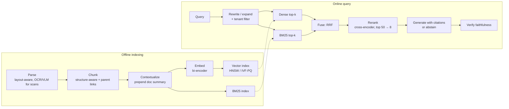

# 10 — Applied LLM systems

How to build LLM products that work and keep working: retrieval-augmented generation with real evals, agents that are reliable and safe to run, context engineering, structured outputs, and the operations and cost discipline around them. This is where existing projects (FinSentinelAI, ECHOME) live; the goal of this module is to make them rigorous and measurable.

Lab: [17 retrieval](../labs/17_retrieval/README.md) · Statistics for every comparison here: [module 08 §2](08-evaluation-and-research.md#2-statistics-error-bars-or-it-didnt-happen) · Security: [module 09 §3](09-interpretability-and-safety.md#3-misuse-and-security-agent-builders-must-master-this) · Visual guides: [library](../library/README.md)

**Contents**
1. [RAG that actually works](#1-rag-that-actually-works) · when to use it, the pipeline, chunking, embeddings and indexes, hybrid retrieval, reranking, evaluation, failure modes, multi-tenancy
2. [Agents](#2-agents) · tool-calling mechanics, reliability math, sandboxing, evaluation
3. [Context engineering](#3-context-engineering)
4. [Structured outputs and control](#4-structured-outputs-and-control)
5. [LLMOps and cost control](#5-llmops-and-cost-control)
6. [Upgrading your own projects](#6-upgrading-your-own-projects)
7. [Interview traps](#interview-traps) · [Check yourself](#check-yourself) · [CPU vs GPU notes](#cpu-vs-gpu-notes) · [Visual guides](#visual-guides) · [Read next](#read-next)

---

## 1. RAG that actually works

### 1.1 Choose deliberately

| Need | Best first tool | Why |
|---|---|---|
| Behavior, tone, task framing | Prompting | Cheapest to iterate; measure before anything heavier |
| Knowledge that changes, must be cited, or is private per customer | **RAG** | Update the index, not the model; citations; access control at retrieval time |
| A format, style or narrow skill the model lacks | Fine-tuning (LoRA, [lab 10](../labs/10_lora/README.md)) | Teaches *how*, not *what*; poor at injecting facts reliably |
| A small corpus (fits comfortably in the window) with relaxed latency | Long context, with prompt caching | Simplest system; no retrieval errors. Cost and quality degrade as the context grows |
| Lower cost or latency at fixed quality | Distillation or a smaller model plus RAG | After you have evals that prove parity |

These combine: a fine-tuned small model that cites retrieved passages is a common production shape.

### 1.2 The pipeline



### 1.3 Parsing and chunking

- **Parsing is where quality is lost first.** PDFs are layout, not text: columns, headers, tables and footnotes get interleaved by naive extractors. Use layout-aware parsers; for scans, tables and forms, a vision-language model often beats OCR plus heuristics. Inspect 20 parsed documents by eye before building anything else.
- **Chunk along structure** (sections, headings, list items, table rows with their header) rather than fixed windows where possible. Sizes of about 200–800 tokens with 10–20% overlap are common starting points; the right size depends on the question type (fact lookup wants small chunks; "summarize the policy" wants large ones), so treat it as a hyperparameter and sweep it on your eval.
- **Parent-document retrieval:** retrieve small chunks for precision, then pass the enclosing section to the generator for context.
- **Contextual chunk augmentation:** before embedding, prepend a short, chunk-specific context generated from the whole document ("This chunk is from ACME's 2023 10-K, section on credit risk; it discusses..."). Anthropic's *Contextual Retrieval* write-up reported that contextual embeddings plus contextual BM25 cut top-20 retrieval failures by 49%, and by 67% with reranking added, on their benchmarks. Prompt caching of the full document makes generating the contexts cheap.
- Keep **metadata** with each chunk (document id, section path, date, tenant, access list, page) for filtering, citation and debugging.

### 1.4 Embeddings and indexes

| Model type | How it scores | Speed | Use |
|---|---|---|---|
| **Bi-encoder** (DPR, Sentence-BERT, E5 family) | Embed query and document separately; cosine or dot product | Fast: documents pre-embedded | First-stage retrieval |
| **Late interaction** (ColBERT) | Token-level embeddings; sum of max similarities | Medium; large index | Higher recall on hard queries |
| **Cross-encoder** reranker | Reads query and document together | Slow: one forward pass per pair | Rerank the top 50–100 |

- Pick embedding models on **your** eval, not only on MTEB averages; domain, language (Telugu, Hindi, code-mixed text) and document length change the ranking.
- **Matryoshka** embeddings (Kusupati et al. 2022) are trained so that prefixes of the vector are good embeddings too: truncate 1024 → 256 dimensions for a 4× smaller index at a small recall cost.
- **Memory math.** 1M chunks × 1024 dims: 4.1 GB in fp32, 2.0 GB in fp16, 1.0 GB in int8, 128 MB as binary codes. Product quantization (PQ) with 64 one-byte codes per vector stores the same set in 64 MB, at a recall cost you recover by reranking with full vectors.
- **HNSW** (Malkov and Yashunin 2016): a layered proximity graph; search greedily descends layers. Parameters: `M` (links per node; memory and recall), `efConstruction` (build quality), `efSearch` (query-time recall vs latency). Excellent recall and latency; memory-heavy; deletes are awkward.
- **IVF** (inverted file, [lab 17](../labs/17_retrieval/README.md)): k-means into `nlist` cells; search the `nprobe` nearest cells. A common starting point is `nlist` on the order of √N (FAISS's guidelines suggest roughly 4√N–16√N), then tune `nprobe` to hit a recall target. **IVF-PQ** combines it with PQ for billion-scale indexes.
- Always measure **ANN recall against exact search** on a sample of queries. An approximate index that loses 5% of true neighbors silently caps your RAG quality.

### 1.5 Hybrid retrieval and fusion

Dense retrieval matches meaning ("terminate the contract" ≈ "end the agreement"); BM25 matches exact strings (account numbers, error codes, rare names, Telugu words the embedding model barely saw). Run both and fuse.

**Reciprocal rank fusion** (Cormack et al. 2009): $\text{score}(d) = \sum_{\text{lists}} 1/(k + \text{rank}(d))$ with $k = 60$. It ignores raw scores, so there is no need to normalize BM25 and cosine onto one scale.

*Worked example:* document X is rank 1 in BM25 and rank 3 in dense: $1/61 + 1/63 = 0.03227$. Document Y is rank 2 in both: $2/62 = 0.03226$. They nearly tie. RRF rewards agreement between retrievers, and a large $k$ flattens the advantage of a single first place.

### 1.6 Reranking and diversity

- A cross-encoder reranker over the fused top 50–100 is usually the single largest precision gain per unit of engineering. Its cost scales with candidates × length, so cap both.
- LLM-based rerankers (ask a model to score or order passages) work well and cost more; distill them into a cross-encoder once you have labels.
- **MMR** (maximal marginal relevance, [lab 17](../labs/17_retrieval/README.md)) trades relevance against redundancy: pick $\arg\max_d\ \lambda\,\text{sim}(q, d) - (1-\lambda)\max_{s \in S}\text{sim}(d, s)$. Use it when the top results are near-duplicates (versions of the same policy, repeated boilerplate).

### 1.7 Query-side techniques

Query rewriting (resolve pronouns from the conversation, expand acronyms), decomposition for multi-hop questions, HyDE (Gao et al. 2022: embed a hypothetical answer instead of the question), metadata filters extracted from the query (dates, document types), and routing between indexes. Each adds latency and a failure point; add one only when the eval says it helps.

### 1.8 Generation with citations

- Give each passage an id; require a citation after every claim; instruct the model to **abstain** ("not found in the provided documents") when the passages do not support an answer.
- Place the most relevant passages at the start or end of the context: *Lost in the Middle* (Liu et al. 2023) showed accuracy dips for information buried in the middle of long contexts.
- For high-stakes answers, have the model extract supporting quotes first, then answer from the quotes; verify that quotes appear verbatim in the sources (a cheap programmatic check).

### 1.9 Evaluating RAG end to end

**Evaluate retrieval and generation separately**, then end to end. In practice, most bad answers trace back to retrieval.

| Stage | Metric | Notes |
|---|---|---|
| Retrieval | **recall@k** | The generator reads all k passages, so "was the needed passage in the top k?" matters most |
| Retrieval | MRR, nDCG@k | Order-sensitive; nDCG handles graded relevance ([lab 17](../labs/17_retrieval/README.md)) |
| Generation | **Faithfulness** (groundedness) | Fraction of answer claims supported by the retrieved passages; an LLM judge calibrated against human labels ([module 08 §1.4](08-evaluation-and-research.md#14-llm-as-judge-calibrate-it-like-any-instrument)) |
| Generation | Answer correctness | Against reference answers; exact match or a judge |
| Generation | Citation precision and recall | Do cited passages support their claims; are claims cited? |
| Generation | Abstention | Correctly says "not found" on unanswerable questions; wrongly abstains on answerable ones |
| System | Latency p50/p95, cost per query | Next to every quality number |

**Building the eval set.**

1. Collect 100–300 real questions (from users, support tickets, domain experts). Synthetic questions generated from chunks are easier than real ones and leak the chunk's wording; use them only to supplement.
2. Label the relevant **documents or spans**, not chunk ids, so labels survive re-chunking.
3. Include unanswerable questions (10–20%), multi-hop questions, questions with exact identifiers, and questions in every language your users write.
4. Freeze a test split. Tune on a development split.
5. Report every metric with a CI, and compare pipelines with **paired** tests on the same questions (lab 15).

Frameworks such as RAGAS and ARES automate judge-based metrics; treat their scores as uncalibrated until you have checked them against your own labels.

> [!TIP]
> Build a **failure browser** early: for each eval question, show the question, the top-k retrieved passages with scores from each retriever, the answer, the citations and the grades on one screen. Debugging RAG from aggregate numbers alone is slow.

### 1.10 Failure modes

| Symptom | Likely cause | Check |
|---|---|---|
| Right document exists, answer says "not found" | Retrieval miss: chunking split the answer, vocabulary mismatch, bad parse | recall@k on that question; look at the parsed text |
| Confident wrong answer with a real-looking citation | Generator ignored or misread the passage | Faithfulness grading; quote-then-answer |
| Answers mix up entities (two customers, two policy versions) | Chunks lost context; near-duplicate documents | Contextual augmentation; metadata filters; MMR |
| Exact codes and names never retrieved | Dense-only retrieval | Add BM25 and fuse |
| Quality dropped after re-indexing | Embedding model or chunker changed; labels tied to chunk ids | Re-run the frozen eval; span-level labels |
| Good offline, bad in production | Eval questions unlike real ones | Sample production queries into the eval weekly |

### 1.11 Multi-tenant security

- Filter by tenant and access list **inside the retrieval query** (a pre-filter in the index), never by post-filtering generated text. Post-filtering leaks through the model's summary.
- Test it: an automated test per tenant that searches for another tenant's unique strings and must return nothing.
- Keep per-tenant caches separate (section 5.4).
- Treat retrieved documents as **untrusted input** for prompt injection ([module 09 §3.2](09-interpretability-and-safety.md#32-prompt-injection-the-agent-builders-main-threat)); a customer can upload a document that attacks other users of a shared workflow.

---

## 2. Agents

An agent is an LLM in a loop that chooses actions (tool calls) based on observations, until it decides it is done or hits a budget. Many problems are better served by a **workflow** (fixed code paths that call an LLM at specific steps: chaining, routing, parallelization, orchestrator–workers, evaluator–optimizer), as Anthropic's *Building Effective Agents* argues. Use an agent when the steps cannot be known in advance, and start with the simplest thing that works.

### 2.1 Tool-calling mechanics

1. You declare tools: a **name**, a **description** (the model's only documentation) and a **JSON Schema** for the arguments. The provider's chat template renders them into the prompt.
2. The model emits a structured tool call (name plus JSON arguments), possibly several in parallel, instead of or alongside text.
3. Your runtime **validates** the arguments against the schema, checks policy (permissions, budgets, confirmation rules), executes, and appends the result as a tool-result message tied to the call's id.
4. Repeat until the model returns a final answer, or a step, token, time or cost budget runs out.

```python
def run_agent(task, tools, max_steps=20, budget_usd=0.50):
    messages = [system_prompt(), user(task)]
    for step in range(max_steps):
        reply = llm(messages, tools=[t.schema for t in tools])
        messages.append(reply)
        if not reply.tool_calls:
            return reply.text                       # final answer
        for call in reply.tool_calls:               # may be parallel
            tool = lookup(tools, call.name)
            args = validate(call.arguments, tool.schema)   # reject, don't guess
            if tool.irreversible and not confirm_with_human(call):
                result = error("user declined")
            else:
                result = sandboxed(tool.run, args, timeout=30)
            messages.append(tool_result(call.id, truncate(result)))
        if spent(messages) > budget_usd:
            return escalate("budget exhausted", messages)
    return escalate("step limit", messages)
```

**Tool design is interface design for the model** (the "agent–computer interface" of SWE-agent). Few, well-scoped tools beat many overlapping ones; names and descriptions should say when to use the tool and when not; return concise, informative results and **actionable error messages** ("date must be YYYY-MM-DD; got 03/04/25"); paginate and truncate large outputs; make tools idempotent where possible. Anthropic's *Writing effective tools for agents* covers this well.

**MCP** (Model Context Protocol) standardizes how applications expose tools, resources and prompts to models through servers, so one integration works across clients. It is transport and discovery, not security: an MCP server's tool descriptions and outputs are untrusted input like any other.

### 2.2 Reliability math

If each step succeeds independently with probability $p$, an $n$-step task succeeds with $p^n$:

| Per-step success | 10 steps | 20 steps | 50 steps |
|---|---|---|---|
| 0.90 | 35% | 12% | 0.5% |
| 0.95 | 60% | 36% | 8% |
| 0.99 | 90% | 82% | 61% |

Levers, with the arithmetic:

- **Raise per-step reliability:** better tools and error messages, fewer steps (one tool that does the right thing beats three calls).
- **Verify and retry:** if a verifier catches a failed step with recall $r$ and one retry is allowed, per-step failure falls from $q$ to $q(1 - r + rq)$. At $q = 0.05$, $r = 0.8$: failure 1.2%, and 20-step success rises from 36% to 79%. With a perfect verifier: 95%.
- **Checkpoints:** a failure costs a restart from the last checkpoint, not from the beginning.
- **Consistency matters to users:** τ-bench's **pass^k** is the chance of succeeding on all k tries. At 90% per-trial success, pass^8 is 43%.

Real steps are not independent (errors correlate, and agents sometimes recover), so treat this as a model that tells you where to look, and measure the real curve: success rate vs task length.

### 2.3 Sandboxing

Assume the agent will eventually run a harmful command, through its own mistake or a prompt injection.

- **Isolation:** run code in a container with no host mounts, or a microVM (Firecracker, gVisor-style sandboxes) for untrusted code; a fresh environment per task.
- **Network:** egress off by default; allowlist the domains a task needs.
- **Credentials:** short-lived, least-privilege, per-task tokens; never secrets in the context window or environment variables the agent can print.
- **Filesystem:** scope to a working directory; snapshots or version control for rollback.
- **Limits:** CPU, memory, wall-clock, number of tool calls, spend.
- **Irreversible actions:** payments, emails, deletions, deployments require human confirmation showing the exact arguments, or a dry-run mode.
- **Audit log:** every call, argument, result and the provenance of the text that led to it.

### 2.4 Evaluating agents

- **Task success in realistic, resettable environments.** Grade the **end state** (the database row, the file, the test suite result) rather than the transcript's claims. Reset the environment between trials.
- **Multiple trials per task** (agents are high-variance): report pass@1 with a CI, and pass^k for reliability.
- **Trajectory analysis:** read failed transcripts, build a failure taxonomy (wrong tool, bad arguments, gave up early, looped, misread an observation, hallucinated success), and track counts per release.
- **Cost and latency per task,** including failed attempts.
- **Safety:** attempted irreversible actions without confirmation, injection success rate (plant attacks in the environment), policy violations.
- **The scaffold is part of the system:** prompts, tools and context management change scores as much as the model does. Version them together.
- Public references: SWE-bench Verified (code), τ-bench (customer-service tool use with simulated users), OSWorld (computer use), GAIA (assistant tasks).

**Single vs multi-agent.** A single well-tooled agent is the default. Multiple agents help when work splits into independent, parallel subtasks (broad research), each with a clean context; they cost more tokens and add coordination failures. Add them when an eval shows the gain.

---

## 3. Context engineering

Everything the model knows about the task is in its context window. Context engineering is deciding what goes in, in what order, and at what cost.

| Component | Typical size | Stable across calls? |
|---|---|---|
| System prompt and policies | 1–5k tokens | Yes |
| Tool definitions | 1–10k tokens | Yes |
| Few-shot examples | 0–5k tokens | Yes |
| Retrieved documents | 2–30k tokens | No |
| Conversation and tool-result history | Grows every step | Append-only |
| Current user message | Small | No |

- **Order for caching:** stable content first, dynamic content last. Prompt caching reuses the provider's computation for an identical **prefix**; any change early in the prompt (a timestamp in the system prompt, reordered tools) invalidates everything after it. Cached input tokens are billed at a steep discount by major providers; check current pricing (as of September 2026).
- **Placement:** put long documents before the question and restate the key instruction near the end; models attend less reliably to the middle of long contexts.
- **Less is more:** quality degrades as irrelevant context grows, well before the window is full. Retrieve fewer, better passages; truncate tool outputs; remove stale tool results.
- **Long-horizon agents:** compaction (summarize old turns into a running state), structured notes or memory files the agent writes and re-reads, and sub-agents that explore in their own contexts and return only a summary. Anthropic's *Effective context engineering for AI agents* describes these patterns.
- **Measure every change with evals.** Context edits are prompt edits; they regress things.

---

## 4. Structured outputs and control

**Constrained decoding.** A JSON Schema or grammar is compiled into a state machine (a finite automaton for regular constraints, a pushdown automaton for nested JSON). At each decoding step the engine masks the logits of every token that would make the output invalid, so the result always parses. Engineering details: tokens can span several grammar symbols, so masks are computed over the tokenizer's vocabulary, and fast engines precompute most of that work (Outlines, Willard and Louf 2023; XGrammar, 2024).

- It guarantees **syntax**, not **semantics**: a valid JSON object can still hold the wrong account number.
- It can hurt quality when the format fights the model's natural reasoning. Tam et al. (2024) found format restrictions can degrade reasoning performance. Let the model reason first (a free-text `reasoning` field *before* the answer fields, or a separate call), keep schemas shallow, and use enums for categorical fields.
- **Validate and retry:** parse with a schema library, and on failure send the validation error back once or twice. Log retry rates as a quality metric.
- **Contracts:** version schemas like APIs; add fields as optional; never change the meaning of an existing field silently.

```json
{
  "type": "object",
  "properties": {
    "reasoning": {"type": "string"},
    "category": {"enum": ["refund", "fraud", "kyc", "other"]},
    "amount_inr": {"type": ["number", "null"]},
    "citations": {"type": "array", "items": {"type": "string"}}
  },
  "required": ["reasoning", "category", "amount_inr", "citations"],
  "additionalProperties": false
}
```

---

## 5. LLMOps and cost control

### 5.1 Observability

Trace every call as a span: trace id, prompt and config version, model and version, parameters, input tokens (cached and uncached), output tokens, latency (time to first token and total), cost, tool calls, tenant or user, and any online eval scores. OpenTelemetry has semantic conventions for generative-AI spans, so traces can go to standard backends. Sample production traces into your eval sets weekly.

### 5.2 Change management

- Version prompts, tools, retrieval configs and model ids together; one config hash per deploy.
- Run the eval suite in CI on every change; block merges on significant regressions per failure category ([module 08 §3](08-evaluation-and-research.md#3-product-evals-founder-critical)).
- Pin dated model versions; treat a model upgrade as a deployment: evals, then a canary on a slice of traffic, then rollout with a rollback switch.
- Keep **fallbacks**: a second model or provider behind timeouts and circuit breakers.

### 5.3 Routing

Send easy requests to a cheap model and escalate hard or low-confidence ones: cascades (FrugalGPT, Chen et al. 2023) or learned routers (RouteLLM, Ong et al. 2024). The router needs its own eval: measure quality and cost on the same held-out set as the single-model baselines.

### 5.4 Caching

- **Prompt (prefix) caching:** the biggest, safest saving for stable prefixes (section 3).
- **Exact response caching:** safe for deterministic, non-personalized calls; key on the full prompt, model and parameters.
- **Semantic caching** (reuse answers for similar queries) is risky: "cancel my order" and "cancel my subscription" embed closely. Scope caches per tenant, set high similarity thresholds, and evaluate false-hit rates.

### 5.5 A cost model you can defend

Cost per request $= T_{\text{in,uncached}}\,p_{\text{in}} + T_{\text{in,cached}}\,p_{\text{cache}} + T_{\text{out}}\,p_{\text{out}}$.

*Worked example* with illustrative prices (check current pricing): $3 per million input tokens, $0.30 per million cached input tokens, $15 per million output tokens. A RAG request with a 4k-token cacheable prefix, 2k tokens of retrieved passages and 500 output tokens:

- With caching: 4,000 × 0.30 + 2,000 × 3 + 500 × 15 per million = $0.0012 + $0.0060 + $0.0075 = **$0.0147**.
- Without caching: 6,000 × 3 + 500 × 15 per million = **$0.0255**.
- At 10,000 requests a day that is $147 vs $255 a day, about $4.4k vs $7.7k a month. Output tokens are now the largest line item.

| Lever | Typical effect | Risk |
|---|---|---|
| Prompt caching | Large input-cost cut on stable prefixes; lower latency | None beyond engineering; watch cache-busting changes |
| Shorter outputs (format, stop sequences, no preamble) | Output cost and latency | Quality loss if it cuts reasoning; measure |
| Routing to a smaller model | Often the largest cut | Quality regressions on hard slices; eval per slice |
| Fewer, better retrieved passages | Input cost; often quality up | Recall loss; check recall@k |
| Batch APIs for offline work | Major providers discount asynchronous batch jobs (often around 50%) | Hours of latency |
| Self-hosting an open model | Cheap at high utilization | Idle GPUs are expensive; see [lab 03](../labs/03_napkin_math/README.md) and [founder track 03](../tracks/founder/03-unit-economics.md) |

Report cost **per successful task**, not per call: a cheap model that needs three attempts is not cheap.

---

## 6. Upgrading your own projects

The pattern for each project: baseline, eval set, one change at a time, paired comparison with CIs, cost next to quality.

**FinSentinelAI (financial document RAG).**

1. Build a 200-question labeled eval from real filings: span-level relevance labels, 15% unanswerable questions, questions with exact identifiers (clause numbers, amounts), multi-hop questions.
2. Baseline: current retriever. Report recall@10, nDCG@10, faithfulness and answer correctness with 95% CIs.
3. Changes, one at a time, each compared **paired** against the previous best: BM25 + dense with RRF; contextual chunk augmentation; a cross-encoder reranker; quote-then-answer generation.
4. Per-tenant isolation tests in CI; a prompt-injection test set of poisoned documents with attack success rate reported.
5. A table of quality vs cost vs p95 latency for each configuration.

**ECHOME (conversational memory).**

1. Define measurable memory tasks: recall of a fact after N turns (N = 10, 50, 200), updating a fact that changed (contradiction handling), not leaking one user's memory to another, and knowing when it does not know.
2. Baselines: full history in long context, and a sliding window. Compare the memory system at equal cost.
3. Report accuracy by N with CIs, cost per session, and latency; include failure examples.

These upgrades turn "I built X" into "I measured X", which is what interviewers and customers believe. Write each one up as a post with the tables above.

---

## Interview traps

- **"We improved RAG by switching embedding models"** without a retrieval eval. Ask for recall@k on a labeled set, with CIs, paired.
- **Measuring RAG only end to end.** You can't tell retrieval failures from generation failures.
- **Post-filtering tenants after generation.** Leaks through the summary; filter in the retrieval query.
- **"Our agent is 95% accurate per step, so it's reliable."** At 20 steps that is 36% per task.
- **Grading agents from their own transcript claims.** Grade the environment's end state.
- **"Constrained decoding means the output is correct."** It means it parses.
- **Semantic caching of personalized answers.** Wrong answers and cross-tenant leaks.
- **Quoting cost per call** instead of cost per successful task.
- **Putting a timestamp or user name at the top of the system prompt**, then wondering why prompt caching never hits.
- **Treating MCP tool descriptions and outputs as trusted.** They are an injection surface.

## Check yourself

<details><summary>1. When would you choose long context over RAG, and when not?</summary>

Long context when the corpus is small enough to fit comfortably, changes rarely, latency and cost are acceptable (especially with prompt caching), and you want to avoid retrieval failures. RAG when the corpus is large or changing, citations and access control matter, or per-query cost must stay low. Measure both on the same eval if unsure.
</details>

<details><summary>2. Why does hybrid retrieval with RRF help, and why is k = 60 not arbitrary?</summary>

BM25 catches exact identifiers and rare terms; dense retrieval catches paraphrases. RRF fuses ranks without normalizing incomparable scores. A large k flattens the difference between top ranks, so documents that both retrievers rank reasonably high beat a document one retriever ranks first; k = 60 worked well empirically in the original paper and is a robust default.
</details>

<details><summary>3. Your RAG answers are wrong for 30% of eval questions. How do you find out why?</summary>

Split by stage: for each wrong answer, was a relevant span in the top k (retrieval), and was the answer faithful to the retrieved passages (generation)? Then look at parsing and chunking for the retrieval misses, and at prompt, ordering and quote-then-answer for the generation misses. A failure browser makes this fast.
</details>

<details><summary>4. 1M chunks with 768-dim fp32 embeddings: how much memory, and how do you cut it?</summary>

1M × 768 × 4 bytes ≈ 3.1 GB. Use fp16 (1.5 GB) or int8 (0.8 GB), Matryoshka truncation, or PQ (tens of MB), and rerank candidates with full-precision vectors to recover recall.
</details>

<details><summary>5. A verifier catches 80% of failed steps and you allow one retry. Per-step success was 95%. What is 20-step success now?</summary>

Per-step failure becomes 0.05 × (1 − 0.8 + 0.8 × 0.05) = 0.012, so success is 0.988²⁰ ≈ 79%, up from 36%.
</details>

<details><summary>6. How do you evaluate an agent that books travel?</summary>

A resettable simulated environment (flights, a booking database, a simulated user), tasks with end-state checks (correct booking, no extra charges), multiple trials per task for pass@1 and pass^k, trajectory failure taxonomy, cost and latency per task, and safety checks (no booking without confirmation, planted injections in fare descriptions).
</details>

<details><summary>7. Why can constrained decoding lower answer quality, and what do you do about it?</summary>

Masking forces tokens the model would not naturally choose, and forcing the answer field first removes the room to reason. Put a free-text reasoning field before answer fields or use a two-step call, keep schemas simple, and measure quality with and without constraints.
</details>

<details><summary>8. Where does the money go in an LLM feature, and what's the first lever you pull?</summary>

Build the per-request cost model (uncached input, cached input, output) from traces. Usually the first levers are prompt caching of the stable prefix and trimming output length; then routing easy traffic to a smaller model, validated by per-slice evals. Report cost per successful task.
</details>

## CPU vs GPU notes

- **Lab 17 is pure NumPy** and runs on any laptop.
- **Embedding on CPU** is fine for small corpora (thousands of chunks) with small embedding models; an 8 GB GPU embeds hundreds of thousands of chunks in minutes and runs a cross-encoder reranker comfortably.
- **Local generation on 8 GB:** 1–4B models in bf16, or 7–8B models in 4-bit, are practical for development and evals. Use a serving engine with continuous batching for eval throughput.
- **CPU-only learners:** use BM25 plus a small embedding model on CPU, and an API model for generation under a hard budget; everything about evaluation, fusion, reranking logic and agent design is the same.
- **Agents:** the bottleneck is usually tool latency and model calls, not local compute; sandboxing works the same on any machine (containers, or a VM on Windows).

## Visual guides

- [Library: visual guides and PDFs per topic](../library/README.md) (retrieval, agents, LLMOps).
- Anthropic's engineering posts are clear, diagram-driven introductions: [Building effective agents](https://www.anthropic.com/engineering/building-effective-agents), [Contextual retrieval](https://www.anthropic.com/news/contextual-retrieval), [Effective context engineering for AI agents](https://www.anthropic.com/engineering/effective-context-engineering-for-ai-agents), [Writing effective tools for agents](https://www.anthropic.com/engineering/writing-tools-for-agents).
- Redraw the pipeline diagram in section 1.2 for your own project, with the metric you measure at each arrow.

## Read next

- **Read first:** Anthropic, [*Building Effective Agents*](https://www.anthropic.com/engineering/building-effective-agents) (2024); Lewis et al. 2020, [RAG](https://arxiv.org/abs/2005.11401); Liu et al. 2023, [*Lost in the Middle*](https://arxiv.org/abs/2307.03172); Yao et al. 2022, [ReAct](https://arxiv.org/abs/2210.03629).
- Then: Anthropic, [*Contextual Retrieval*](https://www.anthropic.com/news/contextual-retrieval) (2024); Khattab and Zaharia 2020, [ColBERT](https://arxiv.org/abs/2004.12832); Thakur et al. 2021, [BEIR](https://arxiv.org/abs/2104.08663); Yang et al. 2024, [SWE-agent](https://arxiv.org/abs/2405.15793); Yao et al. 2024, [τ-bench](https://arxiv.org/abs/2406.12045); Tam et al. 2024, [*Let Me Speak Freely?*](https://arxiv.org/abs/2408.02442); Chip Huyen, *AI Engineering* (2025).
- Full list: [papers.md, applied systems](papers.md#10-applied-llm-systems).
- Product side: [founder track 02, AI product engineering](../tracks/founder/02-ai-product-engineering.md) and [03, unit economics](../tracks/founder/03-unit-economics.md).
