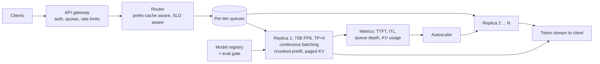
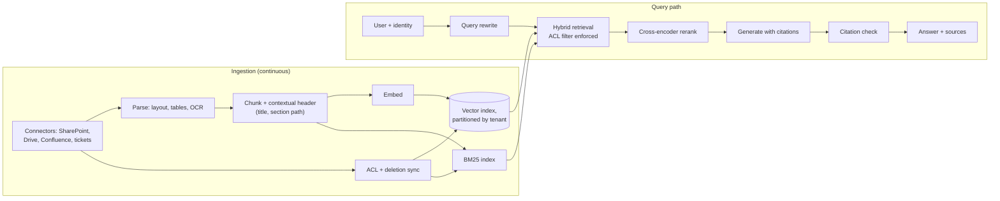
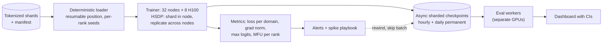
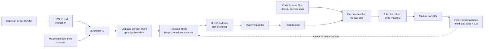
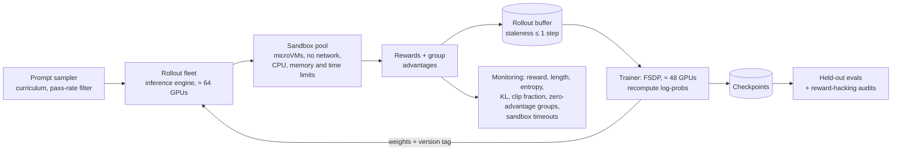
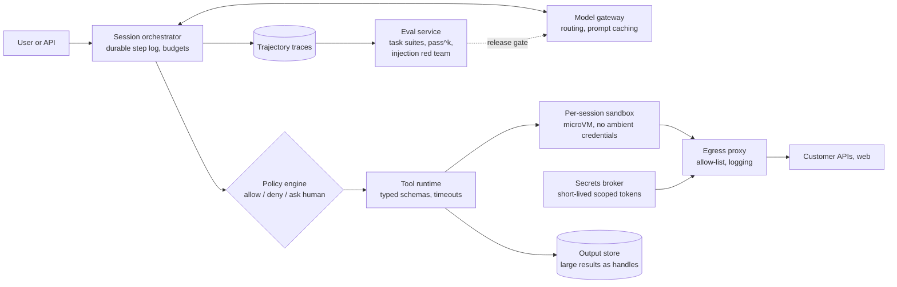
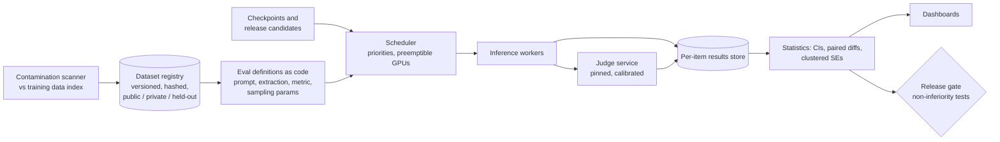
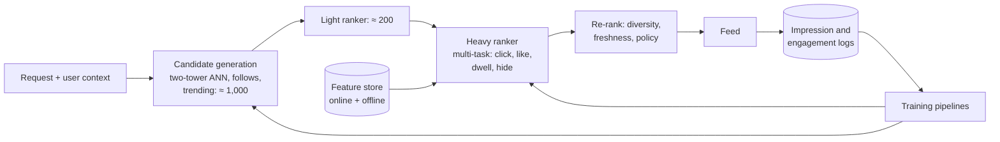

# ML system design (LLM era)

How to answer a 45–60 minute ML system design round, with eight worked designs: LLM serving, enterprise RAG, a pretraining run, a pretraining data pipeline, RL post-training infrastructure, an agent platform, an eval platform and a classic recommender.
Each design gives explicit numbers, a diagram, trade-offs, failure modes and what separates a strong answer from a weak one. Outline each design yourself before reading it.

## Contents

- [The framework](#the-framework)
- [One-page answer template](#one-page-answer-template)
- [Reference numbers](#reference-numbers)
- [A. LLM serving platform](#a-llm-serving-platform)
- [B. Enterprise RAG with access control and citations](#b-enterprise-rag-with-access-control-and-citations)
- [C. Pretraining run: 7B on 2T tokens](#c-pretraining-run-7b-on-2t-tokens)
- [D. Pretraining data pipeline](#d-pretraining-data-pipeline)
- [E. RL post-training infrastructure](#e-rl-post-training-infrastructure)
- [F. Agent platform with tool sandboxing and evals](#f-agent-platform-with-tool-sandboxing-and-evals)
- [G. Eval platform](#g-eval-platform)
- [H. Classic ranking and recommendation](#h-classic-ranking-and-recommendation)
- [Traps](#traps)

## The framework

| Step | Time | What you do | What the interviewer is checking |
|---|---|---|---|
| 1. Clarify | 5 min | Users, task, quality bar, latency SLOs, scale (peak and average), privacy and compliance, budget, what exists today | You design for the actual problem, not a generic one |
| 2. Napkin math | 5 min | QPS, tokens in and out, FLOPs, memory (weights, KV, activations), GPUs, $ per request. Say the numbers out loud | You can size a system; most candidates are weakest here |
| 3. Architecture | 10 min | Draw the data path end to end, then the control plane (deploys, scaling, monitoring) | Clean decomposition, clear interfaces |
| 4. Model and data choices | 10 min | API vs open weights vs fine-tuned; size vs latency; quantization; routing; where training data comes from | Choices justified by the numbers and the quality bar |
| 5. Evaluation | 5–10 min | Offline eval sets, online metrics, guardrails, a regression gate before every deploy | You know how you would know it works |
| 6. Failure modes and scaling | 5–10 min | Bursts, long-tail inputs, cache misses, hardware failures, provider outages, abuse, drift, cost blowups | Operational maturity |
| 7. Iterate | 2–5 min | What you build first, what you measure, what you defer | Judgment and prioritization |

> [!TIP]
> Spend the first minute agreeing on two or three numbers (peak QPS, input and output length, latency target). Every later decision should trace back to them. If the interviewer does not give numbers, propose reasonable ones and say "I'll assume X; tell me if that's off".

> [!TIP]
> Draw the diagram early and keep pointing at it. When the interviewer pushes on a component, zoom into that box rather than redrawing everything.

## One-page answer template

Copy this into a notes file before a mock and fill it in as you talk. If a line stays empty at minute 40, that is the gap the interviewer noticed too.

```text
PROBLEM         one sentence, in the user's terms
USERS / SLOs    who; p50/p95 latency (TTFT, ITL, end to end); availability; quality bar
SCALE           peak QPS ___  avg QPS ___  input tokens ___  output tokens ___  corpus/data size ___
NUMBERS         FLOPs/request ___  weights ___ GB  KV/token ___ KiB  GPUs ___  $/request ___
                bottleneck: compute | memory bandwidth | memory capacity | network | human labels
ARCHITECTURE    data path: ___ -> ___ -> ___ -> ___
                control plane: deploys, autoscaling, config, secrets
MODEL           choice + why; size; precision; fine-tuning?; fallback model
DATA            sources; labels; freshness; privacy/ACLs; retention
EVAL            offline set (size, CI width); online metrics; guardrails; release gate
FAILURE MODES   top 5, each with detection + mitigation
TRADE-OFFS      2-3 explicit "I chose X over Y because Z; I'd revisit if W"
V1 / LATER      build first ___  measure first ___  defer ___
```

## Reference numbers

Use these for estimates and say they are approximate; verify spec sheets before quoting precise figures.

| Quantity | Value |
|---|---|
| H100 SXM dense throughput | ≈ 989 TFLOP/s bf16, ≈ 1,979 TFLOP/s FP8 |
| H100 memory | 80 GB HBM3, ≈ 3.35 TB/s |
| Interconnect | NVLink ≈ 900 GB/s bidirectional per GPU; InfiniBand NDR ≈ 50 GB/s per port; PCIe 5.0 x16 ≈ 64 GB/s per direction |
| Training FLOPs | ≈ 6N per token (2N forward, 4N backward) |
| Inference FLOPs | ≈ 2N per token, plus attention 2·n_layers·T·d per token |
| Training memory | ≈ 16 bytes/param with mixed-precision Adam, plus activations |
| KV cache per token | 2 · n_layers · n_kv_heads · d_head · bytes (Llama-2-70B shape: 320 KiB in bf16, 160 KiB in FP8) |
| Decode time per step | ≈ (weight bytes + KV bytes read) / bandwidth, when memory-bound |
| Realistic efficiency | 35–50% MFU for large dense training; 60–80% of peak bandwidth for decode |

The derivations are in [lab 03](../../labs/03_napkin_math/README.md) and [module 02](../../curriculum/02-compute-and-hardware.md); the [question bank](question-bank.md#14-napkin-math) has drills.

---

## A. LLM serving platform

**Prompt.** Serve a 70B dense chat model at 1,000 requests/s peak, averaging 1,000 input and 300 output tokens, with p95 time to first token (TTFT) under 1 s and p95 inter-token latency (ITL) under 50 ms.

**Clarify.** Peak vs average traffic (diurnal ratio decides autoscaling savings); prompt-length distribution and maximum context; how much of each prompt is a shared system prompt; whether FP8 quality is acceptable; streaming; regions; a latency tier vs a batch tier.

### Numbers

| Quantity | Calculation | Result |
|---|---|---|
| Input tokens/s | 1,000 × 1,000 | 1.0M |
| Output tokens/s | 1,000 × 300 | 300k |
| Prefill compute | 2 × 70·10⁹ × 10⁶ tokens/s | 1.4·10¹⁷ FLOP/s |
| Weights in FP8 | 70·10⁹ × 1 byte | 70 GB: TP = 4 on 80 GB GPUs leaves ≈ 250 GB per replica for KV and activations |
| KV per token (FP8 KV, 80 layers, 8 KV heads, d_head 128) | 2 × 80 × 8 × 128 × 1 B | 160 KiB |
| Prefill cost per request | 1.4·10¹⁴ FLOPs / (1,979·10¹² × 0.4 assumed MFU) | ≈ 0.18 GPU-s |
| Decode step, TP = 4, batch 128, ≈ 1,150-token average context | per GPU: 17.5 GB weights + 128 × 1,150 × 160 KiB / 4 ≈ 6 GB of KV; 23.5 GB / (0.7 × 3.35 TB/s) ≈ 10 ms, plus ≈ 1.6 ms of TP all-reduce latency (160 small all-reduces) | ≈ 12 ms per step: ITL ≈ 12 ms, ≈ 10.7k tokens/s per replica |
| Decode cost per request | 300 tokens × 4 GPUs × 12 ms / 128 | ≈ 0.11 GPU-s |
| GPUs busy at peak | (0.18 + 0.11) × 1,000 | ≈ 290 |
| GPUs provisioned (≈ 65% target utilization for p95 headroom) | 290 / 0.65 | ≈ 450 GPUs, ≈ 112 TP = 4 replicas |
| TTFT from compute alone | 1.4·10¹⁴ / (4 × 792·10¹²) | ≈ 45 ms, so queueing dominates TTFT |
| Cost at an assumed $2 per GPU-hour | 450 × $2 per hour / (1.08·10⁹ output tokens per hour) | ≈ $0.83 per million output tokens at peak load |

Two conclusions fall out of the numbers. First, **prefill is about 60% of GPU time** at this input/output ratio, so the biggest cost levers are prefix caching and shorter prompts: if 600 of the 1,000 input tokens are a cached system prompt, prefill cost drops to ≈ 0.07 GPU-s and the fleet shrinks by ≈ 38%. Second, **a 1,000-token prefill takes ≈ 45 ms on a replica**, so inserting it between decode steps would push ITL from 12 ms to ≈ 57 ms and break the SLO; prefill must be chunked or moved to separate GPUs.

### Architecture



- **Engine:** continuous batching with paged KV (vLLM, SGLang or TensorRT-LLM class), chunked prefill with chunks of ≈ 256–512 tokens. A 256-token chunk adds ≈ 11 ms of compute per GPU to a step that is otherwise memory-bound, so ITL rises to roughly 15 ms instead of spiking by 45 ms.
- **Router:** send requests with the same prefix to the replica that holds it (cache locality), but cap per-replica load so a popular prefix cannot overload one replica. Admission control per tier: reject early with retry-after when the queue predicts a TTFT violation, rather than accepting and missing the SLO.
- **Batch size from the SLO:** raise batch size until p95 ITL approaches the target minus headroom; that sets throughput per GPU and therefore cost.
- **Autoscaling** on queue depth and KV-cache utilization, not CPU. Loading 70 GB of weights takes tens of seconds to minutes, so keep warm spare capacity for bursts.
- **Deploys:** canary new weights or engine versions on a small traffic slice, with an automatic eval gate (quality suite with paired comparison against production) and latency checks.

### Trade-offs

| Decision | Option chosen | Alternative | When to switch |
|---|---|---|---|
| Precision | FP8 weights and KV | bf16 | FP8 fails the paired quality eval on a slice you care about (e.g. a language or long context) |
| Parallelism | TP = 4 per replica | TP = 8 | A premium low-latency tier: per-token weight time halves, but communication does not, and cost per token rises |
| Prefill placement | Chunked prefill on shared GPUs | Disaggregated prefill and decode pools | Very large scale or strict SLOs on both TTFT and ITL; needs ≈ 150 GiB/s of cluster-wide KV transfer here (10⁶ tokens/s × 160 KiB) |
| Speculative decoding | Latency tier only | Everywhere | At batch 128 decode is closer to compute-bound per replica and verification costs real FLOPs; at small batch it cuts ITL substantially |

### Failure modes

| Failure | Detection | Mitigation |
|---|---|---|
| Traffic burst | Queue depth, predicted TTFT | Admission control, shed the batch tier first, warm spares |
| Very long prompts (50k+ tokens) | Prompt-length histogram | Separate long-context pool; charge by tokens; cap context per tier |
| KV cache exhausted | KV utilization near 100%, preemptions | Preempt and swap to host memory or recompute; lower max batch; FP8 KV |
| Hot prefix overloads one replica | Per-replica load skew | Replicate the prefix to several replicas; bounded-load consistent hashing |
| GPU or node failure | Health checks, NCCL timeouts | Drain and replace the replica; retry in-flight requests elsewhere |
| Bad model or engine release | Canary evals, error rates | Automatic rollback; shadow traffic before canary |

### What a strong candidate says that a weak one does not

- **Weak:** "Put it on vLLM behind a load balancer and autoscale." **Strong:** computes that prefill dominates GPU time at a 1,000/300 token ratio and names prefix caching as the first cost lever.
- Explains why chunked prefill (or disaggregation) is required to meet the ITL SLO, with the 45 ms number.
- Derives batch size from the ITL target, and cost per token from batch size.
- Knows TTFT at this prompt length is mostly queueing, so admission control matters more than faster prefill kernels.
- Treats quantization as a quality decision that needs a paired eval, not a free speedup.

---

## B. Enterprise RAG with access control and citations

**Prompt.** Build question answering over 10M internal documents for 500 enterprise tenants, with citations, respecting each source system's permissions. 50 queries/s at peak; p95 time to first token under 2.5 s.

**Clarify.** Document types (PDFs with tables, scans, slides, wiki pages, tickets); how fast permission changes and deletions must propagate; languages; whether answers may combine documents the user can see with ones they cannot (never); data residency; how "correct" is judged.

### Numbers

| Quantity | Calculation | Result |
|---|---|---|
| Corpus size | 10M docs × ≈ 2,000 tokens | ≈ 20B tokens |
| Chunks | 500-token chunks with ≈ 10% overlap | ≈ 44M |
| Vector storage, 1,024 dims | 44M × 4 KiB (fp32) / 2 KiB (fp16) / 1 KiB (int8) | ≈ 168 GiB / 84 GiB / 42 GiB, plus graph overhead for HNSW |
| Initial embedding compute, ≈ 335M-parameter encoder | 2 × 335·10⁶ × 20·10⁹ = 1.3·10¹⁹ FLOPs at ≈ 300 TFLOP/s effective | ≈ 12 H100-hours: re-embedding the corpus is cheap |
| Reranking, 100 candidates × ≈ 600 tokens, ≈ 300M-parameter cross-encoder | 2 × 300·10⁶ × 60,000 = 3.6·10¹³ FLOPs per query | ≈ 0.1 s on one GPU; at 50 QPS ≈ 6 GPUs busy, so rerank 50 candidates or use a smaller model if that is too costly |
| Generation context | 8 chunks × 500 tokens + instructions | ≈ 5k input tokens, ≈ 400 output |

The numbers say that embedding compute is not the constraint. **Parsing quality, permission sync and evaluation are** where the engineering effort goes.

### Architecture



- **Parsing:** layout-aware extraction keeps tables and headings; OCR for scans; each chunk gets a header with document title and section path so it makes sense out of context.
- **Retrieval:** BM25 plus dense retrieval fused with reciprocal rank fusion; BM25 catches product codes and names that embeddings blur. Retrieve ≈ 100, rerank to ≈ 8.
- **Permissions:** store allowed principals (users and groups) on every chunk; resolve the user's groups from the identity provider at query time and apply the filter inside retrieval, never after generation. Large tenants get their own index partitions; small tenants share an index with a mandatory tenant filter. Heavily filtered approximate-nearest-neighbor search can lose recall, which is another reason to partition.
- **Citations:** the generator must cite chunk ids for each claim. A post-check verifies that every cited id was in the retrieved set and that the cited text supports the claim (a small entailment model or validated judge); unsupported claims are removed or flagged. Say "I could not find this" when retrieval returns nothing relevant.
- **Freshness and deletion:** incremental ingestion from change feeds; deletions and permission revocations propagate within a stated SLA (for example minutes), with tombstones checked at query time until the index is compacted.

### Trade-offs

| Decision | Options | Guidance |
|---|---|---|
| Index topology | Per-tenant index vs shared with filter | Per-tenant for large tenants and strict isolation; shared for the long tail |
| Chunk size | 200–1,000 tokens | Smaller improves precision, larger keeps context; tune on the eval set, and add neighbor expansion at read time |
| Reranker | None / cross-encoder / LLM reranker | Cross-encoder is the usual sweet spot; measure the recall gain against the latency |
| Long context instead of RAG | Put whole documents in context | Good for a few long documents per query; does not replace permission filtering or corpus-scale search |

### Failure modes

| Failure | Detection | Mitigation |
|---|---|---|
| **Permission leak** (most serious) | Canary documents with restricted ACLs queried by test users; audits | Filter in retrieval, not in the prompt; sync SLA with alerts; deny on unknown ACL |
| Stale deleted documents answering questions | Deletion canaries | Tombstone check at query time |
| Table or scan parsed into garbage | Parse-quality sampling per file type | Better parsers, OCR, route failures to a review queue |
| Answer split across chunk boundaries | Error analysis on failed queries | Overlap, neighbor expansion, section-aware chunking |
| Prompt injection inside documents | Red-team documents | Treat retrieved text as data; no tool access from this path; output filtering |
| Hallucinated or wrong citations | Citation checker failure rate | Enforce the citation contract; drop unsupported claims |
| Embedding model upgrade | Planned | Dual-write a new index, compare on evals, then switch |

### Evaluation

- Offline, per tenant where possible: 200+ real questions with labeled relevant passages. Retrieval recall@20 and nDCG@10; answer correctness; faithfulness (claims supported by cited text); citation precision; correct refusal when the answer is absent.
- Online: citation click-through, thumbs up/down with reasons, escalations to humans, "no answer" rate.
- A regression gate on any change to parser, chunker, embedder, reranker or prompt, with paired comparisons on the same questions.

### What a strong candidate says that a weak one does not

- **Weak:** "Chunk, embed, put it in a vector database, call the LLM." **Strong:** starts with permissions and deletion as correctness requirements, and enforces them inside retrieval.
- Calculates that embedding is cheap (≈ 12 GPU-hours) and spends the design time on parsing, ACLs and evals instead.
- Evaluates retrieval and generation separately, so a failure can be attributed to one stage.
- Uses hybrid retrieval for identifiers and names, and explains why.
- Has an explicit plan for prompt injection in retrieved content.

---

## C. Pretraining run: 7B on 2T tokens

**Prompt.** Plan the pretraining of a 7B dense model on 2T tokens using 256 H100s (32 nodes of 8). The detailed paper exercise is in [module 05 §8](../../curriculum/05-pretraining.md#8-exercise-plan-a-7b-run-on-paper).

**Clarify.** Target capabilities (English only, multilingual, code), context length, deadline, whether a tokenizer and data pipeline exist (see design D), and what evaluation defines success.

### Numbers

| Quantity | Calculation | Result |
|---|---|---|
| Training compute | 6 × 7·10⁹ × 2·10¹² | 8.4·10²² FLOPs |
| Cluster throughput at 40% MFU | 256 × 989·10¹² × 0.4 | 1.01·10¹⁷ FLOP/s |
| Pure training time | 8.4·10²² / 1.01·10¹⁷ | 8.3·10⁵ s ≈ 9.6 days; plan ≈ 11–12 days with restarts and evals |
| Global batch | 1,024 sequences × 4,096 tokens | ≈ 4M tokens (Llama 2 used 4M) → 500k steps, ≈ 1.7 s per step |
| Tokens per GPU per step | 4M / 256 | 16,384 = 4 sequences: micro-batch 1 with 4 accumulation steps, or 2 × 2 |
| Model states | 16 bytes × 7·10⁹ | 112 GB total |
| States per GPU with HSDP (shard within node, replicate across 32 nodes) | 112 GB / 8 | 14 GB |
| Activations, micro-batch 1 × 4,096, FlashAttention | 34 · s · h bytes per layer × 32 layers | ≈ 18 GB; fits beside 14 GB of states, with room for micro-batch 2 or selective recomputation |
| Cross-node gradient all-reduce per step | each GPU all-reduces its 1/8 shard: 1.75 GB bf16 → ≈ 3.5 GB sent at ≈ 50 GB/s | ≈ 70 ms per 1.7 s step, easily overlapped with backward |
| Expected interruptions | Llama 3 reported 419 unexpected interruptions in 54 days on 16,384 GPUs ≈ 4.7·10⁻⁴ per GPU-day; × 256 GPUs | ≈ 0.12 per day: expect 1–2 during the run |
| Checkpoint interval (Young) | √(2 × C × MTBF) with C ≈ 30 s blocking and MTBF ≈ 8 days | ≈ 1.8 h; checkpoint roughly hourly anyway, because loss-spike rewinds also need recent checkpoints |

### Architecture



**Recipe to start from (then ablate):** Llama-style architecture (RMSNorm pre-norm, SwiGLU, RoPE, GQA), AdamW with β = (0.9, 0.95), weight decay 0.1, gradient clipping at 1.0, warmup ≈ 2,000 steps, peak LR ≈ 3·10⁻⁴ with cosine or WSD decay; these match what Llama 2 7B reported. Add QK-norm or z-loss if you see logit growth in proxies.

**Before the big run:** spend ≈ 5–10% of the budget on proxy runs (≤ 1B parameters) to choose the LR, data mixture and any architecture change, and run a short full-scale job (a few hours) to measure real MFU, memory and checkpoint times.

**During the run:** held-out loss per data domain every ~1,000 steps; a downstream suite on checkpoints every ~50–100B tokens with CIs (small-model benchmarks are noisy, so compare trends, not single points); a straggler detector comparing per-rank step times.

### Trade-offs

| Decision | Choice | Alternative and why |
|---|---|---|
| Sharding | HSDP (shard within node) | Full FSDP over 256 GPUs saves memory but puts all-gathers on InfiniBand every layer; TP is unnecessary at 7B |
| Sequence length | 4k for most tokens, a long-context phase at the end | Training at 32k throughout multiplies attention cost for little benefit early |
| Precision | bf16 with fp32 master weights | FP8 training raises throughput but adds scaling complexity and risk; adopt only after proxy runs show parity |
| Schedule | WSD | Cosine is standard; WSD lets you branch cooldowns at several token counts and extend the run |

### Failure modes

| Failure | Signal | Response |
|---|---|---|
| Loss spike | Grad norm and max logit jump | Rewind to the last good checkpoint, skip the batch, lower LR if it recurs |
| Straggler GPU | One rank's step time is high | Replace the node; stragglers slow the whole job |
| Silent data corruption (hardware computing wrong values) | Loss or grad-norm anomalies without a data cause; mismatched replicas | Periodic cross-replica checksums, known-answer tests, retire bad hosts |
| Data loader bug (repeated or skipped shards) | Per-shard token accounting | Deterministic manifest, assert every shard is consumed once per epoch |
| Checkpoint write throttled or corrupt | Save time, restore tests | Async writes, verify by restoring periodically |

### What a strong candidate says that a weak one does not

- Gives the 9.6-day number in a minute, then adds overheads for failures and evals.
- Chooses a parallelism layout from memory and communication numbers, not from habit.
- Plans ablations and a short full-scale shakedown before committing the budget.
- Has a written loss-spike playbook and knows that deterministic data resumption is part of fault tolerance.
- Mentions silent data corruption and straggler detection, which dominate operations at scale.

---

## D. Pretraining data pipeline

**Prompt.** Build the pipeline that produces the 2T training tokens for design C: filtered, deduplicated English web text plus code and multilingual data including Indian languages, and a way to test whether any pipeline change helps.

**Clarify.** Token target per source; languages; licensing and opt-out policy; PII policy; which evals the data must not contain; compute budget for processing; how often the pipeline reruns.

### Numbers

| Quantity | Calculation | Result |
|---|---|---|
| Yield per Common Crawl snapshot | FineWeb produced ≈ 15T tokens from 96 snapshots | ≈ 156B tokens per snapshot after filtering and dedup |
| Snapshots for ≈ 1.6T English web tokens (80% of 2T) at similar filtering | 1.6T / 156B | ≈ 10–11 snapshots |
| With an aggressive educational-quality filter | FineWeb-Edu kept ≈ 1.3T of ≈ 15T tokens (≈ 9%) | All ≈ 100 snapshots give only ≈ 1.3T: trade quality for quantity, or repeat data (≈ 4 epochs costs little, per Muennighoff et al., 2023) |
| Pages per snapshot | order of 2–3 billion (check the crawl's release notes) | |
| HTML-to-text extraction cost | if ≈ 10 ms per page per core (measure on a sample): 2.5·10⁹ × 10 ms | ≈ 7,000 core-hours per snapshot; ≈ 3 days on 1,000 cores for 10 snapshots |
| MinHash dedup signatures | 14 bands × 8 rows = 112 hashes; threshold ≈ (1/14)^(1/8) ≈ 0.72; one 8-byte key per band | 112 bytes per document ≈ 280 GB per 2.5B documents: a distributed group-by, then union-find over candidate pairs |
| Model-based quality classifier, ≈ 100M-parameter encoder on ≈ 150B tokens | 2 × 10⁸ × 1.5·10¹¹ = 3·10¹⁹ FLOPs at ≈ 100 TFLOP/s effective | ≈ 80 GPU-hours per snapshot (less if you score only the first 512 tokens per document) |
| Tokenized storage, 128k vocabulary | 2·10¹² tokens × 4 bytes (uint32; uint16 only fits vocabularies below 65,536) | ≈ 8 TB |

### Architecture



- **Every document keeps provenance:** source URL, snapshot, which filters it passed with which scores, and content hashes. Datasets are immutable, versioned manifests, so any training run can name exactly what it saw.
- **The funnel is a first-class output:** documents and tokens in and out of every stage, broken down by language and domain, plus a viewer to read random kept and removed samples. Most pipeline bugs are found by reading samples.
- **Changes are tested, not argued:** a pipeline change is accepted only if proxy models (≈ 1B parameters, tens of billions of tokens, several seeds or a bootstrap over eval items) trained on the new data beat the old data on a fixed, decontaminated eval suite at matched tokens.
- **Dedup scope matters:** FineWeb reported that deduplicating each snapshot separately worked better than one global dedup across all snapshots. Test the choice on proxies rather than assuming more dedup is always better.
- **Indian languages need their own handling:** language ID confuses related languages and romanized text; an English-trained quality classifier can reject good Telugu text, so train or validate classifiers per language with native-speaker review; volumes are small, so upsample within the ≈ 4-epoch budget; check tokenizer fertility (see [lab 04](../../labs/04_tokenizer/README.md)).
- **Code:** permissive-license filtering, exact and near dedup, removal of generated and minified files, secret and PII scanning, and repository-aware ordering so related files appear together.

### Trade-offs

| Decision | Options | Consideration |
|---|---|---|
| Filtering strength | Light vs aggressive | Aggressive filtering improves knowledge benchmarks per token but shrinks and narrows the data (classifiers favor one style) |
| Dedup granularity | Document vs paragraph or line | Line-level removes boilerplate (menus, cookie notices) but can break documents |
| Classifier type | fastText vs small transformer | fastText costs almost nothing on CPU; transformers judge quality better but need GPUs |
| Synthetic data | None vs rephrased or generated | Adds targeted skills and diversity of format; risks homogeneity and generator errors; test on proxies |

### Failure modes

| Failure | Detection | Mitigation |
|---|---|---|
| Extraction drops code blocks, math or tables | Sample review by content type | Extraction settings per page type; targeted parsers |
| Filters remove dialects or languages disproportionately | Funnel by language and region | Per-language thresholds, audits |
| Benchmark contamination | n-gram overlap scans against eval sets | Decontaminate before tokenizing; keep a list of protected evals |
| License or opt-out violations | Provenance audits | Filter at ingest, keep provenance for removal requests |
| PII in training data | Scanners, sampled audits | Redaction; exclude high-risk sources |
| Pipeline non-determinism makes ablations irreproducible | Hash comparison of reruns | Seeded, versioned stages; manifests |

### What a strong candidate says that a weak one does not

- **Weak:** lists the stages. **Strong:** describes how each stage is validated with proxy models and a fixed eval suite, and treats the funnel as a monitored product.
- Sizes the job: snapshots needed for the token target, and where the compute goes (extraction, not dedup).
- Knows the quantity–quality trade-off in numbers (FineWeb vs FineWeb-Edu) and how repetition changes it.
- Builds decontamination, provenance and opt-out handling in from the start.
- Treats non-English data as needing its own classifiers and review, not a translation of the English pipeline.

---

## E. RL post-training infrastructure

**Prompt.** Build infrastructure to train an 8B model with GRPO on coding problems verified by unit tests. Each step uses 512 prompts × 8 samples; responses can be up to 16k tokens.

**Clarify.** Model size and reference model; synchronous or asynchronous updates; problem sources and test quality; languages to execute; security requirements for running model-written code; target steps and wall-clock.

### Numbers

| Quantity | Calculation | Result |
|---|---|---|
| Rollouts per step | 512 × 8 | 4,096 |
| Generated tokens per step | 4,096 × ≈ 2,000 average | ≈ 8.2M |
| Rollout throughput per GPU (8B bf16, batch 256, ≈ 1.5k average context, 128 KiB KV per token) | per step: 16 GB weights + 256 × 1,500 × 128 KiB ≈ 50 GB of KV → ≈ 29 ms at 70% of 3.35 TB/s → ≈ 9k tokens/s; assume ≈ 5k after overheads (measure) | |
| Rollout GPU time | 8.2M / 5k | ≈ 1,640 GPU-s: ≈ 26 s on 64 GPUs, if perfectly balanced |
| The tail | A sequence decodes at ≈ 35 tokens/s inside a batch of 256 and ≈ 150–200 tokens/s once alone | A 16k-token response takes roughly 1.5–8 minutes while the average finishes in 26 s |
| Trainer compute | ≈ 10M tokens (responses + prompts): policy 6N + reference forward 2N + old-policy log-probs 2N = 10N per token → 10 × 8·10⁹ × 10⁷ | 8·10¹⁷ FLOPs ≈ 2,000 GPU-s at 400 TFLOP/s: ≈ 42 s on 48 GPUs |
| Sandbox executions | 4,096 per step, median ≈ 2 s CPU, 10 s timeout | ≈ 8,000–40,000 CPU-s per step: ≈ 8–40 s on 1,000 cores; overlap with generation |
| Weight sync | 16 GB bf16 per update to 64 rollout GPUs | ≈ 1–2 s with a pipelined broadcast over InfiniBand |

The tail row is the key insight: **in a synchronous design, step time is set by the longest response, not the average**, and GPUs idle while the last sequences finish.

### Architecture



- **Asynchronous rollouts:** the trainer consumes completed groups while generation continues, with staleness bounded (for example one policy version) and corrected by the clipped importance ratio. Partial rollouts (pause long generations and resume them with new weights) cut the tail further.
- **Do not simply take the first groups to finish:** that biases training toward short responses. If you over-sample prompts, keep selection independent of length or correct for it.
- **Log-probabilities:** recompute the old-policy log-probabilities with the trainer; the inference engine's numerics differ, and treating them as identical silently makes the data off-policy. Track the engine–trainer KL as a metric.
- **Sandbox:** a fresh microVM or gVisor container per execution, no network, read-only test files, resource limits, deterministic seeds and no wall-clock dependence. Rerun reference solutions to find flaky tests before they become reward noise.
- **Prompt curriculum:** drop problems the model always solves or never solves (zero advantage, no gradient) and refresh the pool as the model improves.
- **Version every rollout** with the weight version used; a silent failure of weight sync (rollouts on stale weights) otherwise looks like slow learning.

### Trade-offs

| Decision | Options | Consideration |
|---|---|---|
| Sync vs async | Synchronous is simplest and exactly on-policy | Async raises throughput 2× or more when lengths vary widely; needs staleness control |
| Colocated vs separate pools | Same GPUs alternate generation and training | Colocation avoids idle pools at small scale; separate pools scale and pipeline better |
| Group size G | 4–16 | Larger G gives better baselines and fewer zero-advantage groups at higher rollout cost |
| KL penalty | k3 KL to reference vs none | Without KL you skip the reference forward (≈ 20% of trainer compute here) and allow larger moves; with a learned reward model keep it |
| Max length | 8k–32k | Longer allows harder reasoning but worsens the tail; use overlong shaping rather than hard truncation rewards |

### Failure modes

| Failure | Signal | Mitigation |
|---|---|---|
| Reward hacking (special-casing tests, editing tests, early exit) | Reward rises, held-out pass rate flat; audits of top-reward samples | Hidden tests, immutable test files, strict harness, penalties, audits |
| Flaky tests | Reference solutions fail intermittently | Quarantine flaky problems; multiple runs |
| Entropy collapse | Entropy drops, pass@k stops improving | Clip-higher, temperature, filtering zero-advantage groups |
| Length explosion | Mean length climbs without accuracy gains | Token-level loss normalization, overlong penalties, length monitoring |
| Sandbox escape or abuse | Security monitoring | Defense in depth: microVM, no network, least privilege, separate accounts |
| Stale weights on rollouts | Version-tag mismatch | Assert versions, checksums after sync |

### What a strong candidate says that a weak one does not

- Identifies rollout generation, and specifically the length tail, as the throughput bottleneck, with numbers.
- Sizes rollout, trainer and sandbox pools so their times match, and overlaps them.
- Knows the log-probability mismatch between inference engine and trainer, and the length bias of first-finished selection.
- Treats the sandbox as a security boundary and a source of reward noise.
- Monitors the specific GRPO failure signals (entropy, length, zero-advantage fraction, clip fraction), not only mean reward.

---

## F. Agent platform with tool sandboxing and evals

**Prompt.** Design a platform that runs customer-configured agents (coding, data analysis, internal workflows) on a frontier model: 10,000 concurrent sessions at peak, up to 50 steps each, with tools that run code, browse the web and call customer APIs. It must be safe, observable, and measurably improving.

**Clarify.** Which actions are irreversible (payments, emails, deploys, deletes); who approves them; customer data boundaries; whether the model is self-hosted or an API; session length and budgets; what "task success" means for each agent type.

### Numbers

| Quantity | Calculation | Result |
|---|---|---|
| Input tokens per session | 50 steps with context growing from ≈ 5k to ≈ 60k: ≈ 32.5k average × 50 | ≈ 1.6M, of which only ≈ 55k (≈ 1.1k per step) are new |
| Effect of prompt caching | If cached input costs 10% of uncached (some APIs price cache reads this way): 55k + 0.1 × 1.6M ≈ 215k uncached-equivalent | ≈ 7× cheaper input; without caching, agents at this length are rarely affordable |
| Output tokens per session | 50 × ≈ 300 | ≈ 15k |
| Model calls per second | 10,000 sessions, one step per ≈ 10 s (model plus tool time) | ≈ 1,000 calls/s: the same order as design A |
| Resident context | 10,000 × 32.5k tokens × 160 KiB (70B-class, FP8 KV) | ≈ 48 TiB: far more than GPU memory, so KV must be tiered to host memory or SSD, or recomputed |
| Reload vs recompute a 30k-token context | reload 30k × 160 KiB ≈ 4.6 GiB at ≈ 25 GB/s ≈ 0.2 s; recompute 2 × 70·10⁹ × 3·10⁴ = 4.2·10¹⁵ FLOPs ≈ 1.3 s on a TP = 4 replica | Offloading beats recompute by ≈ 6× while the agent waits on a tool |
| Sandboxes | 10,000 × 2 vCPU, 2 GB RAM | 20k vCPUs, 20 TB RAM if all active; most idle during model calls, so pause or snapshot them |
| Sandbox start | Firecracker documents microVM launch in as little as ≈ 125 ms | Per-session microVMs are practical |
| Eval precision | 300 tasks, success near 50%: SE ≈ √(0.25/300) | ≈ 2.9 points, so changes under ≈ 6 points need paired comparison on the same tasks |

If the model is behind an API, the same physics shows up as cache pricing and cache lifetime: a tool call that outlasts the cache's time-to-live makes the next step pay full price.

### Architecture



- **Orchestrator:** each step (model call, tool call, result) is persisted before the next begins, so sessions survive crashes and can be replayed. Budgets on steps, tokens, wall-clock and money are enforced here, not left to the model.
- **Tools:** typed JSON schemas with versions; validation of arguments before execution; idempotency keys so a retried call cannot, for example, pay twice; structured errors returned to the model so it can recover; large outputs stored as files and returned as a handle plus a summary, with a search tool to read more.
- **Policy engine:** rules per tool and argument pattern (read-only actions allowed; writes to customer systems need a scope; irreversible or external actions such as sending email, deploying or deleting require human approval). The model never decides its own permissions.
- **Sandbox:** one microVM (or gVisor container for lower-risk tools) per session, resource limits, filesystem snapshots for rollback, network only through an egress proxy with an allow-list.
- **Secrets:** the broker attaches short-lived, narrowly scoped credentials at the proxy. Secrets never enter the model's context, so prompt injection cannot read them. Traces are scanned and redacted.
- **Prompt injection:** content from web pages, files and tool outputs is untrusted data. The dangerous combination is private data plus untrusted content plus a way to send data out; the policy engine and egress allow-list break that chain for each task.
- **Context management:** keep the stable prefix (system prompt, tool definitions) first and unchanged so caches hit; compact old tool outputs into summaries when context grows, accepting a cache miss at that point.

### Evaluation

| Layer | What | Detail |
|---|---|---|
| Offline task suite | ≈ 300 tasks per agent type, each a container image with seeded state and a programmatic checker (tests pass, database state, file diff) | 5 trials per task; report success with CIs clustered by task, pass^k for reliability, cost and steps per success |
| Safety suite | Injection tasks (tool outputs containing adversarial instructions), canary secrets, attempted policy violations | Attack success rate, unsafe-action attempts, exfiltration of canaries: all must be zero or below a set bar |
| LLM judges | Only for criteria without programmatic checks (report quality, tone) | Validated against human labels; pinned judge versions |
| Release gate | Any change to model, prompts, tools or policies | Paired comparison on the same tasks; non-inferiority on safety |
| Online | Task completion, human-intervention rate, user ratings, cost per session | Sample trajectories weekly for failure taxonomy; new failures become offline tasks |

### Trade-offs

| Decision | Options | Consideration |
|---|---|---|
| Isolation | Containers vs gVisor vs microVMs vs full VMs | Stronger isolation costs startup time and memory; microVMs are the usual choice for running untrusted code |
| Autonomy | Approvals everywhere vs risk-tiered | Too many approvals and users rubber-stamp them; tier by reversibility and blast radius |
| Architecture | Single agent vs multiple agents | Multiple agents multiply tokens and add coordination failures; use them when subtasks are parallel and separable |
| History | Full history vs compaction | Full history keeps caches warm and information intact; compaction bounds cost and context length |

### Failure modes

| Failure | Mitigation |
|---|---|
| Injection leads to data exfiltration | Egress allow-list, no secrets in context, approvals for external sends, canary monitoring |
| Runaway loop repeating a failing call | Step and cost budgets, repetition detection, structured errors |
| Volatile content early in the prompt (timestamps, user names) destroys cache hits | Stable prefix ordering; cache hit rate as a dashboard metric |
| Non-idempotent retries cause duplicate side effects | Idempotency keys, exactly-once semantics in the tool runtime |
| Tool schema change breaks deployed agents | Versioned tools, contract tests in the eval suite |
| Eval environment drift makes scores move without a model change | Pinned images, rerun a fixed baseline with every eval |

### What a strong candidate says that a weak one does not

- **Weak:** "An LLM calls tools in a loop, run code in Docker." **Strong:** treats the sandbox, egress and secrets as a security design and explains exactly why the model can never see credentials.
- Computes that input tokens dominate and that caching (and cache-friendly prompt layout) decides whether the product is affordable.
- Makes the orchestrator durable and tool calls idempotent, because agents run for minutes and retry.
- Evaluates reliability (pass^k), safety (injection success rate) and cost, not just average success, and gates releases on paired comparisons.
- Turns production failures into new eval tasks.

---

## G. Eval platform

**Prompt.** Build the evaluation platform for a lab: every training checkpoint gets a quick evaluation, every release candidate a full one, and researchers add new evals every week.

### Numbers

| Quantity | Calculation | Result |
|---|---|---|
| Full suite for a release candidate | 150k items × 4 samples × ≈ 1k output tokens | 6·10⁸ generated tokens |
| Compute for a 70B model at ≈ 10k tokens/s per 4-GPU replica | 6·10⁸ / 10⁴ = 6·10⁴ replica-seconds | ≈ 17 replica-hours ≈ 67 GPU-hours, plus judge-model tokens |
| Quick suite per checkpoint | ≈ 5% of the full suite | ≈ 3–4 GPU-hours; 30 checkpoints a day ≈ 100 GPU-hours per day |
| Smallest detectable difference | 1,000-item eval at ≈ 70% accuracy | unpaired SE of a difference ≈ 2 points, so gates need paired tests and larger sets |

### Architecture



- **Store per-item outputs, not just aggregates.** Paired comparisons, error analysis and re-scoring with a fixed extractor all depend on it.
- **Eval definitions are code** with versions: any change to a prompt template, few-shot set, answer extraction or sampling parameter creates a new version, so scores never silently change meaning.
- **Statistics by default:** every number on a dashboard has a CI; comparisons against the baseline are paired; clustered SEs where items share a source ([lab 15](../../labs/15_eval_stats/README.md)).
- **Gates use non-inferiority margins:** "the candidate is not worse than production by more than 1 point on safety evals, with 95% confidence", rather than "the number went up".
- **Judges are models too:** pinned versions, calibration sets with human labels, bias tests (position, length, self-preference), and re-validation when anything changes.
- **Data protection:** held-out sets are access-controlled, canaried, and scanned against training data; contamination findings are reported with the scores.

**Failure modes:** a template tweak shifts scores (versioning); judge drift after a judge update (calibration set rerun); small noisy evals driving decisions (CIs, minimum sizes); contamination (scanner, held-out refresh); eval compute starved by training (reserved or preemptible capacity with priorities).

**What a strong candidate says:** per-item storage and paired tests by default; "evaluating the evaluator" (judge validation, label audits); explicit sample-size reasoning; gates with statistical margins; a process for retiring saturated evals.

---

## H. Classic ranking and recommendation

Still common in Big Tech loops, and the patterns (retrieval then ranking, logging, position bias, online experiments) carry over to LLM products.

**Prompt.** Design a feed recommender for 100M daily users choosing from 10M items, with p99 latency under 200 ms.

| Quantity | Calculation | Result |
|---|---|---|
| Requests | 100M users × 20 feed loads per day / 86,400 s | ≈ 23k QPS average; plan for 2–3× at peak |
| Funnel | 10M items → ≈ 1,000 candidates → ≈ 200 → ≈ 50 shown | Each stage affords a costlier model on fewer items |



- **Key points to cover:** training/serving feature consistency (the same feature code for both); position bias in logged data (position as a feature at training, fixed at serving, or randomized exploration); cold start for new items and users (content embeddings, including from an LLM); multi-objective ranking with explicit weights; A/B tests with guardrail metrics and novelty effects.
- **Failure modes:** feedback loops that narrow content, training on delayed labels, feature leakage from the future, and popularity bias.
- **Strong answers** quantify the funnel, separate retrieval recall from ranking precision, and describe how offline metrics are checked against online experiments.

---

## Traps

- Skipping the numbers, or doing them and never using them to make a decision.
- Designing for 100× scale on day one instead of the stated load with a path to grow.
- No evaluation story, or an evaluation story with no sample sizes and no gate.
- "Fine-tune" as the answer to every quality problem before measuring whether retrieval, prompting or data is the cause.
- Ignoring privacy, permissions and deletion until the interviewer asks.
- Forgetting cost per request and what drives it.
- Listing technologies (vector database brands, serving frameworks) instead of explaining mechanisms and trade-offs.

> [!TIP]
> Practice each design out loud in 45 minutes with the [answer template](#one-page-answer-template), then compare with the write-up above and note what you missed. Company-specific emphasis differs: see the [company guides](../../companies/README.md), for example [NVIDIA](../../companies/nvidia/README.md) for performance-heavy rounds and [Anthropic](../../companies/anthropic/README.md) for safety-aware system design.
